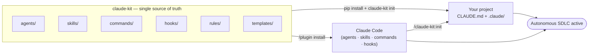
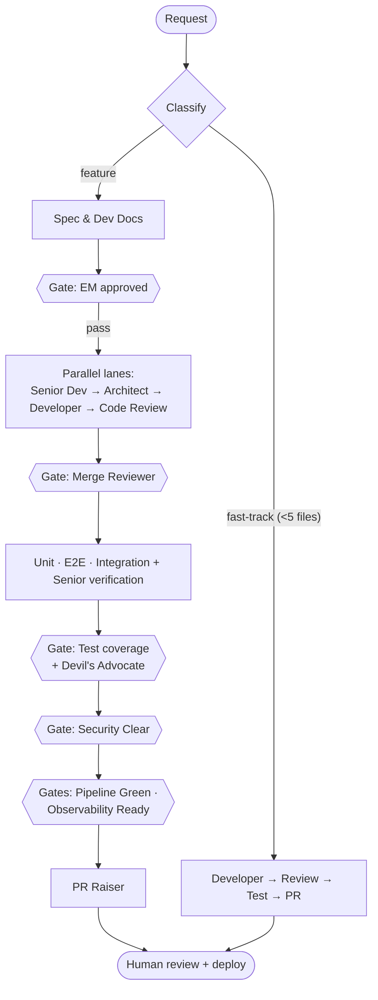

<div align="center">

# claude-kit

**An autonomous, stack-agnostic SDLC for [Claude Code](https://www.claude.com/product/claude-code).**

Turn a one-line request into reviewed, tested, secured, shippable code — driven by 24
specialized agents that move work through spec → review → build → test → security → ship,
with a quality gate between every phase.

[](https://pypi.org/project/claude-kit/)
[](https://pypi.org/project/claude-kit/)
[](LICENSE)
[](https://www.claude.com/product/claude-code)

[Install](#install) · [Generate a project](#generate-a-project-claude-kit-new) · [How it works](#how-it-works) · [The pipeline](#the-pipeline) · [Agents](#the-agents) · [Agent guide](docs/agents.md) · [CLI](#cli-reference)

</div>

---

## What is this?

claude-kit installs a **complete software-delivery lifecycle** into Claude Code. Instead of one
assistant doing everything in one pass, your work flows through a pipeline of focused agents —
a spec writer, reviewers, a developer, code reviewers, testers, security scanners, and a PR
raiser — coordinated by an **Orchestrator** that runs independent work in parallel and refuses
to advance a phase until its **quality gate** passes.

It is **fully generic**: nothing assumes a particular language or framework. The same pipeline
drives a Python service, a TypeScript app, a Go CLI, or anything else — you point the rules at
your stack's lint/test/build commands and go.

Two things make it reliable over long runs:

- **Working memory (`CONTINUITY.md`)** — the current task state is re-read every turn, so work
  survives context compaction and brand-new sessions.
- **A self-improving learnings loop (`agent-memory/`)** — durable lessons are captured and
  re-injected into future sessions, so the same mistake isn't made twice.

> Inspired by the autonomous-SDLC idea, rebuilt from the ground up **for Claude Code** — as a
> first-class plugin **and** a pip-installable scaffolder.

---

## Install

claude-kit ships through two channels from one source of truth. Use either — or both.

### A) As a Claude Code plugin (recommended)

Makes all agents, skills, commands, and hooks available inside Claude Code:

```text
/plugin marketplace add ajyadav013/claude-kit
/plugin install claude-kit
```

Then, inside any project you want managed by the pipeline:

```text
/claude-kit:init        # lays down CLAUDE.md + .claude/{rules,agents,skills,hooks}
/claude-kit:sdlc Add a CSV export button to the reports page
```

### B) As a pip package

A CLI that scaffolds the same config into any repo — great for CI, onboarding, or non-plugin
workflows:

```bash
pip install claude-kit          # or: uvx claude-kit init .
claude-kit init                 # scaffold into the current project
```

This writes a generic `CLAUDE.md` and a `.claude/` directory (rules, agents, skills, hooks,
working-memory templates). Open the project in Claude Code and the pipeline is active.

---

## Generate a project (`claude-kit new`)

Don't have a project yet? Generate a **batteries-included monorepo** — a React frontend, a FastAPI
backend, and a Postgres database — with the SDLC config already wired in:

```bash
claude-kit new my-app            # prompts for the stack; or:
claude-kit new my-app --no-input # take the defaults (React + FastAPI + Postgres)
```

Or inside Claude Code: `/claude-kit:new my-app`.

You get a runnable app with **zero framework setup**:

```bash
cd my-app
docker compose up --build        # db + backend + frontend — no local Python/Node needed
#   frontend → http://localhost:5173   ·   API docs → http://localhost:8000/docs
# prefer native dev? `make setup` then `make dev` (needs Python 3.11+ and Node 22+)
```

What's inside: a worked **items** vertical slice (DB model → service/repository → typed API →
React page) with tests on both sides, async SQLAlchemy 2.0 + Alembic migrations, Vite + Vitest, a
`docker-compose.yml`, a `Makefile`, and stack-tuned agent rules (`fastapi-patterns.md`,
`react-patterns.md`) plus a `CLAUDE.md` filled in with your stack's exact commands.

The engine is a **registry**: React and FastAPI are the options today, but each stack is just a
folder under `templates/stacks/` — adding another is a data change, not a code change.

---

## How it works



Three ideas do the heavy lifting:

1. **Quality gates with a shared severity model.** Every finding is classified
   Critical / High / Medium / Low / Cosmetic. A gate passes **only** with zero
   Critical/High/Medium open. No silent advancement.
2. **RARV self-check.** Every agent runs **R**eason → **A**ct → **R**eflect → **V**erify and
   must show a *green Verify* (real commands run, not imagined) before handing off.
3. **Blind review + Devil's Advocate.** Parallel reviewers judge independently. A *unanimous*
   PASS is treated as suspicious and triggers an adversarial `devils-advocate` pass before the
   gate is allowed to close — an explicit guard against agents rubber-stamping each other.

See [`docs/architecture.md`](docs/architecture.md) for the full diagrams.

---

## The pipeline



| Phase | What happens | Gate |
|-------|--------------|------|
| **Plan** | Spec + developer docs written; UI design spec if needed | EM approved |
| **Review** | Senior Developer → Technical Architect → EM, per work stream (parallel) | Merge Reviewer (cross-stream consistency) |
| **Build** | Developer implements in an isolated worktree; Code Reviewer iterates | Code review `APPROVED` |
| **Test** | Unit + E2E + integration testers, then Senior Tester verification | Test-coverage (blind review + Devil's Advocate) |
| **Secure** | `security-reviewer` fans out secret / dependency / OWASP / policy scanners | Security Clear |
| **Operate** | DevOps + Observability checks (only if a deployable/observable surface changed) | Pipeline Green · Observability Ready |
| **Ship** | PR Raiser runs final checks, formats the commit, opens the PR | Human review + deploy |

A **fast-track** mode skips planning for small changes (< 5 files): Developer → Code Reviewer →
Tester → PR.

---

## The agents

24 specialized roles in [`agents/`](agents/), each invokable on its own or orchestrated together.
See the **[agent guide](docs/agents.md)** for how to drive them (`/claude-kit:sdlc`, single-agent
calls, the gates, and working memory).

| Agent | Role |
|-------|------|
| `orchestrator` | Pipeline controller — decomposes, delegates, runs lanes in parallel, gates progression (never writes code) |
| `spec-doc-writer` | Turns requirements into a spec + developer documentation in one pass |
| `ui-designer` | Drafts and self-reviews UI/UX design specs |
| `senior-backend-dev` · `senior-frontend-dev` | Senior review of a work stream's spec (the two-lane example) |
| `technical-architect` | Cross-system architecture, scalability, integration review |
| `em-reviewer` | Engineering-manager strategic & completeness review |
| `merge-reviewer` | Verifies consistency between parallel lanes at join points |
| `developer` | Writes production code from an approved spec, in an isolated worktree |
| `sdlc-code-reviewer` | Reviews code for bugs, security, performance, spec compliance |
| `unit-tester` · `e2e-tester` | Author unit and end-to-end test suites |
| `tester` · `senior-tester` | Integration testing and independent verification of coverage |
| `auditor` | Read-only audit for accessibility, performance, responsiveness, console errors |
| `devils-advocate` | Anti-sycophancy adversarial reviewer (runs on a unanimous PASS) |
| `security-reviewer` | Security stage coordinator — owns the Security Clear gate |
| `secret-scanner` · `dependency-scanner` · `owasp-reviewer` · `policy-validator` | The four parallel security sub-scanners |
| `devops-engineer` | CI/build/containers, env, migrations, runbook — owns Pipeline Green |
| `observability-engineer` | SLOs, health/readiness, structured logging, alerts — owns Observability Ready |
| `pr-raiser` | Final checks, commit hygiene, and PR creation |

---

## Rules & skills

**Rules** ([`rules/`](rules/)) are the contracts every agent obeys — 13 stack-agnostic files:
`mandatory-workflow`, `quality-gates`, `rarv-cycle`, `continuity`, `agent-memory`,
`documentation`, `design-patterns`, `code-organization`, `linting-and-formatting`, `testing`,
`frontend-best-practices`, `responsive-and-accessibility`, `devops-observability`.

**Skills** ([`skills/`](skills/)) are 42 on-demand capabilities Claude activates by context —
spec-driven development, planning & task breakdown, TDD, debugging & error recovery, code
review, security hardening, API design, git workflow, performance optimization, the `remember`
learnings loop, and more.

Make it yours: drop your stack's conventions into the **Project-specific rules** section of the
scaffolded `CLAUDE.md` and add matching files under `.claude/rules/`.

---

## CLI reference

```text
claude-kit <command>          # alias: ckit
```

| Command | Description |
|---------|-------------|
| `new [name] [--backend <id>] [--frontend <id>] [--db <id>] [--no-input] [--here] [--force]` | Generate a new React + FastAPI project with the SDLC baked in |
| `init [path] [--force] [--minimal] [--no-hooks]` | Scaffold `CLAUDE.md` + `.claude/` into an existing project |
| `upgrade [path]` | Refresh rules/agents/skills/hooks; keep your `CLAUDE.md` & `settings.json` |
| `status [path]` | Show what's installed and the current working memory |
| `list` | List the bundled agents, rules, and skills |
| `version` | Print the version |

Plugin slash commands: `/claude-kit:new`, `/claude-kit:init`, `/claude-kit:sdlc <task>`, `/claude-kit:status`.

---

## Project structure

```
claude-kit/
├── .claude-plugin/        plugin.json + marketplace.json
├── agents/                24 SDLC agents          rules/        13 engineering rules
├── skills/                42 on-demand skills     templates/    CLAUDE.md, settings, memory seeds
├── commands/              /claude-kit:* commands  hooks/        hooks.json + scripts/
├── scripts/init.sh        shared scaffolder       src/claude_kit/  the pip CLI
├── docs/architecture.md   diagrams                pyproject.toml   packaging
```

See [`docs/architecture.md`](docs/architecture.md) for the full picture and
[`CLAUDE.md`](CLAUDE.md) for how to develop the kit itself.

---

## Contributing

Issues and PRs welcome — see [`CONTRIBUTING.md`](CONTRIBUTING.md). To dogfood a local checkout:

```bash
# As a plugin:  /plugin marketplace add .   then   /plugin install claude-kit
# As the CLI:   pip install -e .   then   claude-kit init /tmp/demo
```

## License

[MIT](LICENSE) © Arjunsingh Yadav
