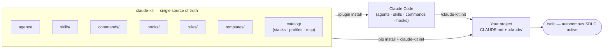
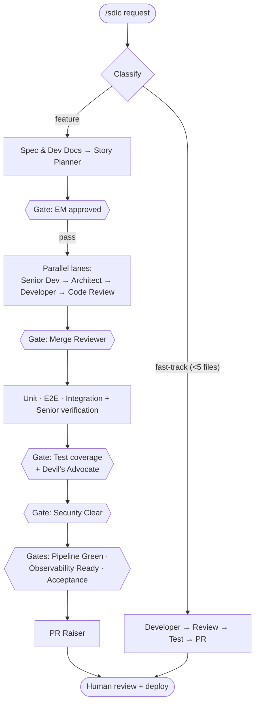

<div align="center">

# claude-kit

**A Cookiecutter-style scaffolder for an autonomous SDLC inside [Claude Code](https://www.claude.com/product/claude-code).**

`claude-kit init` asks a few questions and lays down a `CLAUDE.md` + a `.claude/` configuration —
rules, a profile-selected set of specialized agents and skills, hooks, and artifact templates — that
turn a one-line request into reviewed, tested, secured, shippable code, with a quality gate between
every phase. **No application code. No Docker. Configuration only.**

[](https://pypi.org/project/claude-kit/)
[](https://pypi.org/project/claude-kit/)
[](LICENSE)
[](https://www.claude.com/product/claude-code)

[Install](#install) · [The init flow](#the-init-flow) · [How it works](#how-it-works) · [The pipeline](#the-pipeline) · [Agents](#the-agents) · [Catalog](#catalog--extensibility) · [Agent guide](docs/agents.md) · [CLI](#cli-reference)

</div>

---

## What is this?

claude-kit installs a **complete software-delivery lifecycle** into Claude Code. Instead of one
assistant doing everything in one pass, your work flows through a pipeline of focused agents —
a spec writer, story planner, reviewers, a developer, code reviewers, testers, security scanners,
and a PR raiser — coordinated by an **Orchestrator** that runs independent work in parallel and
refuses to advance a phase until its **quality gate** passes. You drive it all with one command:
`/sdlc <your task>`.

It is **stack-agnostic**: the pipeline itself assumes no language or framework. You pick a stack at
`init` time and claude-kit installs matching **overlay rules** (e.g. for React, FastAPI, PostgreSQL,
MongoDB) and fills `CLAUDE.md` with your stack's exact lint/test/build commands — but it never writes
your application code and never requires Docker.

Three things keep it reliable over long runs:

- **Profiles** — `lean ⊊ standard ⊊ enterprise` decide how many agents, skills, hooks, and gates are
  active, so you can dial the rigor from "fast track" to "full audit".
- **Scope** — `individual` / `team` (default) / `organization`. Organization scope adds a
  **vibe-coding capability layer** so PMs, designers, QA, support, data, and founders can drive work
  safely too — with role-based **packs**, an **autonomy model**, and **risk classification**. See
  [`docs/org-capabilities.md`](docs/org-capabilities.md).
- **Working memory (`CONTINUITY.md`)** — the current task state is re-read every turn, so work
  survives context compaction and brand-new sessions.
- **A self-improving learnings loop (`agent-memory/`)** — durable lessons are captured and
  re-injected into future sessions, so the same mistake isn't made twice.

> Inspired by the autonomous-SDLC idea, rebuilt from the ground up **for Claude Code** — as a
> first-class plugin **and** a pip-installable scaffolder, both from one source of truth.

---

## Install

claude-kit ships through two channels from one source of truth. Use either — or both.

### A) As a Claude Code plugin (recommended)

Makes all agents, skills, commands, and hooks available inside Claude Code:

```text
/plugin marketplace add ajyadav013/claude-kit
/plugin install claude-kit
```

Then, inside any project you want managed by the pipeline:

```text
/claude-kit:init        # asks the ordered questions, lays down CLAUDE.md + .claude/
/sdlc Add a CSV export button to the reports page
```

### B) As a pip package

A CLI (`claude-kit`, aliases `ckit` / `claude-sdlc`) that scaffolds the same config into any repo —
great for CI, onboarding, or non-plugin workflows:

```bash
pip install claude-kit
claude-kit init                 # interactive: prompts for stack, profile, MCP
claude-kit init --defaults      # non-interactive: React + Python/FastAPI + Postgres + standard
```

Open the project in Claude Code afterwards and the pipeline is active.

---

## The init flow

`claude-kit init` asks an ordered set of questions (all with sensible defaults), then writes the
config — nothing else:

1. **Target path** (default: current dir; if `.claude/` exists → **merge / overwrite / backup / abort**)
2. **Frontend framework** (default: React) → **frontend language** (default: TypeScript)
3. **Backend language** (default: Python) → **backend framework** (default: FastAPI)
4. **Database** (PostgreSQL · MongoDB)
5. **SDLC profile** (`lean` · `standard` · `enterprise`)
6. **Optional MCP integrations** (GitHub, Jira/Linear, Postgres/Mongo, Playwright, Docs) — a
   project-root `.mcp.json` is written **only** if you select any (env placeholders, never secrets)

Non-interactive equivalents: `--defaults`, or `--config init.yaml` (flat or nested YAML). What lands:

```
CLAUDE.md                      # "Project-specific rules" filled from your stack's commands
README.claude-sdlc.md
.claude/
  settings.json                # assembled from the profile's hooks
  rules/                        # stack-agnostic core + selected overlay rules
  agents/                       # the profile's agent subset + DB overlay agents
  skills/  (incl. sdlc/)        # the profile's skill subset; sdlc/ is the /sdlc entrypoint
  hooks/                        # the profile's hook scripts
  templates/                    # artifact templates (spec, ADR, test-plan, …)
  config/                       # init-options.json (checksums) + stack snapshot
  state/  tmp/                  # gitignored runtime
.mcp.json                       # only if MCP servers were selected
```

---

## How it works



Three ideas do the heavy lifting:

1. **Quality gates with a shared severity model.** Every finding is classified
   Critical / High / Medium / Low / Cosmetic. A gate passes **only** with zero
   Critical/High/Medium open. No silent advancement.
2. **RARV self-check.** Every agent runs **R**eason → **A**ct → **R**eflect → **V**erify and
   must show a *green Verify* (real commands run, not imagined) before handing off.
3. **Blind review + Devil's Advocate.** Parallel reviewers judge independently. A *unanimous*
   PASS is treated as suspicious and triggers an adversarial `devils-advocate` pass before the
   gate is allowed to close — an explicit guard against agents rubber-stamping each other.

See [`docs/architecture.md`](docs/architecture.md) for the full diagrams.

---

## The pipeline

`/sdlc` reads the profile you chose and runs **only that profile's gates**:



| Profile | Gates that run |
|---|---|
| **lean** | code-review · build-green |
| **standard** | spec-complete · em-approved · code-review · build-green · test-coverage · security-clear |
| **enterprise** | standard + pipeline-green · observability-ready · acceptance |

A **fast-track** mode collapses small changes (< 5 files) to Developer → Code Reviewer → Tester → PR.

---

## The agents

28 specialized roles in [`agents/`](agents/), each tagged with a `tier` (orchestrator · stage-lead ·
specialist · review) and installed per profile. Plus per-database **overlay agents** added only for
your chosen DB, and **org persona agents** added only in organization scope. See the
**[agent guide](docs/agents.md)** for how to drive them.

| Agent | Role |
|-------|------|
| `orchestrator` | Pipeline controller — decomposes, delegates, runs lanes in parallel, gates progression (never writes code) |
| `spec-doc-writer` | Turns requirements into a spec + developer documentation in one pass |
| `story-planner` | Decomposes an approved spec into ordered, parallelizable stories |
| `ui-designer` | Drafts and self-reviews UI/UX design specs |
| `senior-backend-dev` · `senior-frontend-dev` | Senior review of a work stream's spec (the two-lane example) |
| `technical-architect` | Cross-system architecture, scalability, integration review |
| `em-reviewer` | Engineering-manager strategic & completeness review |
| `merge-reviewer` | Verifies consistency between parallel lanes at join points |
| `developer` | Writes production code from an approved spec, in an isolated worktree |
| `sdlc-code-reviewer` | Reviews code for bugs, security, performance, spec compliance |
| `unit-tester` · `e2e-tester` | Author unit and end-to-end test suites |
| `tester` · `senior-tester` | Integration testing and independent verification of coverage |
| `auditor` | Read-only audit for accessibility, performance, responsiveness, console errors |
| `devils-advocate` | Anti-sycophancy adversarial reviewer (runs on a unanimous PASS) |
| `acceptance-reviewer` | Verifies delivery against acceptance criteria before the human gate |
| `risk-classifier` | Read-only — classifies work as low/medium/high/restricted and names the required gates (enterprise + org) |
| `security-reviewer` | Security stage coordinator — owns the Security Clear gate |
| `secret-scanner` · `dependency-scanner` · `owasp-reviewer` · `policy-validator` | The four parallel security sub-scanners |
| `devops-engineer` | CI/build/release, env, migrations, runbook — container-optional; owns Pipeline Green |
| `observability-engineer` | SLOs, health/readiness, structured logging, alerts — owns Observability Ready |
| `pr-raiser` | Final checks, commit hygiene, and PR creation |
| **DB overlays** | `postgres-specialist` · `mongodb-specialist` · `migration-specialist` (installed for the selected database) |
| **Org personas** | `pm-copilot` · `founder-prototype-agent` · `support-ticket-engineer` · `data-workflow-agent` · `internal-tools-builder` (organization scope only) |

---

## Catalog & extensibility

Everything selectable lives in [`catalog/`](catalog/) as data — **adding a stack, framework,
database, profile, or MCP server is a YAML edit plus a `templates/stacks/<dir>/` folder, never a code
change**:

- **`catalog/stacks.yaml`** — frontend frameworks, backend languages → frameworks, and databases.
  Live today: React · Python/FastAPI · PostgreSQL/MongoDB. Vue/Svelte/Django/Express are listed as
  `planned` (offered by `list-options`, not yet selectable).
- **`catalog/profiles.yaml`** — what each profile activates (`inherit:` composes; `all` = everything).
- **`catalog/mcp.yaml`** — ready `.mcp.json` fragments per server, with `${ENV}` placeholders.
- **`catalog/org.yaml`** — the **organization layer**: scopes, teams, the autonomy model, review
  strictness, and the 7 capability **packs**. Scope-gated content lives under `templates/org/` and
  installs only when `scope == organization`. See [`docs/org-capabilities.md`](docs/org-capabilities.md).

A third install dimension joins `profile` (a subset) and `stack` (an overlay): **org** (scope-gated).
`resolve()` stays branch-free — adding a pack, team, autonomy level, or org rule is a `catalog/org.yaml`
edit plus content under `templates/org/`, never a code change.

Run `claude-kit list-options` to see everything available.

---

## Rules & skills

**Rules** ([`rules/`](rules/)) are the stack-agnostic contracts every agent obeys — 21 files:
`mandatory-workflow`, `quality-gates`, `rarv-cycle`, `continuity`, `agent-memory`, `documentation`,
`design-patterns`, `code-organization`, `linting-and-formatting`, `testing`,
`frontend-best-practices`, `responsive-and-accessibility`, `devops-observability`, the
agent-operation rules `reasoning-techniques`, `agent-guardrails`, `agent-resilience`,
`goal-setting-and-monitoring`, `human-in-the-loop`, and `model-tiers` (how the agents themselves
reason, stay safe, recover, escalate, and pick a model tier — see
[`docs/agentic-patterns.md`](docs/agentic-patterns.md)), plus `autonomy-levels` and
`risk-classification` (how much Claude may do before a human acts, and how work is risk-gated — see
[`docs/org-capabilities.md`](docs/org-capabilities.md)). Selected
**overlay rules** (e.g. `fastapi-patterns`, `react-patterns`, `postgres-patterns`,
`database-performance`) and, in organization scope, **org policy rules** (`secrets-policy`,
`pii-policy`, `production-data-policy`, `branch-and-pr-policy`, `compliance-policy`, …) are layered
on top.

**Skills** ([`skills/`](skills/)) are on-demand capabilities Claude activates by context — led by the
`sdlc` entrypoint, plus spec-driven development, planning, TDD, debugging, code review, security
hardening, API design, the `remember` learnings loop, and more. Each profile installs a subset.

---

## CLI reference

```text
claude-kit <command>          # aliases: ckit · claude-sdlc
```

| Command | Description |
|---------|-------------|
| `init [path] [--defaults] [--config FILE] [--force]` | Scaffold `CLAUDE.md` + `.claude/` (interactive, or non-interactive) |
| `validate [path]` | Structurally validate an installed config |
| `doctor [path]` | Validate + environment/health checks with fix hints |
| `diff [path]` | Preview what an `upgrade` would change (no writes) |
| `upgrade [path] [--force]` | Refresh kit/overlay files; protect your edits; prune orphans |
| `list-options` | List available frontend/backend/database/profile/MCP options |
| `status [path]` | Show what's installed, the selection, and working memory |
| `version` | Print the version |

Plugin slash commands: `/claude-kit:init`, `/claude-kit:sdlc <task>`, `/claude-kit:status`; and the
`/sdlc` skill inside any scaffolded project.

---

## Safe upgrades

Every install records per-file checksums and an `owner` (kit / overlay / user-editable) in
`.claude/config/init-options.json`. `upgrade` refreshes kit and overlay files to the latest version,
**never clobbers your edits** (a user-modified file is kept and the new version is dropped beside it
as a `.claude-kit` sidecar), backs up anything it changes or removes, and restores files you deleted.
Run `diff` first to preview.

---

## Project structure

```
claude-kit/
├── .claude-plugin/        plugin.json + marketplace.json
├── agents/                28 SDLC agents          rules/        21 engineering rules
├── skills/                on-demand skills        templates/    CLAUDE.md, settings, artifacts, memory seeds
├── commands/              /claude-kit:* commands  hooks/        hooks.json + scripts/
├── catalog/         stacks·profiles·mcp·org       templates/stacks/  per-stack overlay rules + agents
│                                                  templates/org/     org packs · personas · policies (scope-gated)
├── scripts/init.sh        thin fallback scaffolder  src/claude_kit/  the pip CLI (Typer + Jinja2 + PyYAML)
├── docs/architecture.md   diagrams                pyproject.toml   packaging
```

See [`docs/architecture.md`](docs/architecture.md) for the full picture and [`CLAUDE.md`](CLAUDE.md)
for how to develop the kit itself.

---

## Contributing

Issues and PRs welcome — see [`CONTRIBUTING.md`](CONTRIBUTING.md). To dogfood a local checkout:

```bash
# As a plugin:  /plugin marketplace add .   then   /plugin install claude-kit
# As the CLI:   pip install -e '.[dev]'   then   claude-kit init /tmp/demo --defaults   &&   pytest
```

## License

[MIT](LICENSE) © Arjunsingh Yadav
