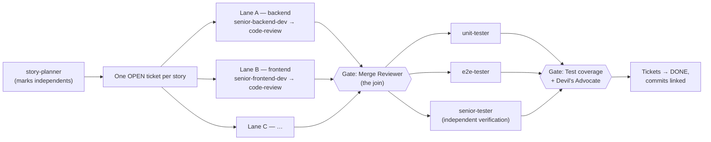

<div align="center">

# claude-kit

### Evidence-gated SDLC for Claude Code — with native Codex support in Preview

**Turn an agent host into a disciplined engineering team: `/sdlc <task>` in Claude Code and
`$sdlc <task>` in Codex load the same spec → review → code → test → security → PR contract, with a
quality gate between every phase. The Python ledger enforces gate order; Codex is Preview, and any
managed stage whose native safety boundary cannot be proven stops before launch.**

The differentiator is trust: **every gate verdict must cite real command output, and the
deterministic state layer refuses to close a gate out of order or with unresolved
Critical/High findings; Medium findings require a separate, structured human risk acceptance.** It
installs as **configuration, not a runtime** — no application code and no daemon: native host
configuration, local hooks, and a small lifecycle CLI.

</div>

**Proof over pitch:** in the captured run in [`examples/real-run/`](examples/real-run/), a unanimous
review PASS triggered the adversarial `devils-advocate` — it caught a Medium bug every reviewer had
missed, and the gate refused to advance until the fix landed. The run is checked in verbatim: state
file, agent verdicts, diff, asciicast.

```bash
pipx install claude-code-kit
ckit init . --defaults --runtime claude
```

<!-- DEMO PLACEHOLDER — a 60–90s terminal capture of a gated `/sdlc` run belongs here once recorded.
     Shot list, timing, and which real assets to show: docs/launch/demo-script.md.
     The recording replays the genuine run already in examples/real-run/ (the devils-advocate catching a
     Medium bug a unanimous review missed, and the gate refusing to advance until it was fixed).
     Until the GIF exists, that folder IS the evidence — linked from "How it works" and "The pipeline" below. -->

<div align="center">

[](https://pypi.org/project/claude-code-kit/)
[](https://pypi.org/project/claude-code-kit/)
[](LICENSE)
[](https://www.claude.com/product/claude-code)
[](https://github.com/ajyadav013/claude-kit/actions/workflows/ci.yml)
[](CHANGELOG.md)

⚡ [Quick start](#quick-start) · 🧭 [How it works](#how-it-works) · 🔁 [The pipeline](#the-pipeline) · ⚖️ [Compare](#how-claude-kit-compares) · 🔒 [Security](#security--trust-model) · 📚 [Docs](#docs--deeper-reference)

</div>

---

## What is this?

Agentic coding hosts are brilliant at single tasks — but a real change is never just one task. It's
a spec, a plan, code, review, tests, a security pass, and a PR. **claude-kit turns that lifecycle into
a pipeline of focused agents and compiles one provider-neutral plan into native host configuration.**

Your request flows through specialists — a spec writer, a developer, independent reviewers, testers,
security scanners, a PR raiser — coordinated by an **Orchestrator** that runs independent work in
parallel and **refuses to advance until each phase's quality gate passes**. Choose your stack, rigor,
and team scope at `init`; everything else adapts.

**Use claude-kit if** you drive real repository changes with Claude Code, or are evaluating the
Codex Preview, and want a repeatable spec → review → test → security → PR workflow whose kit ledger
will not advance on an unproven verdict.

**Skip it if** you want a small prompt pack, don't want project config written into your repo, or need a
standalone runtime/daemon. claude-kit is **configuration for the selected host**, not a separate
runtime. Its guard hooks are convenience guardrails (they need `jq` + a POSIX shell and no-op without
them), **not a hardened security boundary**. See [Known limitations](docs/KNOWN_LIMITATIONS.md).

---

## Quick start

Install once; `ckit` is the recommended command (`claude-kit` and `claude-sdlc` remain aliases):

```bash
pipx install claude-code-kit
```

Choose exactly one native deployment:

```bash
# Claude Code — stable
ckit init . --defaults --runtime claude
ckit validate . --strict

# Codex — Preview, explicit opt-in
CKIT_EXPERIMENTAL=1 ckit init . --defaults --runtime codex
ckit validate . --strict

# Both native surfaces, one shared control plane — Preview
CKIT_EXPERIMENTAL=1 ckit init . --defaults --runtime both
ckit validate . --strict
```

Restart Claude Code and invoke `/sdlc <task>`. In a trusted Codex project, invoke `$sdlc <task>`.
Codex and `both` stay Preview until the protected live-host gates in the
[runtime support contract](docs/runtime-support.md) pass.

Fresh native installs have these topologies (selected profile/stack/scope changes the contents):

```text
claude:  CLAUDE.md + .claude/{agents,hooks,rules,scripts,skills,templates} + one .ckit/
codex:   AGENTS.md + .agents/skills + .codex/{agents,config.toml,hooks.json,hooks} + one .ckit/
both:    both native surfaces above + exactly one shared .ckit/
```

`.ckit` owns continuity, the install/checksum manifest, upgrade journal, agent memory, artifacts,
and the pipeline gate ledger. Do not duplicate it under `.claude` or `.codex`. Exact trees,
interactive/config examples, plugin installation, trust, and migration:
**[docs/install.md](docs/install.md)**.

The static plugins are useful but intentionally narrower than the scaffold: they cannot select a
stack/profile/scope, create `.ckit`, migrate or upgrade a project, or install project instruction and
custom-agent surfaces. For a project-native installation, use `ckit init`.

---

## What you get

| Area | What you get |
|------|--------------|
| 🔁 **Pipeline & quality gates** | Explicit start/adopt lifecycle and ordered progression: Critical/High always block; Medium requires a distinct, structured accepted-risk record; conditional gates need configured not-applicable evidence; plus a fast-track and `devils-advocate` pass. Preview `ckit pipeline run --provider …` freezes/resumes Modes A–D; Mode E additionally requires `--program-manifest` and records typed waves, units, evidence, budgets, gates, and checkpoints. Every mode fail-closes before capabilities the selected adapter cannot safely attest |
| 🤖 **Agent roster** | **29** tiered agents led by an Orchestrator that never writes code, plus per-database overlay agents and 6 org personas ([full roster](docs/agents.md)) |
| 📐 **Rules & skills** | **25** stack-agnostic core rules + **126** context-activated skills (63 core + 63 stack-collection): 122 user-facing canonical skills plus 4 generated legacy-command adapters; pulled into context on demand |
| 🧱 **Stacks & overlays** | A stack-agnostic core + **15** overlay rule files (React · FastAPI · Django · Go · Express · Postgres · Mongo) wired to your exact commands and path-scoped to load only when you touch matching files |
| 🛠️ **Hooks & guards** | **20** event hooks — deterministic safety guards and advisory warnings — that no-op gracefully without `jq` |
| 📊 **Traceability & live board** | A git-native ticket per story with a work-log and commit linkage, plus `ckit tickets` — a terminal chart and a click-through browser Kanban board. Claude transcript metadata can enrich it; automatic Codex host telemetry is currently unsupported ([below](#parallel-lanes-and-the-live-ticket-board)) |
| 📦 **Distribution & lifecycle** | Provider plugins plus pip from canonical sources, **24** ready MCP fragments (version-pinned), native Claude/Codex projections, one shared `.ckit` control plane, and edit-preserving upgrades |

Profiles (`lean` · `standard` · `enterprise`), team scopes, autonomy levels, and org capability
packs decide how much of this actually installs — see
[Profiles & what lands in your project](#profiles--what-lands-in-your-project).

---

## How it works

Four ideas do the heavy lifting:

1. **Evidence or it didn't happen.** Every gate verdict — PASS or FAIL — must cite the command that
   ran and its captured output. A verdict that's invented, assumed, or read off still-running work
   is an **auto-Critical finding** — the same severity as a hardcoded secret
   ([`quality-gates.md` §2.5](rules/quality-gates.md)).
2. **Quality gates with a shared severity model.** Every finding is classified
   Critical / High / Medium / Low / Cosmetic. Critical and High always block. Medium never becomes an
   ordinary pass: proceeding requires a structured, human-attested `accepted-risk` record tied to
   the current gate, commit, findings, and evidence. No silent advancement.
3. **RARV self-check.** Every agent runs **R**eason → **A**ct → **R**eflect → **V**erify and must show
   a *green Verify* (real commands run, not imagined) before handing off.
4. **Blind review + Devil's Advocate.** Parallel reviewers judge independently; a *unanimous* PASS
   triggers an adversarial `devils-advocate` pass before the gate may close — an explicit guard
   against agents rubber-stamping each other.

See [`docs/architecture.md`](docs/architecture.md) for the full diagrams, including how the canonical
payload compiles into provider-native projections without branching catalog resolution.

---

## The pipeline

`/sdlc` in Claude Code, or `$sdlc` in Codex, reads the profile you chose and selects **only that
profile's gates**. Native delegation and the provider-neutral ledger drive the flow; the managed
subprocess path remains Preview and fails closed when its adapter cannot attest a required
capability:


```mermaid
flowchart TD
    REQ(["sdlc request"]) --> CLS{"Classify"}
    CLS -->|"feature"| SPEC["Spec & Dev Docs"]
    SPEC --> EM{{"Gate: EM approved"}}
    EM -->|"pass"| STORY["Story breakdown + coverage gate<br/>story-planner"]
    STORY --> LANES["Parallel lanes:<br/>Senior Dev → Architect → Developer → Code Review"]
    LANES --> MR{{"Gate: Merge Reviewer"}}
    MR --> TEST["Unit · E2E · Integration + Senior verification"]
    TEST --> TCG{{"Gate: Test coverage<br/>+ Devil's Advocate"}}
    TCG --> SEC{{"Gate: Security Clear"}}
    SEC --> OPS{{"Gates: Pipeline Green ·<br/>Observability Ready · Acceptance"}}
    OPS --> PR["PR Raiser"] --> HUMAN(["Human review + deploy"])
    CLS -->|"fast-track (<5 files)"| FT["Developer → Review → Test → PR"] --> HUMAN
```

| Profile | Gates that run |
|---|---|
| **lean** | code-review · build-green |
| **standard** | spec-complete · em-approved · code-review · build-green · contract-clear\* · test-coverage · security-clear |
| **enterprise** | standard + pipeline-green · observability-ready · acceptance |

\* `contract-clear` (API breaking-change diff) is conditional: when the stack exposes no API
surface, it may be marked `not-applicable` only with the configured condition and current evidence.
A **fast-track** mode collapses small changes (< 5 files) to Developer → Code Reviewer → Tester → PR;
organization scope at `regulated` strictness adds `accessibility-clear` (WCAG-AA on changed UI).

The state layer does not infer that a run has begun. `ckit pipeline start` opens a fresh run at
its first active gate; work already in flight must use `pipeline adopt` with a reason and adopting
identity. Gate results are recorded with `close-gate`, `not-applicable`, or `accept-risk`, then the
run ends explicitly with `complete` or `abort`. Before any gate transition, `record-findings` binds
all five exact severity counts to a project-contained report and the current commit; a new commit or
report requires a fresh record. `status` and `validate --json` expose adoption and accepted-risk
records without translating them into PASS.

See the real captured run in [`examples/real-run/`](examples/real-run/) — a feature driven through
every gate on a Go project, with the verbatim state file, agent verdicts, diff, and an asciicast —
or the [synthetic walkthrough](examples/react-fastapi-postgres-feature/) of the default stack. To
capture your own publishable run: [`docs/capture-a-real-run.md`](docs/capture-a-real-run.md).

---

## Parallel lanes and the live ticket board

The orchestrator never writes code — it splits work, spawns agents, and refuses to advance a gate.
Once the spec clears the EM gate, `story-planner` produces stories and marks which ones are
**independent**. Each independent story becomes a **lane**: its own ticket, its own branch, its own
implement → review → test loop, running at the same time as the others.


```mermaid
flowchart LR
    STORY["story-planner<br/>(marks independents)"] --> TK["One OPEN ticket per story"]
    TK --> L1["Lane A — backend<br/>senior-backend-dev → code-review"]
    TK --> L2["Lane B — frontend<br/>senior-frontend-dev → code-review"]
    TK --> L3["Lane C — …"]
    L1 --> MR{{"Gate: Merge Reviewer<br/>(the join)"}}
    L2 --> MR
    L3 --> MR
    MR --> T1["unit-tester"]
    MR --> T2["e2e-tester"]
    MR --> T3["senior-tester<br/>(independent verification)"]
    T1 --> TCG{{"Gate: Test coverage<br/>+ Devil's Advocate"}}
    T2 --> TCG
    T3 --> TCG
    TCG --> DONE["Tickets → DONE,<br/>commits linked"]
```

Two things make this observable rather than a black box:

- **A ticket is opened before any lane starts** and accumulates a work-log entry per meaningful step —
  what changed, why, which files, what was decided (`ticketing-and-traceability`). Commits carry the
  ticket id, so `git log --grep=` walks it in either direction.
- **Lanes are branches, and Claude telemetry is keyed on the branch.** `ckit tickets` can read Claude
  Code session transcripts (metadata only — usage counters, model id, agent name, timestamp) and
  attributes tokens, cache, elapsed time, and the agent that ran to whichever ticket names that
  branch. The shared ticket store and board work in a Codex project, but automatic Codex host
  telemetry capture is explicitly unsupported today.

### The board

```bash
ckit tickets                # board: one row per ticket, in-progress first
ckit tickets --watch 5      # re-render every 5s while a run is in flight
ckit tickets --graph        # dependency DAG — what is blocked by what
ckit tickets --graph-git    # the commit graph with each commit's ticket attached
ckit tickets CKIT-74        # one ticket: full work log + available telemetry
ckit tickets --html         # a Kanban board in your browser
ckit tickets --open         # the same board, opened for you
```

`--html` writes a self-contained page to `.ckit/state/ticket-board.html` on a native install and
prints a `file://` URL;
`--open` does that and launches your browser (and quietly falls back to the printed path on a headless
box). **`/sdlc` runs `--open` for you** the moment it creates the tickets, before any implementation
agent starts — so you watch the run rather than reading chat for status.

It is a **file, not a server** — the page refreshes itself and the `capture-ticket-telemetry` Stop hook
rewrites it after each turn, so an open tab tracks a running pipeline live with nothing daemonised.
A header strip shows which gate the pipeline is on, and clicking any card opens a full issue view —
spec, design, stage, files, commits, per-agent telemetry and the work log — all with **no JavaScript
at all**, so the page makes zero network requests and leaks nothing:


Token counts are **deduplicated by request id** — streaming rewrites the same usage block many times,
and a naive sum overstates output by ~3× — and cache reads are counted separately from fresh input
because they routinely differ by three orders of magnitude. Full reference:
[`docs/cli.md`](docs/cli.md#the-ticket-chart-ckit-tickets).

---

## Profiles & what lands in your project

The profile you pick decides how much canonical content is projected into the selected native
surface. Measured on a React + FastAPI + PostgreSQL project, individual scope:

| Profile | Agents | Skills | Rules |
|---------|-------:|-------:|------:|
| `lean` | 8 | 15 | 36 |
| `standard` (default) | 26 | 43 | 36 |
| `enterprise` | 31 | 108 | 36 |

- **Rules are profile-independent** — every profile installs the same 25 core rules + the selected
  stack's overlays (11 for this stack = 36); rigor changes the *agents and gates*, not the rule set.
- **Installs are stack-true** — every lane offers `none`, and a lane you don't have installs
  nothing: a backend-only project gets no React rules, frontend skills, or npm commands.
- **`enterprise` installs the whole skill collection** — including stacks you didn't select. That's
  disk footprint, not always-resident context, but prefer `standard` for a tighter install. See
  [`docs/skill-audit.md`](docs/skill-audit.md).

Organization scope adds teams, 5 autonomy levels, review strictness, and capability packs — see
[`docs/org-capabilities.md`](docs/org-capabilities.md).

---

## How claude-kit compares

The closest alternative is just **using a host's own subagents** — and that's the comparison that
matters most: **the host gives you agents; claude-kit gives you a repeatable governance layer.**

| Compared to… | What it is | What claude-kit adds |
|---|---|---|
| **Native Claude Code or Codex subagents** | Spawn agents on demand; you define workflow and verification yourself each time | A structured workflow with owned gates, evidence requirements, the `devils-advocate` anti-rubber-stamp pass, and resume from the shared pipeline state file. Codex persona/delegation behavior remains a Preview proof gap |
| **[wshobson/agents](https://github.com/wshobson/agents)** & similar collections | Large libraries of individual subagent prompts you pick from | A smaller, opinionated set wired into a sequenced pipeline — agents are stages that hand off and block on each other, not a menu |
| **[GitHub spec-kit](https://github.com/github/spec-kit)** | Spec-driven development as a platform: constitution → spec → tasks → analyze, plus label-driven CI stages | The same coverage-gate idea absorbed into a broader in-session lifecycle — review, security, build, test, release, and observability gates with enforced severity blocking. Complementary: their CI stages, this kit's gate depth ([details](docs/autonomous-operation.md)) |
| **claude-flow / multi-agent runtimes** | Long-lived runtime orchestrators that execute swarms of agents | Portable configuration plus an optional bounded Preview CLI coordinator for one active workflow — no daemon, no app code, and the native hosts remain the worker runtimes |
| **dotfiles / instruction-file starters** | A single rules file or settings snippet | A catalog-driven compiler: resolves your stack/profile/scope into the right subset of 25 rules, 29 agents, 126 skills, gates, and hooks — 122 are user-facing capabilities and 4 are generated legacy-command adapters; generated surfaces stay upgradeable while preserving user edits |

**Choose claude-kit when** you want a consistent, gate-enforced autonomous-SDLC setup that's the
same across every repo and stack and installs in seconds. It is **not** an application runtime or a
daemon — it is a configuration compiler with an optional bounded managed-execution command that
launches the selected native host and checkpoints in `.ckit`. Claude Code support is stable; Codex
support and managed execution are Preview, with degraded or unsupported mappings listed rather than
hidden. The bundled managed subprocess backend runs exact-tool no-shell Claude roles and a narrowly
bounded class of passive Codex roles. The Codex path is available only for an exact audited CLI pin
after a local lockdown probe disables command, hook, plugin, MCP, browser, app, and delegation
surfaces; it receives a bounded, filtered projection of tracked text in a read-only sandbox. Any
shell, write, delegation, browser, MCP, or external-effect requirement still needs an independently
contained backend and stops before spawn. Managed human approval is also fail-closed until the
runtime can bind and consume a stage/action/workspace-scoped authorization; generic local evidence
is not treated as consent.

---

## Native runtimes and generic editor export

Use `ckit init --runtime codex` for Codex. The older generic `agents` export is a portable
single-document target, **not** the native Codex projection and not evidence of Codex parity.
For Cursor, generic AGENTS consumers, and GitHub Copilot, run:

```bash
ckit export . -t cursor -t agents -t copilot
```

**Fidelity is honest:** rules, the project charter, and MCP servers port cleanly; the *enforced*
gates, hooks, agents, and runtime state do not become native integrations through this export; they
travel as advisory prose where applicable. Full fidelity matrix:
[`docs/cursor-export.md`](docs/cursor-export.md).

---

## Influences & reuse-first

claude-kit evolves by reviewing excellent open-source projects and industry material, then adopting
**only the genuinely-new ideas** — each review fetches the real source, adversarially maps it against
the kit's existing files, and ships only the non-duplicative gaps (many reviews conclude with
"0 new agents/skills/rules" on purpose). The full adoption history — from Agentic Design Patterns
through the alibaba/microsoft/google/Meta/Netflix·aws·apple org reviews — lives in
[`docs/influences.md`](docs/influences.md), with per-release detail in the [CHANGELOG](CHANGELOG.md).

---

## Security & trust model

claude-kit installs **configuration only** — no application code, no Docker, nothing that runs as a
service. Its controls span several trust boundaries; the label matters more than the word "gate":

| Control | Enforcement type | Trust boundary |
|---|---|---|
| Gate order and lifecycle | Mechanically enforced | Python pipeline layer |
| Test result | Typed and semantically checked for managed A–E; manual file evidence remains Agent-enforced | Root-owned managed record or manually cited artifact |
| Hook guard | Hook-enforced | Requires a supported host hook adapter, project trust where applicable, POSIX shell, and `jq` |
| Security scanner result | Externally verified or Agent-enforced, depending on scanner | External tool output or scanner agent |
| Accepted risk | Human-attested | Structured record bound to gate, commit, evidence, and findings |
| MCP permissions | Externally verified plus local policy | External server and selected host; **not a sandbox** |
| Local evidence hash | Mechanically enforced content-integrity check | Detects artifact drift; a writer can change both file and ledger |

Other prose requirements are **Advisory** unless one of those layers enforces them. Three honest
caveats before you rely on the system:

- **The guard hooks are convenience, not a hardened boundary.** They raise the cost of a mistake but
  don't sandbox the agent; they need a POSIX shell + `jq` and silently no-op without them. Seatbelts,
  not walls.
- **Managed evidence is authoritative but not omniscient.** Managed A–D and Mode E require exact
  structured evidence sets, validate required fields and pass/finding semantics, and bind root-owned
  content-addressed records to the owning attempt. The manual file-evidence API still cannot prove
  that an arbitrary file means the tests passed, and even a structurally valid managed report can be
  factually wrong. Keep a human in the loop for anything that matters. Relatedly:
  provider permission and sandbox models are not interchangeable. Claude permission classes are
  projected where supported; Codex Preview preserves the intent in instructions and leaves the
  runtime's sandbox/approval policy authoritative. Do not claim equivalent per-agent confinement.
- **MCP servers are third-party code.** Each fragment runs an external package — pinned to an exact
  version, never `@latest` — that claude-kit references but does not vendor or audit. Review a
  server's source and license before enabling it.

Releases are published to PyPI via OIDC **Trusted Publishing** with **PEP 740 build attestations**.
Report vulnerabilities privately — see [`SECURITY.md`](SECURITY.md).

---

## Docs & deeper reference

| Doc | What's in it |
|---|---|
| [`docs/install.md`](docs/install.md) | Every install detail: prerequisites, Windows, plugin updates, all `init` questions, `init.yaml`, what lands on disk |
| [`docs/runtime-support.md`](docs/runtime-support.md) | Normative Native / Adapted / Degraded / Unsupported matrix and Codex Preview promotion gates |
| [`docs/runtime-migration.md`](docs/runtime-migration.md) | Non-destructive `.claude` → `.ckit` migration and every runtime transition |
| [`docs/cli.md`](docs/cli.md) | Full CLI command reference, safe-upgrade mechanics, troubleshooting |
| [`docs/agents.md`](docs/agents.md) | How to drive the agents + the full 29-agent roster and per-run cost |
| [`docs/architecture.md`](docs/architecture.md) | Diagrams: distribution, catalog resolution, the state machine — and how to extend via the catalog |
| [`docs/influences.md`](docs/influences.md) | The reuse-first adoption history: what we learned, shipped, and deliberately skipped |
| [`docs/autonomous-operation.md`](docs/autonomous-operation.md) | Unattended-run boundary: current fail-closed headless interface, permission/sandbox limits, and promotion requirements |
| [`docs/cursor-export.md`](docs/cursor-export.md) | Export fidelity matrix and `.mdc` mapping |
| [`docs/org-capabilities.md`](docs/org-capabilities.md) | Organization scope: packs, personas, autonomy, review strictness |
| [`docs/skill-audit.md`](docs/skill-audit.md) | Per-profile skill footprint and context economics |
| [`docs/KNOWN_LIMITATIONS.md`](docs/KNOWN_LIMITATIONS.md) | What the kit deliberately does not claim |
| [`examples/real-run/`](examples/real-run/) | The captured, gated real run (evidence, not marketing) |
| [`CONTRIBUTING.md`](CONTRIBUTING.md) | Contributor workflow; [`CLAUDE.md`](CLAUDE.md) covers developing the kit itself |

---

## Contributing

Issues and PRs welcome — see [`CONTRIBUTING.md`](CONTRIBUTING.md). To dogfood a local checkout:

```bash
# As a plugin:  /plugin marketplace add .   then   /plugin install claude-kit@claude-kit
# As the CLI:   pip install -e '.[dev]'   then   ckit init ./ck-demo --defaults --runtime claude   &&   pytest
```

## License

[MIT](LICENSE) © Arjunsingh Yadav

claude-kit is an independent open-source project — not affiliated with or endorsed by Anthropic.
