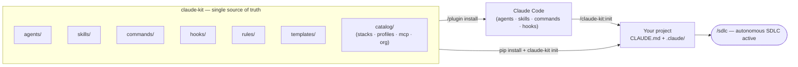

<div align="center">

# claude-kit

**The autonomous SDLC for [Claude Code](https://www.claude.com/product/claude-code) that won't pass a gate on an unproven verdict.**

It turns a one-line request into reviewed, tested, secured, shippable code — but the moat is *trust*:
every quality gate between phases passes **only** on real, cited command output. A fabricated,
assumed, or partial-output "it works" is itself an auto-Critical finding — so a green result means the
checks actually ran. A Cookiecutter-style scaffolder, installed as **configuration only — no
application code, no Docker.**

<!-- DEMO PLACEHOLDER — a 60–90s terminal capture of a gated `/sdlc` run belongs here once recorded.
     Shot list, timing, and which real assets to show: docs/launch/demo-script.md.
     The recording replays the genuine run already in examples/real-run/ (the devils-advocate catching a
     Medium bug a unanimous review missed, and the gate refusing to advance until it was fixed).
     Until the GIF exists, that folder IS the evidence — linked from "How it works" and "The pipeline" below. -->

[](https://pypi.org/project/claude-code-kit/)
[](https://pypi.org/project/claude-code-kit/)
[](LICENSE)
[](https://www.claude.com/product/claude-code)
[](https://github.com/ajyadav013/claude-kit/actions/workflows/ci.yml)
[](CHANGELOG.md)

✨ [Features](#features) · ⚡ [60-second start](#60-second-first-win) · 🚀 [Quick start](#quick-start) · 🧭 [How it works](#how-it-works) · ⚖️ [Compare](#how-claude-kit-compares) · 🔁 [The pipeline](#the-pipeline) · 🧪 [Example](examples/) · 🌱 [What we adopted](#influences--what-we-adopted) · 🤖 [Agents](#the-agents) · 🧩 [Catalog](#catalog--extensibility) · 🛠️ [CLI](#cli-reference) · 🔒 [Security](#security--trust-model)

</div>

---

## What is this?

Claude Code is brilliant at single tasks — but a real change is never just one task. It's a spec, a
plan, code, review, tests, a security pass, a PR. **claude-kit turns that whole lifecycle into a
pipeline of focused agents and installs it into Claude Code as configuration.**

Instead of one assistant doing everything in a single pass, your request flows through specialists — a
spec writer, a story planner, a developer, independent reviewers, testers, security scanners, a PR
raiser — coordinated by an **Orchestrator** that runs independent work in parallel and **refuses to
advance until each phase's quality gate passes**. You drive it all with one command:
**`/sdlc <your task>`**.

It ships **no application code and needs no Docker** — only the rules, agents, skills, and gates that
govern *how* the work gets done. (Some skills *help Claude write* your Dockerfiles, CI, or k8s manifests
when you ask — but the scaffolder itself installs none.) Choose your stack, rigor, and team scope at
`init`; everything else adapts.

> Inspired by the autonomous-SDLC idea, rebuilt from the ground up **for Claude Code**, and kept small
> by a **reuse-first** policy — see [what we adopted](#influences--what-we-adopted) and from where.

---

## Who this is for

**Use claude-kit if** you drive real repository changes with Claude Code and want a repeatable
spec → review → test → security → PR workflow whose quality gates won't advance on an unproven verdict.

**Skip it if** you want a small prompt pack, don't want project config written into your repo, or need a
standalone runtime/daemon. claude-kit is **configuration for Claude Code**, not a separate runtime — and
its guard hooks are convenience guardrails (they need `jq` + a POSIX shell and no-op without them), **not
a hardened security boundary**. See [Known limitations](docs/KNOWN_LIMITATIONS.md).

---

## Features

The whole product at a glance — one line each. Expand **[Feature details](#feature-details)** (below
Quick start) for the full breakdown of any row.

| Area | What you get |
|------|--------------|
| 🔁 **Pipeline & quality gates** | Gate-enforced progression (zero open Critical/High/Medium to advance), per-profile gate sets, a fast-track for small changes, and an anti-sycophancy `devils-advocate` pass |
| 🤖 **Agent roster** | **28** tiered agents + per-database overlays + **6** org personas, led by an Orchestrator that never writes code |
| 🔍 **Self-verification & review** | RARV green-Verify (real commands, not imagined), blind parallel review, and read-only risk classification |
| 📐 **Rules & skills** | **25** stack-agnostic core rules (incl. 8 agent-operation rules) + **104** context-activated skills (56 core + 48 stack-collection) |
| 🧱 **Stacks & overlays** | Stack-agnostic core + **13** overlay rule files (React · FastAPI · Go · Postgres · Mongo) wired to your exact commands, incl. a full React design system — path-scoped so they load only when you touch matching files |
| 🎚️ **Profiles, scopes & org** | **3** rigor profiles · **3** scopes · **5** autonomy levels · **7** org packs + **10** policy rules |
| 🧠 **Memory & learning** | Working memory across context compaction + a cost-aware learnings loop (`capture_mode`) so the same mistake isn't repeated |
| 🛠️ **Hooks & guards** | **18** event hooks — blocking safety guards vs. advisory warnings — that no-op gracefully without `jq` |
| 📦 **Distribution & lifecycle** | Plugin **and** pip from one source, **17** ready MCP fragments, edit-preserving `upgrade`, and a root `AGENTS.md` emitted at init so non-Claude agents (Cursor · Copilot · Codex) share the same standards |
| ♻️ **Reuse-first by design** | Adopt-only-the-new reviews, opt-in LLM/AI security (OWASP LLM Top 10), a worked example + self-test matrix |

---

## 60-second first win

The fastest path to a gated run — **no CLI install, no `init`, no restart:**

```text
/plugin marketplace add ajyadav013/claude-kit
/plugin install claude-kit
/claude-kit:sdlc Add a /health endpoint that returns the build version
```

The plugin loads the Orchestrator and its specialist agents on install, so `/claude-kit:sdlc` runs the
**standard pipeline immediately** — spec → review → build → test, gate by gate — and drives Claude Code
to produce the change with a verdict backed by real output. That's the whole loop in three lines.

When you want it tuned to *your* repo, run `claude-kit init` (next section): it resolves your
stack/profile, wires your exact build/test/lint commands, installs the safety hooks, and turns on
edit-preserving `upgrade`. Pre-`init` runs just use the standard defaults.

---

## Quick start

<details open>
<summary><b>A) As a Claude Code plugin&nbsp; (recommended)</b></summary>

<br>

Makes all agents, skills, commands, and hooks available inside Claude Code:

```text
/plugin marketplace add ajyadav013/claude-kit
/plugin install claude-kit
```

Then, inside any project you want the pipeline to manage:

```text
/claude-kit:init        # Claude asks you the questions in chat, then runs the CLI non-interactively
# ↻ restart Claude Code so the project's agents, skills & hooks load
/sdlc Add a CSV export button to the reports page
```

> **`/claude-kit:init` requires the Python CLI** (`pipx install claude-code-kit`, or `pip install
> claude-code-kit`) — it's what resolves your stack/profile/MCP catalog and records `init-options.json`
> for safe `upgrade`/`diff`. If the CLI isn't on PATH the command stops and tells you to install it
> rather than doing a partial install. (A degraded, no-resolution shell scaffolder is available only by
> explicitly setting `CLAUDE_KIT_BASIC=1`; `upgrade`/`diff` won't work against it.)

> `/sdlc` is a **project skill** installed by `init`, so it becomes available after the restart. The
> plugin also exposes `/claude-kit:sdlc <task>`, which works immediately (no restart needed).

**Updating the plugin** to a newer release later (the plugin is cached, so a plain `/reload-plugins`
won't fetch new code — refresh the marketplace snapshot first):

```text
/plugin marketplace update claude-kit   # refresh the marketplace snapshot from the repo
/plugin update claude-kit@claude-kit    # install the newer version into the cache
/reload-plugins                         # load it into the running session
```

</details>

<details>
<summary><b>B) As a pip package&nbsp; (CI, onboarding, non-plugin workflows)</b></summary>

<br>

A CLI (`claude-kit`, aliases `ckit` / `claude-sdlc`) that scaffolds the same config into any repo:

```bash
pip install claude-code-kit
# or, for the bleeding edge straight from the repo:
#   pip install "git+https://github.com/ajyadav013/claude-kit.git"

claude-kit init                 # interactive: prompts for stack, profile, MCP
claude-kit init --defaults      # non-interactive: React + Python/FastAPI + Postgres + standard
```

</details>

> **Prerequisites:** [Claude Code](https://www.claude.com/product/claude-code); Python ≥ 3.9 for the
> CLI; `jq` to enable the shell hooks (they no-op without it); Node / `npx` only if you enable an MCP
> (Model Context Protocol) server.
>
> **Windows:** the config (agents · skills · rules) and the `claude-kit` CLI work natively. The shell
> hooks (`guard-*`, `warn-*`) need a POSIX shell + `jq`, so run inside **WSL or Git Bash** to enable
> them — `claude-kit doctor` detects Windows and tells you which case you're in. Without a POSIX shell
> the hooks silently no-op (the kit still functions; you just lose the deterministic guards).

<details>
<summary><b>What the init flow asks &amp; what lands on disk</b></summary>

<br>

`claude-kit init` asks an ordered set of questions (all with sensible defaults), then writes the
config — nothing else:

1. **Target path** (default: current dir; if `.claude/` exists → **merge / overwrite / backup / abort**)
2. **Frontend framework** (default: React; `none` for backend-only projects) → **frontend language** (default: TypeScript; skipped for `none`)
3. **Backend language** (default: Python; `none` for frontend-only projects) → **backend framework** (default: FastAPI)
4. **Database** (PostgreSQL · MongoDB · `none`)
5. **SDLC profile** (`lean` · `standard` · `enterprise`)
6. **Optional MCP integrations** (GitHub · Jira/Linear · Azure DevOps · Postgres/Mongo · Playwright · Docs/MS Learn · Azure · Wassette · Google SecOps) — a
   project-root `.mcp.json` is written **only** if you select any (env placeholders, never secrets)
7. **Learning capture** (`session-end-catchup` default · `session-end` · `per-task` · `off`) — how often
   the background learnings job runs. *Privacy note:* it reads your session transcript + changed files
   to write `.claude/agent-memory/` entries (secret-bearing files skipped, secret-shaped values
   redacted); opt out anytime with `CLAUDE_KIT_NO_AUTOCAPTURE=1`
8. **Usage scope** (`individual` · `team` · `organization`) — organization scope asks four follow-ups:
   teams, autonomy level, review strictness, and org capability packs

Non-interactive equivalents: `--defaults`, or `--config init.yaml` — flat keys or this nested form:

```yaml
frontend: { framework: react, language: typescript }
backend:  { language: python, framework: fastapi }
database: postgres
profile:  standard                     # lean · standard · enterprise
mcp:      [github]                     # [] = none; ids from `claude-kit list-options`
capture_mode: session-end-catchup      # off · session-end · session-end-catchup · per-task
scope:    team                         # individual · team · organization (org adds org: {teams, autonomy, review_strictness, packs})
```

What lands:

```
CLAUDE.md                      # "Project-specific rules" filled from your stack's commands
README.claude-sdlc.md
.claude/
  settings.json                # assembled from the profile's hooks
  rules/                        # stack-agnostic core + selected overlay rules
  agents/                       # the profile's agent subset + DB overlay agents
  skills/  (incl. sdlc/)        # the profile's skill subset; sdlc/ is the /sdlc entrypoint
  hooks/                        # the profile's hook scripts
  templates/                    # artifact templates (spec, ADR, test-plan, …)
  config/                       # init-options.json (checksums) + stack snapshot
  state/  tmp/                  # gitignored runtime
.mcp.json                       # only if MCP servers were selected
```

</details>

---

## Use in Cursor / VS Code / Copilot (export)

A teammate who works in **Cursor**, **VS Code**, or **GitHub Copilot** can't consume `.claude/` or run
the gated multi-agent `/sdlc` pipeline — those editors drive their own single agent. `claude-kit
export` projects the **same resolved plan** into the formats those agents read natively, so the
standards travel even when the pipeline can't.

**`init` already emits `AGENTS.md` for you** — every scaffold lands the repo-root `AGENTS.md`
(the cross-tool convention with the [most-requested Claude Code integration](https://github.com/anthropics/claude-code/issues/6235)),
so non-Claude agents get the kit's standards from day one; a pre-existing `AGENTS.md` is never
clobbered. Use `export` to regenerate it or add the other targets:

```bash
claude-kit export .                              # → .cursor/ (default target)
claude-kit export . -t cursor -t agents -t copilot   # all three at once
claude-kit export . --dry-run                    # preview; writes nothing
```

| Target | Emits | What lands |
|---|---|---|
| `cursor` | `.cursor/rules/*.mdc` + `.cursor/mcp.json` | The full rule set (one on-demand `.mdc` each, overlays auto-attach by file glob), an always-applied `000-project.mdc` charter, and your MCP servers |
| `agents` | `AGENTS.md` (repo root) | Project charter + single-agent SDLC checklist + rule index (read by Cursor **and** Copilot) |
| `copilot` | `.github/copilot-instructions.md` | The same synthesized document as `agents` |

**Fidelity is honest.** Rules, the project charter, and MCP servers port cleanly. The **enforced**
quality gates, independent reviewer subagents, and automated defect loop are Claude-Code-only — the
export carries the SDLC workflow as a **single-agent self-check checklist**, not enforced gates. Every
exported document says so. Exports are regenerable projections: `--force` refreshes them in place, and
without it an unchanged file is reported as current while a hand-edited one is preserved (the new
version drops beside it as a `.claude-kit` sidecar).

See **[docs/cursor-export.md](docs/cursor-export.md)** for the full fidelity matrix and the `.mdc`
frontmatter mapping.

---

## Feature details

Each area from the [Features](#features) table, expanded — the README stays short; open only what you
need.

<details>
<summary><b>🔁 Pipeline & quality gates</b></summary>

<br>

- **Gate-enforced progression** — every phase ends in a quality gate that passes *only* with zero open
  Critical/High/Medium findings; no silent advancement (see [the pipeline](#the-pipeline)).
- **Profile-scoped gates** — `lean` runs `code-review · build-green`; `standard` adds spec / EM /
  coverage / security / contract; `enterprise` adds `pipeline-green · observability-ready · acceptance`.
- **Fast-track mode** — changes under 5 files collapse to Developer → Code Reviewer → Tester → PR,
  skipping the heavyweight stages.
- **Anti-sycophancy guard** — a *unanimous* PASS is treated as suspicious and triggers an adversarial
  `devils-advocate` pass before the gate may close.

</details>

<details>
<summary><b>🤖 The agent roster</b></summary>

<br>

- **28 specialized agents** in [`agents/`](agents/), each tagged with a `tier`
  (orchestrator · stage-lead · specialist · review) and installed per profile.
- **An Orchestrator that never writes code** — it decomposes work, runs independent lanes in parallel,
  and blocks each phase on its gate.
- **Database overlay agents** layer in per database — PostgreSQL adds
  `postgres-specialist · migration-specialist · db-performance-reviewer`; MongoDB adds
  `mongodb-specialist · migration-specialist`.
- **6 organization personas** (`pm-copilot` · `founder-prototype-agent` · `support-ticket-engineer` ·
  `data-workflow-agent` · `internal-tools-builder` · `staff-pm-reviewer`) unlock in org scope so
  non-engineers can drive work safely.

</details>

<details>
<summary><b>🔍 Self-verification & review</b></summary>

<br>

- **RARV self-check** — every agent runs Reason → Act → Reflect → Verify and must show a *green Verify*
  (real commands run, not imagined) before handing off.
- **Blind parallel review** — independent reviewers judge a work stream separately, and a
  `merge-reviewer` reconciles parallel lanes at every join point.
- **Risk-classified work** — a read-only `risk-classifier` labels each task low/medium/high/restricted
  and names the gates it requires (enterprise + org).

</details>

<details>
<summary><b>📐 Rules & skills</b></summary>

<br>

- **25 stack-agnostic core rules** in [`rules/`](rules/) — `mandatory-workflow`, `quality-gates`,
  `rarv-cycle`, `continuity`, `wave-orchestration`, plus eight agent-operation rules and `autonomy-levels` +
  `risk-classification` (see [`docs/agentic-patterns.md`](docs/agentic-patterns.md)).
- **104 on-demand skills** in [`skills/`](skills/) (56 core + 48 stack-collection) — spec-driven dev, planning, TDD, debugging, code
  review, threat modeling, and more — activated by context and led by the `sdlc` entrypoint.
- **Profile-subset install** — each profile installs a strict subset of agents, skills, hooks, and
  rules (`lean ⊂ standard ⊂ enterprise`), from fast track to full audit.

</details>

<details>
<summary><b>🧱 Stacks & overlays</b></summary>

<br>

- **Stack-agnostic core** — the pipeline assumes no language or framework; it never writes your app
  code and never needs Docker.
- **13 stack overlay rule files** layer matching guidance on top — React, FastAPI, Go/net-http,
  PostgreSQL, MongoDB — wired to your exact lint/test/build commands. Overlays are **path-scoped**
  (`paths:` frontmatter) so they enter context only when Claude touches matching files; MongoDB's
  stays always-on (a document store has no reliable file signal to scope by).
- **Installs are stack-true** — every lane offers `none` (backend-only, frontend-only, no-database
  projects), and a lane you don't have installs nothing: no off-stack rules, skills, agents, or
  commands. Frontend-specific skills ride the React selection, not the profile core.
- **A full React design system** — picking React installs design tokens, UX patterns, and
  mobile/Capacitor guidelines that the UI skills and `ui-designer` agent read.

</details>

<details>
<summary><b>🎚️ Profiles, scopes & the org layer</b></summary>

<br>

- **3 rigor profiles** — `lean ⊊ standard ⊊ enterprise` decide how many agents, skills, hooks, and
  gates are active.
- **3 usage scopes** — `individual` / `team` (default) / `organization`, with a vibe-coding layer in
  org scope.
- **5 autonomy levels** — from Advisory (plan & review only) through Autonomous (PR) to
  Enterprise-controlled, each adding deterministic guardrail hooks.
- **7 capability packs + 10 org policy rules** under [`templates/org/`](templates/org/) (secrets, PII,
  compliance, production-data) install only in organization scope (see
  [`docs/org-capabilities.md`](docs/org-capabilities.md)).

**What loads into your context** — the profile you pick decides how much lands in `.claude/`. Measured
on a React + FastAPI + PostgreSQL project, individual scope:

| Profile | Agents | Skills | Rules |
|---------|-------:|-------:|------:|
| `lean` | 8 | 15 | 36 |
| `standard` (default) | 26 | 42 | 36 |
| `enterprise` | 31 | 104 | 36 |

Skills are **stack-true**: the frontend-specific ones (component/unit tests, UI design, client API
integration, headed-browser QA) ride the React selection, so a backend-only project (frontend:
`none`) installs none of them — and no React rules or npm commands either.

- **Rules are profile-independent** — every profile installs the same 25 core rules + the selected
  stack's overlays (11 for this stack = 36); rigor changes the *agents and gates*, not the rule set.
- **Skills activate on demand** — they are installed and available, then pulled into context by task
  relevance, not all held resident at once. The count is what's on disk, not a fixed context tax.
- **Counts include stack overlays** — the numbers above already fold in the chosen stack (e.g. the
  Postgres overlay adds 3 agents, which is why `enterprise` shows 31 against a 28-agent core roster). A
  different stack shifts them by a few.
- **`enterprise` installs the whole skill collection** (`skills: all`) — all 104 skills, including
  collection skills for stacks you didn't select. That's disk/selection footprint, not always-resident
  context, but if you want a tighter install prefer `standard`. See [`docs/skill-audit.md`](docs/skill-audit.md).

</details>

<details>
<summary><b>🧠 Memory & continuous learning</b></summary>

<br>

- **Working memory across sessions** — `CONTINUITY.md` survives context compaction so the pipeline
  never loses its place.
- **A learnings loop** — `agent-memory/` captures fixes from your corrections *and*, in a non-blocking
  background job, from what Claude changed, so the same mistake isn't made twice.
- **Cost-aware capture** — how aggressively learnings are captured (`capture_mode`: off · on clean
  exit · + catch-up · per task) is a choice at `init`.

</details>

<details>
<summary><b>🛠️ Hooks & deterministic guards</b></summary>

<br>

- **18 event hook scripts** in [`hooks/`](hooks/) enforce the pipeline outside the model —
  `guard-secrets`, `guard-destructive-git`, `lint-fix`, `type-check`, and `validate-settings` run
  deterministically.
- **Advisory, never-blocking warnings** — `warn-llm-io`, `warn-large-edits`, `warn-missing-tests`, and
  `warn-sensitive-files` flag risk without halting work.
- **Graceful degradation** — hooks need a POSIX shell + `jq` and silently no-op when absent, so the
  kit still functions everywhere.

</details>

<details>
<summary><b>📦 Distribution & lifecycle</b></summary>

<br>

- **Two channels, one source** — a first-class Claude Code **plugin** *and* a `pip` scaffolder
  (`claude-kit` / `ckit` / `claude-sdlc`) generate identical config.
- **Catalog-driven extensibility** — adding a stack, framework, database, profile, MCP server, or org
  pack is a [`catalog/`](catalog/) YAML edit, never a code change; 17 MCP server fragments ship ready.
- **MCP servers are third-party** — each fragment runs an external package or hosted endpoint that
  claude-kit references but does not vendor or audit; the `npx` commands are **pinned to an exact
  version** (not `@latest`) for reproducible, supply-chain-aware installs. Review a server's source and
  license before enabling it, and bump pins deliberately. See [`SECURITY.md`](SECURITY.md).
- **Safe, edit-preserving upgrades** — `upgrade` refreshes kit/overlay files via per-file `owner` +
  checksum, never clobbers your edits, backs up changes, and restores deleted files (`diff` previews
  first).

</details>

<details>
<summary><b>♻️ Reuse-first by design</b></summary>

<br>

- **Adopt only the genuinely-new** — each external review fetches the real source, adversarially maps
  it against existing files, and ships only the non-duplicative gaps (see
  [what we adopted](#influences--what-we-adopted)).
- **Opt-in LLM/AI security** — `security-and-hardening` covers the OWASP LLM Top 10 (input/output
  guardrails, PII vault) as bypassable guidance, distinct from the mandatory appsec gate.
- **A real captured run + self-test matrix** — [`examples/real-run/`](examples/real-run/) is a genuine
  run captured by the `capture-sdlc-run.sh` harness, where the `devils-advocate` found and reproduced a
  Medium bug a unanimous review missed; a profile×stack×scope test matrix backs the stack-agnostic claim.

</details>

---

## How it works


```mermaid
flowchart LR
    subgraph SRC["claude-kit — single source of truth"]
        direction TB
        A["agents/"]
        S["skills/"]
        C["commands/"]
        H["hooks/"]
        R["rules/"]
        T["templates/"]
        K["catalog/<br/>(stacks · profiles · mcp · org)"]
    end
    SRC -->|"pip install + claude-kit init"| PROJ["Your project<br/>CLAUDE.md + .claude/"]
    SRC -->|"/plugin install"| CC["Claude Code<br/>(agents · skills · commands · hooks)"]
    CC -->|"/claude-kit:init"| PROJ
    PROJ --> RUN(["/sdlc — autonomous SDLC active"])
```

Four ideas do the heavy lifting:

1. **Evidence or it didn't happen.** Every gate verdict — PASS or FAIL — must cite the command that
   ran and its captured output (or the `file:line` it rests on). A verdict that's invented, assumed,
   or read off still-running work is an **auto-Critical finding** — the same severity as a hardcoded
   secret — and it fails every downstream gate that trusted it
   ([`quality-gates.md` §2.5](rules/quality-gates.md)).
2. **Quality gates with a shared severity model.** Every finding is classified
   Critical / High / Medium / Low / Cosmetic. A gate passes **only** with zero Critical/High/Medium
   open. No silent advancement.
3. **RARV self-check.** Every agent runs **R**eason → **A**ct → **R**eflect → **V**erify and must show
   a *green Verify* (real commands run, not imagined) before handing off.
4. **Blind review + Devil's Advocate.** Parallel reviewers judge independently; a *unanimous* PASS is
   treated as suspicious and triggers an adversarial `devils-advocate` pass before the gate may close —
   an explicit guard against agents rubber-stamping each other.

See [`docs/architecture.md`](docs/architecture.md) for the full diagrams.

---

## How claude-kit compares

The closest alternative is just **using Claude Code's own subagents** — and that's the comparison that
matters most. Native gives you the agents; claude-kit gives you the **governance**: a fixed pipeline,
owned gates, and the rule that **no gate passes on an unproven verdict**.

| Compared to… | What it is | What claude-kit adds |
|---|---|---|
| **Native Claude Code subagents / Agent Teams** | Spawn parallel agents on demand; you define the workflow, gates, and verification yourself each time | The **opinionated layer on top** of exactly that capability: a fixed, sequenced pipeline with **owned quality gates** (block on any open Critical/High/Medium), an **evidence requirement** (no fabricated verdicts — `quality-gates.md` §2.5), a `devils-advocate` anti-rubber-stamp pass, and **structured resume** from `.claude/state/pipeline-snapshot.json`. Native gives you the agents; claude-kit gives you the governance. |
| **[wshobson/agents](https://github.com/wshobson/agents)** & similar agent collections | Large libraries of individual subagent prompts you pick from | A **smaller, opinionated set wired into a sequenced pipeline with owned quality gates** — agents aren't a menu, they're stages that hand off and block on each other. Adopt-by-reuse, not by accumulation. |
| **[GitHub spec-kit](https://github.com/github/spec-kit)** | A spec-driven workflow (constitution → spec → tasks → analyze) | The same coverage-gate idea (the `story-planner` 1f gate + `task-tracker-sync`) **absorbed into a broader** lifecycle that also covers review, security, build, test, release, and observability gates. Complementary, wider scope. |
| **claude-flow / multi-agent runtimes** | Runtime orchestrators that *execute* swarms of agents | **Portable configuration**, not a running process — the orchestration is described in rules the host (Claude Code) executes. No daemon, no lock-in, no app code. |
| **dotfiles / `CLAUDE.md` starters** | A single rules file or settings snippet | A **catalog-driven generator**: resolves your stack/profile/scope into the right subset of 25 rules, 28 agents, 104 skills, gates, and hooks, kept **upgradeable** (`claude-kit upgrade` preserves your edits via owner + checksum). |

**Choose claude-kit when** you want a consistent, reviewable, **gate-enforced** autonomous-SDLC setup
that's the same across every repo and stack, installs in seconds, ships nothing you have to run, and
**evolves reuse-first** rather than by piling on near-duplicate agents. It is **not** a runtime, an
orchestration engine, or a code library — it's the configuration that makes Claude Code's agents
behave like a disciplined team.

---

## The pipeline

`/sdlc` reads the profile you chose and runs **only that profile's gates**:


```mermaid
flowchart TD
    REQ(["/sdlc request"]) --> CLS{"Classify"}
    CLS -->|"feature"| SPEC["Spec & Dev Docs"]
    SPEC --> EM{{"Gate: EM approved"}}
    EM -->|"pass"| STORY["Story breakdown + coverage gate<br/>story-planner"]
    STORY --> LANES["Parallel lanes:<br/>Senior Dev → Architect → Developer → Code Review"]
    LANES --> MR{{"Gate: Merge Reviewer"}}
    MR --> TEST["Unit · E2E · Integration + Senior verification"]
    TEST --> TCG{{"Gate: Test coverage<br/>+ Devil's Advocate"}}
    TCG --> SEC{{"Gate: Security Clear"}}
    SEC --> OPS{{"Gates: Pipeline Green ·<br/>Observability Ready · Acceptance"}}
    OPS --> PR["PR Raiser"] --> HUMAN(["Human review + deploy"])
    CLS -->|"fast-track (<5 files)"| FT["Developer → Review → Test → PR"] --> HUMAN
```

| Profile | Gates that run |
|---|---|
| **lean** | code-review · build-green |
| **standard** | spec-complete · em-approved · code-review · build-green · test-coverage · security-clear · contract-clear\* |
| **enterprise** | standard + pipeline-green · observability-ready · acceptance |

\* `contract-clear` (API breaking-change diff) self-skips when the stack exposes no API surface, so it
is inert for non-API projects. Organization scope at `regulated` strictness adds `accessibility-clear`
(WCAG-AA on changed UI). A **fast-track** mode collapses small changes (< 5 files) to Developer →
Code Reviewer → Tester → PR.

See [`examples/real-run/`](examples/real-run/) for a **real**, harness-captured run — a `DELETE
/tasks/{id}` feature driven through every gate on a Go/net-http project, where the `devils-advocate`
caught and reproduced a Medium bug a unanimous review missed and the deterministic gate refused to
advance until it was fixed (verbatim `pipeline-snapshot.json`, agent verdicts, diff, and an asciicast of
the green checks). A [synthetic walkthrough](examples/react-fastapi-postgres-feature/) also maps the
default-stack flow. To capture *your own* run as a publishable, redaction-scrubbed bundle, see
[`docs/capture-a-real-run.md`](docs/capture-a-real-run.md).

---

## Influences & what we adopted

claude-kit is built **reuse-first**. We periodically review excellent open-source projects and adopt
**only the genuinely-new ideas** — never duplicating what the kit already does (near-duplicates would
dilute Claude's ability to auto-select the right skill). Each adoption follows the same method:
**fetch the real source → adversarially map it against the kit's existing files → ship only the
non-duplicative gaps**, minimally and catalog-wired.

| Source | What we learned | What we shipped | Since |
|---|---|---|:--:|
| **Agentic Design Patterns** — A. Gulli ([coverage map](docs/agentic-patterns.md)) | Reasoning, guardrails, resilience, human-in-the-loop, evals, and tool design as first-class agent disciplines | 8 agent-operation rules + [`docs/agentic-patterns.md`](docs/agentic-patterns.md) | `0.4.0` |
| **[ponytail](https://github.com/DietrichGebert/ponytail)** | YAGNI / anti-over-engineering as an explicit recurring pass; deferral-debt tracking; surfacing the active autonomy level; a pre-code reuse gate | `over-engineering-review` & `simplification-debt` skills, the `load-autonomy` hook, median-of-N in `evals`; later the pre-code **Reuse/YAGNI gate** (`mandatory-workflow` §2a.5) | `0.8.0`, `0.33.0` |
| **[GitHub spec-kit](https://github.com/github/spec-kit)** | Spec → tasks → **analyze** coverage gate; tasks → tracker issues; stable requirement IDs + assumptions in specs | Wired the (previously orphaned) `story-planner` as the **coverage gate (1f)**, a tracker-agnostic `task-tracker-sync` skill, and enriched the feature-spec template | `0.9.0` |
| **[protectai/llm-guard](https://github.com/protectai/llm-guard)** | Input→model→output guardrails for LLM features — prompt injection, PII vault, treating model output as untrusted | **Opt-in** "LLM / AI Feature Security" guidance in `security-and-hardening` + the advisory `warn-llm-io` hook (warns, **never blocks**) | `0.10.0` |
| **[repowise](https://github.com/repowise-dev/repowise)** | Runtime codebase-intelligence — hotspot (churn × complexity), co-change coupling, and change-risk as *advisory* review input | Hotspot/coupling/bus-factor guidance in `code-review-and-quality` (derivable from `git log` alone) + an **optional** `repowise` MCP fragment in the catalog (advisory, never a gate) | `0.11.0` |
| **Improvement brief** (external self-review) | API backward-compat as a gate; load-against-SLO as a release criterion; supply-chain maintenance cadence; pipeline resumability, clean abort, and worktree lifecycle; pipeline cost/concurrency/cross-platform transparency | The enterprise **`contract-clear`** gate (owned by `merge-reviewer`) + `api-change-report` template; a load-vs-SLO criterion in Observability Ready; dependency **Cadence Mode**; `/sdlc` resume-vs-restart, `/claude-kit:abort`, worktree teardown; cost/concurrency/Windows notes — **9 surgical extensions, 0 new agents/skills/rules** | `0.12.0` |
| **Improvement brief #2** (external self-review) | The covered-vs-**gated** distinction (a skill ≠ a gate); enforce API breaking-changes by default; expand/contract migration safety; back the stack-agnostic claim with a compiled backend; WCAG as a regulated gate; reconcile the PyPI story; ship a worked example + a self-test matrix | [`docs/coverage-audit.md`](docs/coverage-audit.md); **`contract-clear` promoted to `standard`**; a live **Go/net-http** backend; the **`accessibility-clear`** regulated gate; explicit migration-drop rules; a synthetic [`examples/`](examples/) run; an eval-harness template; a profile×stack×scope self-test matrix — **2 gates wired + 1 stack, 0 new agents/skills/rules** | `0.13.0` |
| **[OpenSpec](https://github.com/Fission-AI/OpenSpec)** | Delta-specs — change-scoped artifacts describing only what a change adds / modifies / removes | A `change-proposal.md` delta-spec template (keyed to stable `R#` ids) + a "full vs delta spec" decision in `spec-driven-development` | `0.34.0` |
| **gstack "Iron Law" + [superpowers](https://github.com/obra/superpowers)** `systematic-debugging` | Bounding blind fix attempts on a single bug | The **3-strike fix-attempt rule** in `agent-resilience` (each attempt a distinct hypothesis; at the 3rd, stop → re-derive root cause → escalate) | `0.35.0` |
| **Karpathy-skills · addyosmani/agent-skills · shanraisshan/claude-code-best-practice** | Rule presentation & context hygiene — quotable taglines, embedded self-checks, quantitative context guardrails | Presentation polish on 6 rules + quantitative guardrails in `context-engineering` (presentation only, count-neutral) | `0.36.0` |
| **[temporalio/skill-temporal-developer](https://github.com/temporalio/skill-temporal-developer)** | Temporal *fundamentals* — durable execution, determinism/replay, versioning, testing | `temporal-developer` collection skill (complements, not duplicates, `temporal-config-driven`) | `0.37.0` |
| **[wdm0006/python-skills](https://github.com/wdm0006/python-skills)** | Pre-add dependency evaluation; property-based testing | `library-review` core skill + a Property-Based Testing section in `test-driven-development` (rest skipped as redundant) | `0.38.0` |
| **[athola/claude-night-market](https://github.com/athola/claude-night-market)** (4-part audit) | Supply-chain defense; review grounding; escalation/safety/shell lenses; doc hygiene & resource-proportionality | `dependency-verification` · `safety-critical-patterns` · `shell-review` · `doc-consolidation` skills; finding-grounding in `code-review-and-quality`; tier-escalation + reversibility gates; `tool-design` §7 | `0.39.0`–`0.42.0` |
| **OpenTelemetry · W3C Trace Context · [Grafana Tempo](https://github.com/grafana/tempo)** | Vendor-neutral distributed tracing & trace↔log correlation | `otel-tracing` collection skill | `0.43.0` |
| **[Claude Code docs](https://code.claude.com)** | Verified token-economy settings | `autoCompactEnabled` / `maxSkillDescriptionChars` / terminal-title env in the generated settings, bounded SessionStart context hooks, and a leaner `templates/CLAUDE.md` | `0.44.0` |
| **[library-skills](https://library-skills.io)** | A dependency's *author-shipped, version-synced* skills as the defense against stale-API generation | Documented as the no-MCP companion to Context7 in `catalog/mcp.yaml`; referenced from `dependency-verification` & `library-review` | `0.45.0` |
| **[murphytrueman/design-system-ops](https://github.com/murphytrueman/design-system-ops)** | Operating a design system *over time* — token architecture, drift, health/maturity, governance, adoption, AI-readiness | `design-system-ops` collection skill (the operations layer, distinct from the build-time UI skills) | `0.46.0` |
| **[alibaba](https://github.com/alibaba) org review** (all 542 repos) | Staged leak-resistant evals; agent-operation authorization; tool-set orchestration + atomic state; agent-run span-tree instrumentation; live-attach debugging | `evals` §7, `agent-guardrails` §5, `tool-design` §8, `goal-setting-and-monitoring` §4, and live-attach debugging in `debugging-and-error-recovery` (from atrex-bench · open-agent-auth · app-controller · loongsuite-js · arthas) | `0.47.0` |
| **[alibaba/open-code-review](https://github.com/alibaba/open-code-review)** | Partition-for-coverage review — deterministic full-file coverage on large changesets, related-file bundling, plan-before-deep-pass | The "Cover Every Changed File" section in `code-review-and-quality` + a Coverage category in `sdlc-code-reviewer` | `0.48.0` |
| **[microsoft](https://github.com/microsoft) org review** (all 8,147 repos) | OWASP Agentic Top-10 (ASI01–ASI10) agent threats; agent-aware evals (multi-judge panels, multi-turn degradation, tool-vs-response grading); validator-in-the-loop + Medprompt prompting; sandbox policy schema & layered prompt-injection defense; approval-gate implementation; security-lint layer & SBOM; operationalized GenAI red-teaming; priority-based prompt pruning; quantified-lines PR sizing; first-party MCP servers | Extensions across `agent-guardrails` (ASI01–ASI10 + sandbox policy + injection layers), `evals` (§3 panels, §8 multi-turn), `reasoning-techniques`, `human-in-the-loop`, `linting-and-formatting`, `threat-model`, `security-and-hardening` (SBOM), `context-engineering`, `code-review-and-quality` + 4 MCP fragments (Azure · Azure DevOps · MS Learn · Wassette) — **0 new agents/skills/rules** (from agent-governance-toolkit · mxc · llmail-inject-challenge · lost_in_conversation · llm-as-judge · EvalsforAgentsInterop · promptbase · dsl-copilot · agents-humanoversight · PyRIT · eslint-plugin-sdl · sbom-tool · vscode-prompt-tsx · PullRequestQuantifier) | `0.50.0` |
| **[google](https://github.com/google) org review** (all 2,881 repos) | Reproducible-build verification & source-level missing-patch detection; secure-by-construction injection defense; archive-extraction & ReDoS hardening; multi-party authorization / breakglass; coverage-guided & continuous fuzzing; parameterized + semantic-equality + parallel/flaky testing; compile-time logic-bug & license-header lint layers + deterministic block sorting; multi-window burn-rate alerting & log rate-limiting; long-document extraction; prompt-as-code; statistical browser benchmarking; durable atomic writes; record-replay API testing; first-party SecOps MCP servers | Prose extensions across `security-and-hardening` (reproducible-build · missing-patch · secure-by-construction · archive · ReDoS), `human-in-the-loop` (MPA/breakglass), `testing` (fuzzing · parameterized · semantic-equality · parallel/flaky), `linting-and-formatting` (logic-bug + license-header layers · block sorting), `devops-observability` (burn-rate · log rate-limit), `context-engineering` (long-doc extraction), `reasoning-techniques` (prompt-as-code), `performance-optimization` (statistical benchmarking), `tool-design` (durable atomic writes), `api-integration` (record-replay) + **4 first-party SecOps MCP fragments** (Chronicle SIEM · GTI · SCC · SOAR) — **0 new agents/skills/rules** (from oss-rebuild · vanir · safe-active-record/mug · safearchive · re2 · building-secure-and-reliable-systems · patrick · go-cmp · atheris/honggfuzz/clusterfuzzlite · gtest-parallel · error-prone · addlicense · keep-sorted · prometheus-slo-burn · flogger · langextract · dotprompt · tachometer · renameio · test-server · mcp-security) | `0.51.0` |
| **[facebook](https://github.com/facebook) (Meta) org review** (all 168 repos) | Interprocedural taint / data-flow security analysis (source→sink across functions); continuous A/B performance-regression CI gate; defense-in-depth agent-sandbox enforcement (argument validation + OS-level backstop) | Prose extensions to `linting-and-formatting` (taint/data-flow layer), `devops-observability` (perf-regression gate), `agent-guardrails` (§4 layered sandbox enforcement) — **0 new agents/skills/rules** (from pyre-check/Pysa · mariana-trench · FAI-PEP · mcpguard-dynamic; the org is mostly libraries/frameworks, so the verify pass *dropped* the rest — `DNE-TaaC`, `mbt`, plus already-covered `infer`/`mariana-trench`-as-tool, `fbt`, `memlab`, …) | `0.52.0` |
| **[Netflix](https://github.com/Netflix) · [aws](https://github.com/aws) · [apple](https://github.com/apple) org review** (all **1,214** repos) | Service-level resilience the kit lacked entirely — stability patterns (timeout/retry-budget/circuit-breaker/bulkhead) + adaptive concurrency limiting, chaos engineering, and bounded-clock distributed time; failure-domain-aware progressive rollout; deterministic simulation testing; a formal RFC process (working-backwards + API bar-raiser); continuous usage-based least-privilege | The **new `resilience-engineering` rule** (chaos + stability patterns + bounded clocks, from `Netflix/concurrency-limits` · `Netflix/chaosmonkey` · `aws/clock-bound`); plus prose extensions to `devops-observability` (failure-domain rollout, from `aws/zone-aware-controllers-for-k8s`), `testing` (deterministic simulation testing, from `apple/foundationdb`), `spec-driven-development` (RFC track, from `aws/aws-cdk-rfcs`), and `security-and-hardening` (continuous least-privilege, from `Netflix/repokid`) — **1 new rule, 0 new agents/skills** (the orgs are overwhelmingly SDKs/CLIs/services, so the survey kept only 7 of 1,214) | `0.53.0` |

> Each adoption is detailed in the [CHANGELOG](CHANGELOG.md) — including, for every review, what we
> deliberately **did not** add because the kit already covered it.

<details>
<summary><b>The latest three reviews, in a bit more depth</b></summary>

<br>

**🔴 google org review → 21 hardening & testing patterns (0.51.0).** We reviewed **all 2,881 repos** in
the Google org (60 survey agents over every page → deep-dive the top ~300 candidates → adversarially
verify the shortlist). The vast majority — Android/Kotlin, C++ libraries, ML frameworks, language
runtimes, GCP product code — carried nothing transferable, and the verify pass *dropped* a third of the
shortlist: `deps.dev` (a REST/gRPC API, **not** an MCP server, despite the claim), `licensecheck`
(license *classification*, not the claimed compatibility gate), the Go/Rust/C++-locked tools
(`capslock`, `rust-crate-audits`, `fuzztest`, `libprotobuf-mutator` — can't be re-derived stack-agnostic),
`sqlcommenter` (archived → donated to OpenTelemetry), and `ax` (too early — "major breaking changes
prior to stable"). The survivors are **all prose extensions to existing files, zero new
agents/skills/rules**: reproducible-build verification, source-level missing-patch detection,
secure-by-construction injection defense, archive-extraction & ReDoS hardening in `security-and-hardening`;
multi-party authorization / breakglass in `human-in-the-loop`; coverage-guided & continuous fuzzing,
parameterized, semantic-equality, and parallel/flaky testing in `testing`; compile-time logic-bug &
license-header lint layers plus deterministic block sorting in `linting-and-formatting`; multi-window
burn-rate alerting & log rate-limiting in `devops-observability`; long-document extraction in
`context-engineering`; prompt-as-code in `reasoning-techniques`; statistical browser benchmarking in
`performance-optimization`; durable atomic writes in `tool-design`; record-replay API testing in
`api-integration`; and **4 first-party Google Security Operations MCP fragments** (Chronicle SIEM · GTI ·
SCC · SOAR).

**🔵 facebook (Meta) org review → 3 hardening & reliability patterns (0.52.0).** We reviewed **all 168
repos** in the Meta org (Meta long ago spun React, PyTorch, Jest, etc. into their own orgs, so the
`facebook` org is small). The org is almost entirely libraries, frameworks, and language tooling with
nothing transferable to a config scaffolder — and several famous repos were **already covered** (e.g.
`infer` by the 0.51 compile-time-logic-bug lint layer; React by the kit's React overlay; testing by an
already-deep `testing.md`). The verify pass *dropped* the weak picks: `DNE-TaaC` (datacenter
network-device testing, 1★, overlaps the config-driven skills) and `mbt` (a 0★ Meta-service-specific
binary-transparency client — that practice belongs to Sigstore/Certificate-Transparency, not this org).
Three genuine, stack-agnostic survivors, all **prose extensions, zero new agents/skills/rules**:
**interprocedural taint / data-flow analysis** (declare sources/sinks/sanitizers, trace untrusted data
across functions — distinct from single-line lint) in `linting-and-formatting` (from Pysa/`pyre-check` +
`mariana-trench`); a **continuous A/B performance-regression CI gate** (concurrent control vs treatment
to cancel environment noise, gate on the relative delta) in `devops-observability` (from `FAI-PEP`); and
**defense-in-depth agent-sandbox enforcement** (argument-validation layer + OS-level eBPF/seccomp backstop
*below* the existing declarative policy) in `agent-guardrails` §4 (from `mcpguard-dynamic`).

**⬛🟧 Netflix · aws · apple org review → resilience engineering & more (0.53.0).** We reviewed **all
1,214 repos** across the three orgs (34 survey agents over every page → deep-dive the candidates →
adversarially verify the shortlist). The orgs are overwhelmingly SDKs, CLIs, cloud-product code, and
running services — almost nothing transferable to a config scaffolder — and the verify pass scrutinized
each survivor against the live README + license. **Seven** genuine, stack-agnostic, permissively-licensed
disciplines survived. The biggest finding was a real **gap**: the kit had `agent-resilience` (the coding
agent's own retries) but **no service-level resilience rule at all**, so this review adds the kit's
**first new rule in many releases — `resilience-engineering`**: stability patterns
(timeout/retry-budget/circuit-breaker/bulkhead/load-shedding/fallback) + **adaptive concurrency limiting**
(TCP-congestion-control + Little's Law, from `Netflix/concurrency-limits`), **chaos engineering**
(steady-state hypothesis, blast-radius control, automated abort, from `Netflix/chaosmonkey`), and
**bounded-clock distributed time** (timestamps as `[earliest, latest]` + commit-wait, from
`aws/clock-bound`). The other four are prose extensions to existing files: **failure-domain-aware
progressive rollout** (one zone/region/cell at a time, exponential batches, reverse-order rollback) in
`devops-observability` (from `aws/zone-aware-controllers-for-k8s`); **deterministic simulation testing**
(single-seed control of all nondeterminism + in-sim fault injection) in `testing` (from
`apple/foundationdb`); a formal **RFC track** for one-way-door API changes (working-backwards artifacts +
API bar-raiser + staged sign-off) in `spec-driven-development` (from `aws/aws-cdk-rfcs`); and
**continuous, usage-based least-privilege** (audit exercised grants → auto-revoke the unused → versioned
rollback) in `security-and-hardening` (from `Netflix/repokid`).

</details>

> **Comparing claude-kit to native subagents / Agent Teams, agent collections, spec-kit, or
> multi-agent runtimes?** That's now its own section near the top — see
> [**How claude-kit compares**](#how-claude-kit-compares).

---

## The agents

**28 specialized roles** in [`agents/`](agents/), each tagged with a `tier`
(orchestrator · stage-lead · specialist · review) and installed per profile — plus per-database
**overlay agents** and, in organization scope, **persona agents**. The
**[agent guide](docs/agents.md)** explains how to drive them.

<details>
<summary><b>See the full roster (28 + overlays + personas)</b></summary>

<br>

| Agent | Role |
|-------|------|
| `orchestrator` | Pipeline controller — decomposes, delegates, runs lanes in parallel, gates progression (never writes code) |
| `spec-doc-writer` | Turns requirements into a spec + developer documentation in one pass |
| `story-planner` | Decomposes an approved spec into ordered, parallelizable stories; verifies every acceptance criterion maps to a story (workflow gate 1f) |
| `ui-designer` | Drafts and self-reviews UI/UX design specs |
| `senior-backend-dev` · `senior-frontend-dev` | Senior review of a work stream's spec (the two-lane example) |
| `technical-architect` | Cross-system architecture, scalability, integration review |
| `em-reviewer` | Engineering-manager strategic & completeness review |
| `merge-reviewer` | Verifies consistency between parallel lanes at join points |
| `developer` | Writes production code from an approved spec, in an isolated worktree |
| `sdlc-code-reviewer` | Reviews code for bugs, security, performance, spec compliance |
| `unit-tester` · `e2e-tester` | Author unit and end-to-end test suites |
| `tester` · `senior-tester` | Integration testing and independent verification of coverage |
| `auditor` | Read-only audit for accessibility, performance, responsiveness, console errors |
| `devils-advocate` | Anti-sycophancy adversarial reviewer (runs on a unanimous PASS) |
| `acceptance-reviewer` | Verifies delivery against acceptance criteria before the human gate |
| `risk-classifier` | Read-only — classifies work low/medium/high/restricted and names the required gates (enterprise + org) |
| `security-reviewer` | Security stage coordinator — owns the Security Clear gate |
| `secret-scanner` · `dependency-scanner` · `owasp-reviewer` · `policy-validator` | The four parallel security sub-scanners |
| `devops-engineer` | CI/build/release, env, migrations, runbook — container-optional; owns Pipeline Green |
| `observability-engineer` | SLOs, health/readiness, structured logging, alerts — owns Observability Ready |
| `incident-responder` | Production-incident triage, mitigation, and postmortem (enterprise scope) |
| `pr-raiser` | Final checks, commit hygiene, and PR creation |
| **DB overlays** | installed for the selected database — PostgreSQL → `postgres-specialist` · `migration-specialist` · `db-performance-reviewer`; MongoDB → `mongodb-specialist` · `migration-specialist` |
| **Org personas** | `pm-copilot` · `founder-prototype-agent` · `support-ticket-engineer` · `data-workflow-agent` · `internal-tools-builder` · `staff-pm-reviewer` (organization scope only) |

</details>

---

## Rules & skills

**Rules** ([`rules/`](rules/)) are the 25 stack-agnostic contracts every agent obeys — the
`mandatory-workflow` pipeline, `quality-gates`, `rarv-cycle`, `continuity`, `documentation`,
`testing`, the eight agent-operation rules (`reasoning-techniques`, `agent-guardrails`,
`agent-resilience`, `goal-setting-and-monitoring`, `human-in-the-loop`, `model-tiers`, `evals`,
`tool-design` — see [`docs/agentic-patterns.md`](docs/agentic-patterns.md)), and `autonomy-levels` +
`risk-classification` (see [`docs/org-capabilities.md`](docs/org-capabilities.md)). Stack **overlay
rules** (`fastapi-patterns`, `react-patterns`, `postgres-patterns`, …) and, in organization scope,
**org policy rules** (`secrets-policy`, `pii-policy`, `compliance-policy`, …) layer on top.

Running the pipeline **unattended**? [`docs/autonomous-operation.md`](docs/autonomous-operation.md)
maps the autonomy levels onto Claude Code's real permission modes, documents the headless (`claude
-p`) and `--bare` caveats, and ships a bounded loop pattern with stall detection — every claim
verified against the shipped CLI.

**Skills** ([`skills/`](skills/)) are on-demand capabilities Claude activates by context — led by the
`sdlc` entrypoint. Highlights, including this session's additions:

| Skill | What it does |
|---|---|
| `spec-driven-development` · `planning-and-task-breakdown` | Spec first, then a verifiable task breakdown |
| `task-tracker-sync` | Mirror a plan/story breakdown into GitHub / Linear / Jira issues (tracker-agnostic, idempotent) |
| `security-and-hardening` | Traditional appsec **+ opt-in LLM / AI Feature Security** (OWASP LLM Top 10, with a bypass + implications) |
| `threat-model` | Design-time STRIDE — now with an LLM/AI branch |
| `over-engineering-review` · `simplification-debt` | Keep the code lean: a complexity-only delete-list, and a deferral-debt ledger |
| `test-driven-development` · `debugging-and-error-recovery` · `code-review-and-quality` | The build / fix / review staples |
| `remember` | The self-improving learnings loop into `agent-memory/` |

Each profile installs a subset (`lean ⊂ standard ⊂ enterprise`).

---

## Catalog & extensibility

Everything selectable lives in [`catalog/`](catalog/) as **data** — adding a stack, framework,
database, profile, or MCP server is a YAML edit plus a `templates/stacks/<dir>/` folder, never a code
change.

<details>
<summary><b>The four catalog files</b></summary>

<br>

- **`catalog/stacks.yaml`** — frontend frameworks, backend languages → frameworks, and databases.
  Live today: React · Python/FastAPI · **Go/net-http** · PostgreSQL/MongoDB. Vue/Svelte/Django/Express
  are listed as `planned` (offered by `list-options`, not yet selectable).
- **`catalog/profiles.yaml`** — what each profile activates (`inherit:` composes; `all` = everything).
- **`catalog/mcp.yaml`** — ready `.mcp.json` fragments per server, with `${ENV}` placeholders.
- **`catalog/org.yaml`** — the **organization layer**: scopes, teams, the autonomy model, review
  strictness, and the 7 capability **packs**. Scope-gated content under `templates/org/` installs only
  when `scope == organization`. See [`docs/org-capabilities.md`](docs/org-capabilities.md).

A third install dimension joins `profile` (a subset) and `stack` (an overlay): **org** (scope-gated).
`resolve()` stays branch-free — adding a pack, team, autonomy level, or org rule is a `catalog/org.yaml`
edit plus content under `templates/org/`, never a code change. Run **`claude-kit list-options`** to see
everything available.

</details>

---

## CLI reference

<details>
<summary><b>All commands</b> (<code>claude-kit</code> · aliases <code>ckit</code> · <code>claude-sdlc</code>)</summary>

<br>

| Command | Description |
|---------|-------------|
| `init [path] [--defaults] [--config FILE] [--force]` | Scaffold `CLAUDE.md` + `.claude/` (interactive or non-interactive) |
| `validate [path] [--strict]` | Structurally validate an installed config; `--strict` adds hooks→script, `.mcp.json`-shape, snapshot, and catalog-integrity checks |
| `doctor [path] [--mcp]` | Strict validate + environment/health checks; `--mcp` checks MCP commands, `${ENV}` vars, and lockfile drift |
| `diff [path]` | Preview what an `upgrade` would change (no writes) |
| `export [path] -t cursor\|agents\|copilot [--force] [--dry-run] [--json]` | Project the config into Cursor (`.cursor/`), a root `AGENTS.md`, or GitHub Copilot (`.github/copilot-instructions.md`) for editors that aren't Claude Code |
| `upgrade [path] [--force]` | Refresh kit/overlay files; protect your edits; prune orphans |
| `pipeline validate · status · close-gate · abort` | Inspect/mutate the `/sdlc` state files (gate/lane/evidence coherence); **does not run** the pipeline |
| `list-options` | List available frontend/backend/database/profile/MCP options |
| `status [path]` | Show what's installed, the selection, and working memory |
| `version` | Print the version |
| `package-org-pack` · `install-org-pack` | Package / install an organization capability pack (org scope) |

Plugin slash commands: `/claude-kit:init`, `/claude-kit:sdlc <task>`, `/claude-kit:status`, and
`/claude-kit:abort` (cleanly tear down an in-progress `/sdlc` run — removes only that run's
worktrees); plus the `/sdlc` skill inside any scaffolded project.

> When MCP servers are selected, `init` also writes a derived **`.mcp.lock.json`** pinning each
> server's resolved package version — inspect it (or run `doctor --mcp`) to see exactly what would run.

</details>

<details>
<summary><b>Safe upgrades</b> — how your edits are protected</summary>

<br>

Every install records per-file checksums and an `owner` (kit / overlay / user-editable) in
`.claude/config/init-options.json`. `upgrade` refreshes kit and overlay files to the latest version,
**never clobbers your edits** (a user-modified file is kept and the new version dropped beside it as a
`.claude-kit` sidecar), backs up anything it changes or removes, and restores files you deleted. Run
`diff` first to preview.

</details>

<details>
<summary><b>Troubleshooting</b></summary>

<br>

Run **`claude-kit doctor`** first — it checks your environment (git, `jq`, hook scripts) and prints fix
hints.

| Symptom | Likely cause | Fix |
|---|---|---|
| `/sdlc`, agents, or skills "not found" right after `init` | Claude Code hasn't loaded the new project config yet | **Restart Claude Code** — or use `/claude-kit:sdlc <task>` (works without a restart) |
| Guard / quality hooks seem to do nothing | `jq` isn't installed (the hooks parse tool input with it) | Install `jq`; without it the hooks degrade to no-ops by design |
| Hooks do nothing on **Windows** | No POSIX shell — `.sh` hooks can't run under `cmd`/PowerShell | Run claude-kit inside **WSL or Git Bash** (with `jq`); `claude-kit doctor` confirms. Config + CLI work natively regardless |
| A selected MCP server won't start | `node` / `npx` missing (most MCP servers launch via `npx`) | Install Node.js, or remove the server from `.mcp.json` |
| `pip install claude-kit` fails ("no matching distribution") | The PyPI package name is **`claude-code-kit`** — the repo and CLI are `claude-kit`, the pip name is not | `pip install claude-code-kit` |
| `pip install claude-code-kit` fails | Outdated `pip`, or you want an unreleased change | Upgrade pip (`pip install -U pip`); for unreleased changes use `pip install "git+https://github.com/ajyadav013/claude-kit.git"` |
| `validate` reports missing files | Partial or outdated install | Re-run `claude-kit init` (choose **merge**), or `claude-kit upgrade` |

</details>

---

## Security & trust model

claude-kit installs **configuration only** — no application code, no Docker, nothing that runs as a
service. It never executes your code; it lays down rules, agents, skills, gates, and hook scripts that
**Claude Code** then follows. Three honest caveats are worth understanding before you rely on it:

- **The guard hooks are convenience, not a hardened boundary.** Scripts like `guard-secrets`,
  `guard-destructive-git`, and the `warn-*` advisories raise the cost of a mistake — they do **not**
  sandbox the agent or guarantee prevention. They need a POSIX shell + `jq` and **silently no-op**
  without them (e.g. on Windows outside WSL/Git Bash). Treat them as seatbelts, not walls.
- **Most quality gates are agent protocols, not mechanical enforcement.** The pipeline's gates
  (`spec-complete`, `code-review`, `security-clear`, …) are disciplines Claude is instructed to follow
  and self-verify; only the hook scripts are deterministic, host-enforced checks. A capable model can
  still be wrong or skip a step — keep a human in the loop for anything that matters.
- **MCP servers are third-party code.** Each fragment runs an external package (pinned to an exact
  version) or a hosted endpoint that claude-kit references but does **not** vendor or audit. Review a
  server's source and license before enabling it.

Releases are published to PyPI via OIDC **Trusted Publishing** (no long-lived API token) with **PEP 740
build attestations** for supply-chain provenance. Report vulnerabilities privately — see
[`SECURITY.md`](SECURITY.md) for the full scope and reporting process.

---

## Project structure

<details>
<summary><b>Repository layout</b></summary>

<br>

```
claude-kit/
├── .claude-plugin/        plugin.json + marketplace.json
├── agents/                28 SDLC agents          rules/        25 engineering rules
├── skills/                on-demand skills        templates/    CLAUDE.md, settings, artifacts, memory seeds
├── commands/              /claude-kit:* commands  hooks/        hooks.json + scripts/
├── catalog/         stacks·profiles·mcp·org       templates/stacks/  per-stack overlay rules + agents
│                                                  templates/org/     org packs · personas · policies (scope-gated)
├── scripts/init.sh        thin fallback scaffolder  src/claude_kit/  the pip CLI (Typer + Jinja2 + PyYAML)
├── docs/architecture.md   diagrams                pyproject.toml   packaging
```

See [`docs/architecture.md`](docs/architecture.md) for the full picture and [`CLAUDE.md`](CLAUDE.md)
for how to develop the kit itself.

</details>

---

## Contributing

Issues and PRs welcome — see [`CONTRIBUTING.md`](CONTRIBUTING.md). To dogfood a local checkout:

```bash
# As a plugin:  /plugin marketplace add .   then   /plugin install claude-kit
# As the CLI:   pip install -e '.[dev]'   then   claude-kit init /tmp/demo --defaults   &&   pytest
```

## License

[MIT](LICENSE) © Arjunsingh Yadav
