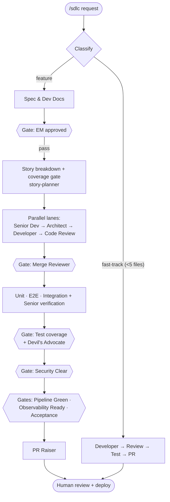

<div align="center">

# claude-kit

**A Cookiecutter-style scaffolder for an autonomous SDLC (software-delivery lifecycle) inside [Claude Code](https://www.claude.com/product/claude-code).**

One command turns a one-line request into reviewed, tested, secured, shippable code —
with a quality gate between every phase. **No application code. No Docker. Configuration only.**

[](https://pypi.org/project/claude-code-kit/)
[](https://pypi.org/project/claude-code-kit/)
[](LICENSE)
[](https://www.claude.com/product/claude-code)
[](https://github.com/ajyadav013/claude-kit/actions/workflows/ci.yml)
[](CHANGELOG.md)

🚀 [Quick start](#quick-start) · 🧭 [How it works](#how-it-works) · 🔁 [The pipeline](#the-pipeline) · 🧪 [Example](examples/) · 🌱 [What we adopted](#influences--what-we-adopted) · 🤖 [Agents](#the-agents) · 🧩 [Catalog](#catalog--extensibility) · 🛠️ [CLI](#cli-reference) · 📖 [Agent guide](docs/agents.md)

</div>

---

## What is this?

claude-kit installs a **complete software-delivery lifecycle** into Claude Code. Instead of one
assistant doing everything in a single pass, your work flows through a pipeline of focused agents —
a spec writer, a story planner, reviewers, a developer, code reviewers, testers, security scanners,
and a PR raiser — coordinated by an **Orchestrator** that runs independent work in parallel and
refuses to advance a phase until its **quality gate** passes. You drive it all with one command:
**`/sdlc <your task>`**.

**At a glance:**

- 🧱 **Stack-agnostic** — the pipeline assumes no language or framework. Pick a stack at `init` and it
  installs matching overlay rules (React · FastAPI · Go/net-http · PostgreSQL · MongoDB) and your exact
  lint/test/build commands. It never writes your app code and never needs Docker.
- 🎚️ **Dial the rigor with profiles** — `lean ⊊ standard ⊊ enterprise` decide how many agents, skills,
  hooks, and gates are active, from "fast track" to "full audit".
- 👥 **Scope to your team** — `individual` / `team` (default) / `organization`. Org scope adds a
  vibe-coding layer so PMs, designers, QA, support, and founders can drive work safely too.
- 🧠 **Remembers across sessions** — working memory (`CONTINUITY.md`) survives context compaction, and a
  learnings loop (`agent-memory/`) means the same mistake isn't made twice.
- 📦 **Two channels, one source** — a first-class Claude Code **plugin** *and* a **pip** scaffolder.

> Inspired by the autonomous-SDLC idea, rebuilt from the ground up **for Claude Code**, and kept small
> by a **reuse-first** policy — see [what we adopted](#influences--what-we-adopted) and from where.

---

## Quick start

<details open>
<summary><b>A) As a Claude Code plugin&nbsp; (recommended)</b></summary>

<br>

Makes all agents, skills, commands, and hooks available inside Claude Code:

```text
/plugin marketplace add ajyadav013/claude-kit
/plugin install claude-kit
```

Then, inside any project you want the pipeline to manage:

```text
/claude-kit:init        # asks the ordered questions, lays down CLAUDE.md + .claude/
# ↻ restart Claude Code so the project's agents, skills & hooks load
/sdlc Add a CSV export button to the reports page
```

> `/sdlc` is a **project skill** installed by `init`, so it becomes available after the restart. The
> plugin also exposes `/claude-kit:sdlc <task>`, which works immediately (no restart needed).

</details>

<details>
<summary><b>B) As a pip package&nbsp; (CI, onboarding, non-plugin workflows)</b></summary>

<br>

A CLI (`claude-kit`, aliases `ckit` / `claude-sdlc`) that scaffolds the same config into any repo:

```bash
pip install claude-code-kit
# or, for the bleeding edge straight from the repo:
#   pip install "git+https://github.com/ajyadav013/claude-kit.git"

claude-kit init                 # interactive: prompts for stack, profile, MCP
claude-kit init --defaults      # non-interactive: React + Python/FastAPI + Postgres + standard
```

</details>

> **Prerequisites:** [Claude Code](https://www.claude.com/product/claude-code); Python ≥ 3.9 for the
> CLI; `jq` to enable the shell hooks (they no-op without it); Node / `npx` only if you enable an MCP
> (Model Context Protocol) server.
>
> **Windows:** the config (agents · skills · rules) and the `claude-kit` CLI work natively. The shell
> hooks (`guard-*`, `warn-*`) need a POSIX shell + `jq`, so run inside **WSL or Git Bash** to enable
> them — `claude-kit doctor` detects Windows and tells you which case you're in. Without a POSIX shell
> the hooks silently no-op (the kit still functions; you just lose the deterministic guards).

<details>
<summary><b>What the init flow asks &amp; what lands on disk</b></summary>

<br>

`claude-kit init` asks an ordered set of questions (all with sensible defaults), then writes the
config — nothing else:

1. **Target path** (default: current dir; if `.claude/` exists → **merge / overwrite / backup / abort**)
2. **Frontend framework** (default: React) → **frontend language** (default: TypeScript)
3. **Backend language** (default: Python) → **backend framework** (default: FastAPI)
4. **Database** (PostgreSQL · MongoDB)
5. **SDLC profile** (`lean` · `standard` · `enterprise`)
6. **Optional MCP integrations** (GitHub · Jira/Linear · Postgres/Mongo · Playwright · Docs) — a
   project-root `.mcp.json` is written **only** if you select any (env placeholders, never secrets)

Non-interactive equivalents: `--defaults`, or `--config init.yaml` (flat or nested YAML). What lands:

```
CLAUDE.md                      # "Project-specific rules" filled from your stack's commands
README.claude-sdlc.md
.claude/
  settings.json                # assembled from the profile's hooks
  rules/                        # stack-agnostic core + selected overlay rules
  agents/                       # the profile's agent subset + DB overlay agents
  skills/  (incl. sdlc/)        # the profile's skill subset; sdlc/ is the /sdlc entrypoint
  hooks/                        # the profile's hook scripts
  templates/                    # artifact templates (spec, ADR, test-plan, …)
  config/                       # init-options.json (checksums) + stack snapshot
  state/  tmp/                  # gitignored runtime
.mcp.json                       # only if MCP servers were selected
```

</details>

---

## How it works


```mermaid
flowchart LR
    subgraph SRC["claude-kit — single source of truth"]
        direction TB
        A["agents/"]
        S["skills/"]
        C["commands/"]
        H["hooks/"]
        R["rules/"]
        T["templates/"]
        K["catalog/<br/>(stacks · profiles · mcp · org)"]
    end
    SRC -->|"pip install + claude-kit init"| PROJ["Your project<br/>CLAUDE.md + .claude/"]
    SRC -->|"/plugin install"| CC["Claude Code<br/>(agents · skills · commands · hooks)"]
    CC -->|"/claude-kit:init"| PROJ
    PROJ --> RUN(["/sdlc — autonomous SDLC active"])
```

Three ideas do the heavy lifting:

1. **Quality gates with a shared severity model.** Every finding is classified
   Critical / High / Medium / Low / Cosmetic. A gate passes **only** with zero Critical/High/Medium
   open. No silent advancement.
2. **RARV self-check.** Every agent runs **R**eason → **A**ct → **R**eflect → **V**erify and must show
   a *green Verify* (real commands run, not imagined) before handing off.
3. **Blind review + Devil's Advocate.** Parallel reviewers judge independently; a *unanimous* PASS is
   treated as suspicious and triggers an adversarial `devils-advocate` pass before the gate may close —
   an explicit guard against agents rubber-stamping each other.

See [`docs/architecture.md`](docs/architecture.md) for the full diagrams.

---

## The pipeline

`/sdlc` reads the profile you chose and runs **only that profile's gates**:


```mermaid
flowchart TD
    REQ(["/sdlc request"]) --> CLS{"Classify"}
    CLS -->|"feature"| SPEC["Spec & Dev Docs"]
    SPEC --> EM{{"Gate: EM approved"}}
    EM -->|"pass"| STORY["Story breakdown + coverage gate<br/>story-planner"]
    STORY --> LANES["Parallel lanes:<br/>Senior Dev → Architect → Developer → Code Review"]
    LANES --> MR{{"Gate: Merge Reviewer"}}
    MR --> TEST["Unit · E2E · Integration + Senior verification"]
    TEST --> TCG{{"Gate: Test coverage<br/>+ Devil's Advocate"}}
    TCG --> SEC{{"Gate: Security Clear"}}
    SEC --> OPS{{"Gates: Pipeline Green ·<br/>Observability Ready · Acceptance"}}
    OPS --> PR["PR Raiser"] --> HUMAN(["Human review + deploy"])
    CLS -->|"fast-track (<5 files)"| FT["Developer → Review → Test → PR"] --> HUMAN
```

| Profile | Gates that run |
|---|---|
| **lean** | code-review · build-green |
| **standard** | spec-complete · em-approved · code-review · build-green · test-coverage · security-clear · contract-clear\* |
| **enterprise** | standard + pipeline-green · observability-ready · acceptance |

\* `contract-clear` (API breaking-change diff) self-skips when the stack exposes no API surface, so it
is inert for non-API projects. Organization scope at `regulated` strictness adds `accessibility-clear`
(WCAG-AA on changed UI). A **fast-track** mode collapses small changes (< 5 files) to Developer →
Code Reviewer → Tester → PR.

See [`examples/`](examples/) for a synthetic end-to-end walkthrough — request → spec → story breakdown
→ gate verdicts (with one defect-loop cycle) → sample PR diff.

---

## Influences & what we adopted

claude-kit is built **reuse-first**. We periodically review excellent open-source projects and adopt
**only the genuinely-new ideas** — never duplicating what the kit already does (near-duplicates would
dilute Claude's ability to auto-select the right skill). Each adoption follows the same method:
**fetch the real source → adversarially map it against the kit's existing files → ship only the
non-duplicative gaps**, minimally and catalog-wired.

| Source | What we learned | What we shipped | Since |
|---|---|---|:--:|
| **Agentic Design Patterns** — A. Gulli ([coverage map](docs/agentic-patterns.md)) | Reasoning, guardrails, resilience, human-in-the-loop, evals, and tool design as first-class agent disciplines | 8 agent-operation rules + [`docs/agentic-patterns.md`](docs/agentic-patterns.md) | `0.4.0` |
| **[ponytail](https://github.com/DietrichGebert/ponytail)** | YAGNI / anti-over-engineering as an explicit recurring pass; deferral-debt tracking; surfacing the active autonomy level | `over-engineering-review` & `simplification-debt` skills, the `load-autonomy` hook, median-of-N in `evals` | `0.8.0` |
| **[GitHub spec-kit](https://github.com/github/spec-kit)** | Spec → tasks → **analyze** coverage gate; tasks → tracker issues; stable requirement IDs + assumptions in specs | Wired the (previously orphaned) `story-planner` as the **coverage gate (1f)**, a tracker-agnostic `task-tracker-sync` skill, and enriched the feature-spec template | `0.9.0` |
| **[protectai/llm-guard](https://github.com/protectai/llm-guard)** | Input→model→output guardrails for LLM features — prompt injection, PII vault, treating model output as untrusted | **Opt-in** "LLM / AI Feature Security" guidance in `security-and-hardening` + the advisory `warn-llm-io` hook (warns, **never blocks**) | `0.10.0` |
| **Improvement brief** (external self-review) | API backward-compat as a gate; load-against-SLO as a release criterion; supply-chain maintenance cadence; pipeline resumability, clean abort, and worktree lifecycle; pipeline cost/concurrency/cross-platform transparency | The enterprise **`contract-clear`** gate (owned by `merge-reviewer`) + `api-change-report` template; a load-vs-SLO criterion in Observability Ready; dependency **Cadence Mode**; `/sdlc` resume-vs-restart, `/claude-kit:abort`, worktree teardown; cost/concurrency/Windows notes — **9 surgical extensions, 0 new agents/skills/rules** | `0.12.0` |
| **Improvement brief #2** (external self-review) | The covered-vs-**gated** distinction (a skill ≠ a gate); enforce API breaking-changes by default; expand/contract migration safety; back the stack-agnostic claim with a compiled backend; WCAG as a regulated gate; reconcile the PyPI story; ship a worked example + a self-test matrix | [`docs/coverage-audit.md`](docs/coverage-audit.md); **`contract-clear` promoted to `standard`**; a live **Go/net-http** backend; the **`accessibility-clear`** regulated gate; explicit migration-drop rules; a synthetic [`examples/`](examples/) run; an eval-harness template; a profile×stack×scope self-test matrix — **2 gates wired + 1 stack, 0 new agents/skills/rules** | `0.13.0` |

> Each adoption is detailed in the [CHANGELOG](CHANGELOG.md) — including, for every review, what we
> deliberately **did not** add because the kit already covered it.

<details>
<summary><b>The latest three reviews, in a bit more depth</b></summary>

<br>

**🪶 ponytail → minimalism layer (0.8.0).** Most of ponytail's philosophy (YAGNI, stdlib-first,
surgical diffs) was already enforced by `CLAUDE.md` "Simplicity First" + `code-simplification`, so we
added only the missing *mechanisms*: `over-engineering-review` (a complexity-only, report-only
delete-list), `simplification-debt` (harvests `TODO`/`FIXME`/inline `shortcut:` markers into a ledger
and flags ones that name no upgrade path), and the `load-autonomy` SessionStart hook (surfaces the
active autonomy level each session).

**🧭 GitHub spec-kit → coverage gate + tracker sync (0.9.0).** The headline was *reuse*: the kit
already had a `story-planner` agent that verifies every acceptance criterion maps to a story, but it
was **never wired into the pipeline**. We made it **stage 1f** (between EM approval and the developer),
so implementation can't start until coverage is proven. We also added `task-tracker-sync` (mirrors a
plan into GitHub / Linear / Jira issues, dependencies preserved) and gave the feature-spec template
stable requirement IDs + an Assumptions section. We **skipped** spec-kit's `/constitution`,
`/clarify`, and `/checklist` — all already covered.

**🛡️ protectai/llm-guard → opt-in LLM security (0.10.0).** The kit secured the *agent itself* and
*traditional* web appsec, but nothing covered **the LLM features you build into your product** (the
OWASP LLM Top 10). Per request, the new layer is **opt-in, bypassable, and states the risk of
bypassing**: an "LLM / AI Feature Security" section in `security-and-hardening` (input/output
guardrails, PII vault, untrusted-output handling, a security-implications-of-bypassing table) plus a
non-blocking `warn-llm-io` hook. We deliberately did **not** add a new rule or fold it into the
mandatory security gate — that would have made it mandatory.

</details>

<details>
<summary><b>How claude-kit compares (positioning)</b></summary>

<br>

claude-kit is a **config-only, stack-agnostic SDLC scaffolder** — it installs a governed pipeline
(agents · skills · rules · gates · hooks) into your project's `.claude/` and then gets out of the way.
It is **not** a runtime, an orchestration engine, or a code library. That framing is the difference:

| Project | What it is | How claude-kit differs |
|---|---|---|
| **[wshobson/agents](https://github.com/wshobson/agents)** & similar agent collections | Large libraries of individual subagent prompts you pick from | claude-kit ships a **smaller, opinionated set wired into a sequenced pipeline with owned quality gates** — agents aren't a menu, they're stages that hand off and block on each other. Adopt-by-reuse, not by accumulation. |
| **[GitHub spec-kit](https://github.com/github/spec-kit)** | A spec-driven workflow (constitution → spec → tasks → analyze) | claude-kit **absorbed spec-kit's coverage-gate idea** (the `story-planner` 1f gate + `task-tracker-sync`) into a **broader** lifecycle that also covers review, security, build, test, release, and observability gates. Complementary, wider scope. |
| **claude-flow / multi-agent runtimes** | Runtime orchestrators that *execute* swarms of agents | claude-kit produces **portable configuration**, not a running process — the orchestration is described in rules the host (Claude Code) executes. No daemon, no lock-in, no app code. |
| **dotfiles / `CLAUDE.md` starters** | A single rules file or settings snippet | claude-kit is a **catalog-driven generator**: it resolves your stack/profile/scope into the right subset of 23 rules, ~28 agents, ~52 skills, gates, and hooks, and keeps them **upgradeable** (`claude-kit upgrade` preserves your edits via owner + checksum). |

**Choose claude-kit when** you want a consistent, reviewable, **gate-enforced** autonomous-SDLC setup
that's the same across every repo and stack, installs in seconds, ships nothing you have to run, and
**evolves reuse-first** rather than by piling on near-duplicate agents.

</details>

---

## The agents

**28 specialized roles** in [`agents/`](agents/), each tagged with a `tier`
(orchestrator · stage-lead · specialist · review) and installed per profile — plus per-database
**overlay agents** and, in organization scope, **persona agents**. The
**[agent guide](docs/agents.md)** explains how to drive them.

<details>
<summary><b>See the full roster (28 + overlays + personas)</b></summary>

<br>

| Agent | Role |
|-------|------|
| `orchestrator` | Pipeline controller — decomposes, delegates, runs lanes in parallel, gates progression (never writes code) |
| `spec-doc-writer` | Turns requirements into a spec + developer documentation in one pass |
| `story-planner` | Decomposes an approved spec into ordered, parallelizable stories; verifies every acceptance criterion maps to a story (workflow gate 1f) |
| `ui-designer` | Drafts and self-reviews UI/UX design specs |
| `senior-backend-dev` · `senior-frontend-dev` | Senior review of a work stream's spec (the two-lane example) |
| `technical-architect` | Cross-system architecture, scalability, integration review |
| `em-reviewer` | Engineering-manager strategic & completeness review |
| `merge-reviewer` | Verifies consistency between parallel lanes at join points |
| `developer` | Writes production code from an approved spec, in an isolated worktree |
| `sdlc-code-reviewer` | Reviews code for bugs, security, performance, spec compliance |
| `unit-tester` · `e2e-tester` | Author unit and end-to-end test suites |
| `tester` · `senior-tester` | Integration testing and independent verification of coverage |
| `auditor` | Read-only audit for accessibility, performance, responsiveness, console errors |
| `devils-advocate` | Anti-sycophancy adversarial reviewer (runs on a unanimous PASS) |
| `acceptance-reviewer` | Verifies delivery against acceptance criteria before the human gate |
| `risk-classifier` | Read-only — classifies work low/medium/high/restricted and names the required gates (enterprise + org) |
| `security-reviewer` | Security stage coordinator — owns the Security Clear gate |
| `secret-scanner` · `dependency-scanner` · `owasp-reviewer` · `policy-validator` | The four parallel security sub-scanners |
| `devops-engineer` | CI/build/release, env, migrations, runbook — container-optional; owns Pipeline Green |
| `observability-engineer` | SLOs, health/readiness, structured logging, alerts — owns Observability Ready |
| `incident-responder` | Production-incident triage, mitigation, and postmortem (enterprise scope) |
| `pr-raiser` | Final checks, commit hygiene, and PR creation |
| **DB overlays** | installed for the selected database — PostgreSQL → `postgres-specialist` · `migration-specialist` · `db-performance-reviewer`; MongoDB → `mongodb-specialist` · `migration-specialist` |
| **Org personas** | `pm-copilot` · `founder-prototype-agent` · `support-ticket-engineer` · `data-workflow-agent` · `internal-tools-builder` (organization scope only) |

</details>

---

## Rules & skills

**Rules** ([`rules/`](rules/)) are the 23 stack-agnostic contracts every agent obeys — the
`mandatory-workflow` pipeline, `quality-gates`, `rarv-cycle`, `continuity`, `documentation`,
`testing`, the eight agent-operation rules (`reasoning-techniques`, `agent-guardrails`,
`agent-resilience`, `goal-setting-and-monitoring`, `human-in-the-loop`, `model-tiers`, `evals`,
`tool-design` — see [`docs/agentic-patterns.md`](docs/agentic-patterns.md)), and `autonomy-levels` +
`risk-classification` (see [`docs/org-capabilities.md`](docs/org-capabilities.md)). Stack **overlay
rules** (`fastapi-patterns`, `react-patterns`, `postgres-patterns`, …) and, in organization scope,
**org policy rules** (`secrets-policy`, `pii-policy`, `compliance-policy`, …) layer on top.

**Skills** ([`skills/`](skills/)) are on-demand capabilities Claude activates by context — led by the
`sdlc` entrypoint. Highlights, including this session's additions:

| Skill | What it does |
|---|---|
| `spec-driven-development` · `planning-and-task-breakdown` | Spec first, then a verifiable task breakdown |
| `task-tracker-sync` | Mirror a plan/story breakdown into GitHub / Linear / Jira issues (tracker-agnostic, idempotent) |
| `security-and-hardening` | Traditional appsec **+ opt-in LLM / AI Feature Security** (OWASP LLM Top 10, with a bypass + implications) |
| `threat-model` | Design-time STRIDE — now with an LLM/AI branch |
| `over-engineering-review` · `simplification-debt` | Keep the code lean: a complexity-only delete-list, and a deferral-debt ledger |
| `test-driven-development` · `debugging-and-error-recovery` · `code-review-and-quality` | The build / fix / review staples |
| `remember` | The self-improving learnings loop into `agent-memory/` |

Each profile installs a subset (`lean ⊂ standard ⊂ enterprise`).

---

## Catalog & extensibility

Everything selectable lives in [`catalog/`](catalog/) as **data** — adding a stack, framework,
database, profile, or MCP server is a YAML edit plus a `templates/stacks/<dir>/` folder, never a code
change.

<details>
<summary><b>The four catalog files</b></summary>

<br>

- **`catalog/stacks.yaml`** — frontend frameworks, backend languages → frameworks, and databases.
  Live today: React · Python/FastAPI · **Go/net-http** · PostgreSQL/MongoDB. Vue/Svelte/Django/Express
  are listed as `planned` (offered by `list-options`, not yet selectable).
- **`catalog/profiles.yaml`** — what each profile activates (`inherit:` composes; `all` = everything).
- **`catalog/mcp.yaml`** — ready `.mcp.json` fragments per server, with `${ENV}` placeholders.
- **`catalog/org.yaml`** — the **organization layer**: scopes, teams, the autonomy model, review
  strictness, and the 7 capability **packs**. Scope-gated content under `templates/org/` installs only
  when `scope == organization`. See [`docs/org-capabilities.md`](docs/org-capabilities.md).

A third install dimension joins `profile` (a subset) and `stack` (an overlay): **org** (scope-gated).
`resolve()` stays branch-free — adding a pack, team, autonomy level, or org rule is a `catalog/org.yaml`
edit plus content under `templates/org/`, never a code change. Run **`claude-kit list-options`** to see
everything available.

</details>

---

## CLI reference

<details>
<summary><b>All commands</b> (<code>claude-kit</code> · aliases <code>ckit</code> · <code>claude-sdlc</code>)</summary>

<br>

| Command | Description |
|---------|-------------|
| `init [path] [--defaults] [--config FILE] [--force]` | Scaffold `CLAUDE.md` + `.claude/` (interactive or non-interactive) |
| `validate [path]` | Structurally validate an installed config |
| `doctor [path]` | Validate + environment/health checks with fix hints |
| `diff [path]` | Preview what an `upgrade` would change (no writes) |
| `upgrade [path] [--force]` | Refresh kit/overlay files; protect your edits; prune orphans |
| `list-options` | List available frontend/backend/database/profile/MCP options |
| `status [path]` | Show what's installed, the selection, and working memory |
| `version` | Print the version |
| `package-org-pack` · `install-org-pack` | Package / install an organization capability pack (org scope) |

Plugin slash commands: `/claude-kit:init`, `/claude-kit:sdlc <task>`, `/claude-kit:status`; and the
`/sdlc` skill inside any scaffolded project.

</details>

<details>
<summary><b>Safe upgrades</b> — how your edits are protected</summary>

<br>

Every install records per-file checksums and an `owner` (kit / overlay / user-editable) in
`.claude/config/init-options.json`. `upgrade` refreshes kit and overlay files to the latest version,
**never clobbers your edits** (a user-modified file is kept and the new version dropped beside it as a
`.claude-kit` sidecar), backs up anything it changes or removes, and restores files you deleted. Run
`diff` first to preview.

</details>

<details>
<summary><b>Troubleshooting</b></summary>

<br>

Run **`claude-kit doctor`** first — it checks your environment (git, `jq`, hook scripts) and prints fix
hints.

| Symptom | Likely cause | Fix |
|---|---|---|
| `/sdlc`, agents, or skills "not found" right after `init` | Claude Code hasn't loaded the new project config yet | **Restart Claude Code** — or use `/claude-kit:sdlc <task>` (works without a restart) |
| Guard / quality hooks seem to do nothing | `jq` isn't installed (the hooks parse tool input with it) | Install `jq`; without it the hooks degrade to no-ops by design |
| Hooks do nothing on **Windows** | No POSIX shell — `.sh` hooks can't run under `cmd`/PowerShell | Run claude-kit inside **WSL or Git Bash** (with `jq`); `claude-kit doctor` confirms. Config + CLI work natively regardless |
| A selected MCP server won't start | `node` / `npx` missing (most MCP servers launch via `npx`) | Install Node.js, or remove the server from `.mcp.json` |
| `pip install claude-code-kit` fails | Outdated `pip`, or you want an unreleased change | Upgrade pip (`pip install -U pip`); for unreleased changes use `pip install "git+https://github.com/ajyadav013/claude-kit.git"` |
| `validate` reports missing files | Partial or outdated install | Re-run `claude-kit init` (choose **merge**), or `claude-kit upgrade` |

</details>

---

## Project structure

<details>
<summary><b>Repository layout</b></summary>

<br>

```
claude-kit/
├── .claude-plugin/        plugin.json + marketplace.json
├── agents/                28 SDLC agents          rules/        23 engineering rules
├── skills/                on-demand skills        templates/    CLAUDE.md, settings, artifacts, memory seeds
├── commands/              /claude-kit:* commands  hooks/        hooks.json + scripts/
├── catalog/         stacks·profiles·mcp·org       templates/stacks/  per-stack overlay rules + agents
│                                                  templates/org/     org packs · personas · policies (scope-gated)
├── scripts/init.sh        thin fallback scaffolder  src/claude_kit/  the pip CLI (Typer + Jinja2 + PyYAML)
├── docs/architecture.md   diagrams                pyproject.toml   packaging
```

See [`docs/architecture.md`](docs/architecture.md) for the full picture and [`CLAUDE.md`](CLAUDE.md)
for how to develop the kit itself.

</details>

---

## Contributing

Issues and PRs welcome — see [`CONTRIBUTING.md`](CONTRIBUTING.md). To dogfood a local checkout:

```bash
# As a plugin:  /plugin marketplace add .   then   /plugin install claude-kit
# As the CLI:   pip install -e '.[dev]'   then   claude-kit init /tmp/demo --defaults   &&   pytest
```

## License

[MIT](LICENSE) © Arjunsingh Yadav
