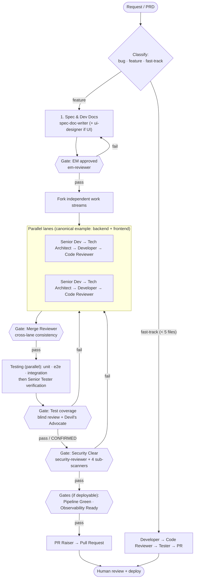
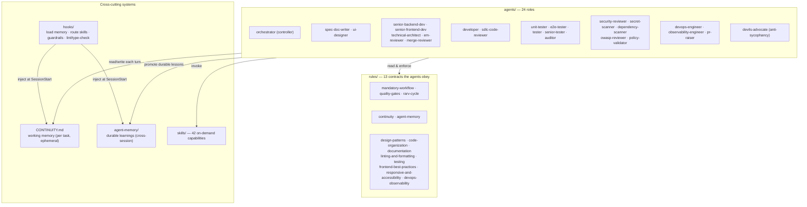

# claude-kit Architecture

claude-kit packages a complete, **stack-agnostic** software-delivery lifecycle as Claude Code
components — agents, skills, rules, hooks — plus the working-memory and learning systems that
make a long-running agent reliable. It ships through **two channels from one source of truth**.

---

## 1. Distribution: one source of truth, two install channels

```mermaid
flowchart LR
    subgraph SRC["claude-kit repo — single source of truth"]
        direction TB
        A["agents/ (24)"]
        S["skills/ (42)"]
        C["commands/"]
        H["hooks/"]
        R["rules/ (13)"]
        T["templates/"]
    end

    SRC -->|"hatchling force-include<br/>(bundled into the wheel)"| PKG["PyPI: claude-kit<br/>CLI: claude-kit / ckit"]
    SRC -->|"auto-discovered at repo root"| MKT["GitHub marketplace<br/>.claude-plugin/marketplace.json"]

    PKG -->|"pip install claude-kit<br/>claude-kit init"| PROJ
    MKT -->|"/plugin marketplace add ajyadav013/claude-kit<br/>/plugin install claude-kit"| CC["Claude Code session<br/>(agents · skills · commands · hooks live)"]
    CC -->|"/claude-kit:init"| PROJ["Your project:<br/>CLAUDE.md + .claude/{rules,agents,skills,hooks}"]

    PROJ --> RUN(["Autonomous SDLC active"])
    CC --> RUN
```



**Why two channels converge on `init`:** a Claude Code plugin cannot auto-inject a `CLAUDE.md`
or a `rules/` directory into your project — those only take effect as real files in the repo.
So both the pip CLI (`claude-kit init`) and the plugin command (`/claude-kit:init`) do the same
job: copy the rules + templates into `.claude/`. The plugin additionally makes the agents,
skills, commands, and hooks available globally without any files in your repo.

---

## 2. The SDLC pipeline

The **Orchestrator** never writes code — it decomposes the request, spawns the right agents,
runs them in parallel where independent, and enforces a quality gate between phases.



**Every gate uses the same rules:** the severity model (zero Critical/High/Medium to pass), the
RARV self-check (Reason → Act → Reflect → Verify, with a green Verify before any handoff), and
blind review (parallel reviewers judge independently; a unanimous PASS triggers the Devil's
Advocate before the gate counts).

---

## 3. Component map



### The two memory systems (don't conflate them)

| | `.claude/CONTINUITY.md` | `.claude/agent-memory/` |
|---|---|---|
| Holds | Current task state — phase, active work, next steps | Durable learnings — rules, gotchas, patterns |
| Lifespan | Ephemeral — overwritten as work progresses | Permanent — accumulates across all work |
| Scope | This pipeline run | The whole project, forever |
| Loaded by | `load-continuity.sh` (SessionStart) | `load-learnings.sh` (SessionStart) |

Together they let the pipeline **survive context compaction and new sessions**: the next turn
reads CONTINUITY and resumes from "Next Steps," and applies accumulated learnings before acting.

---

## 4. Repository layout

```
claude-kit/
├── .claude-plugin/
│   ├── plugin.json            # plugin manifest (hooks → ./hooks/hooks.json)
│   └── marketplace.json       # marketplace entry (source ".")
├── agents/                    # 24 SDLC agents (plugin auto-discovers)
├── skills/                    # 42 skills (plugin auto-discovers)
├── commands/                  # /claude-kit:init · :sdlc · :status
├── hooks/
│   ├── hooks.json             # plugin hooks via ${CLAUDE_PLUGIN_ROOT}
│   └── scripts/               # load-continuity, load-learnings, lint-fix, type-check, warn-shared-modules
├── rules/                     # 13 engineering rules (scaffolded into .claude/rules/)
├── templates/                 # CLAUDE.md, CONTINUITY.template.md, settings.json, agent-memory/ seed
├── scripts/init.sh            # shared scaffolder used by /claude-kit:init
├── src/claude_kit/            # pip CLI (init/upgrade/status/list/version)
├── docs/architecture.md       # this file
└── pyproject.toml             # force-include bundles the payload into the wheel
```
