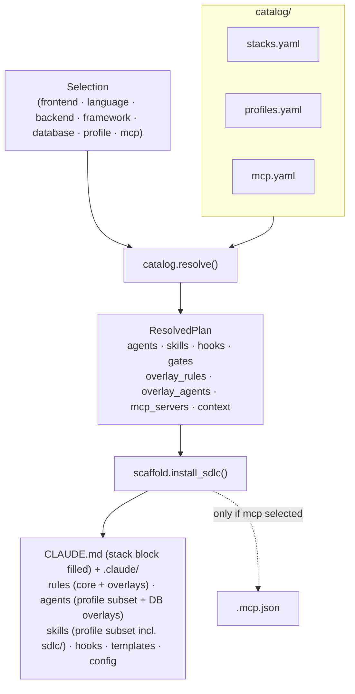
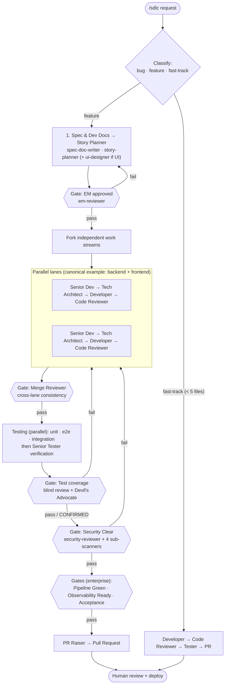
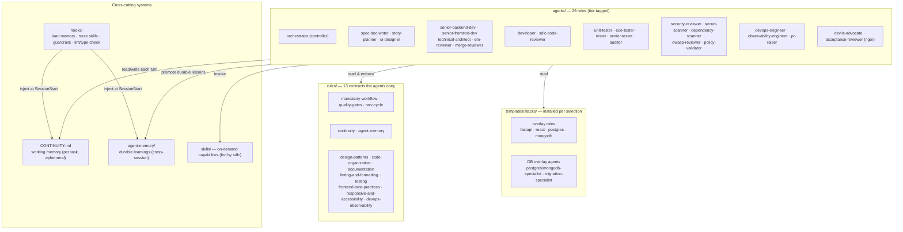

# claude-kit Architecture

claude-kit packages a complete, **stack-agnostic** software-delivery lifecycle as Claude Code
**configuration** — agents, skills, rules, hooks — plus the working-memory and learning systems that
make a long-running agent reliable. It installs configuration only (no application code, no Docker),
is driven by a data **catalog**, and ships through **two channels from one source of truth**.

---

## 1. Distribution: one source of truth, two install channels

```mermaid
flowchart LR
    subgraph SRC["claude-kit repo — single source of truth"]
        direction TB
        A["agents/ (26)"]
        S["skills/"]
        C["commands/"]
        H["hooks/"]
        R["rules/ (13)"]
        T["templates/ (+ stacks/ overlays)"]
        K["catalog/ (stacks · profiles · mcp)"]
    end

    SRC -->|"hatchling force-include<br/>(bundled into the wheel)"| PKG["PyPI: claude-kit<br/>CLI: claude-kit / ckit / claude-sdlc"]
    SRC -->|"auto-discovered at repo root"| MKT["GitHub marketplace<br/>.claude-plugin/marketplace.json"]

    PKG -->|"pip install claude-kit<br/>claude-kit init"| PROJ
    MKT -->|"/plugin marketplace add ajyadav013/claude-kit<br/>/plugin install claude-kit"| CC["Claude Code session<br/>(agents · skills · commands · hooks live)"]
    CC -->|"/claude-kit:init"| PROJ["Your project:<br/>CLAUDE.md + .claude/{rules,agents,skills,hooks,templates,config}"]

    PROJ --> RUN(["/sdlc — autonomous SDLC active"])
    CC --> RUN
```



**Why two channels converge on `init`:** a Claude Code plugin cannot auto-inject a `CLAUDE.md` or a
`rules/` directory into your project — those only take effect as real files in the repo. So both the
pip CLI (`claude-kit init`) and the plugin command (`/claude-kit:init`) do the same job: resolve the
catalog and write the config into `.claude/`. The plugin command prefers the pip CLI when it's on
PATH (full resolver) and falls back to a thin `scripts/init.sh` otherwise; it also makes the agents,
skills, commands, and hooks available globally without any files in your repo.

---

## 2. Catalog-driven resolution (init)

`init` never branches on a specific stack. It collects a `Selection` (interactive prompts,
`--defaults`, or `--config`), and `catalog.resolve()` turns it into a concrete `ResolvedPlan`:



- **Profiles** (`lean ⊊ standard ⊊ enterprise`) select *which* agents/skills/hooks/gates are
  installed — composed via `inherit:` and an `all` token, with no code branches.
- **Overlays** (rules + DB agents) are copied only for the selected stacks from
  `templates/stacks/<dir>/`.
- **`init-options.json`** records every installed file's checksum + `owner` (kit / overlay /
  user-editable), which powers `validate`, `diff`, and a safe `upgrade`.

Adding a framework/database/profile/MCP server is a **catalog edit + a `templates/stacks/` folder** —
never a change to `resolve()`.

---

## 3. The SDLC pipeline (run)

`/sdlc` reads the installed profile's gate set and hands off to the **Orchestrator**, which never
writes code — it decomposes the request, spawns the right agents, runs them in parallel where
independent, and enforces a quality gate between phases. **Only the active profile's gates run.**



**Every gate uses the same rules:** the severity model (zero Critical/High/Medium to pass), the RARV
self-check (Reason → Act → Reflect → Verify, with a green Verify before any handoff), and blind review
(parallel reviewers judge independently; a unanimous PASS triggers the Devil's Advocate before the
gate counts).

---

## 4. Component map



### The two memory systems (don't conflate them)

| | `.claude/CONTINUITY.md` | `.claude/agent-memory/` |
|---|---|---|
| Holds | Current task state — phase, active work, next steps | Durable learnings — rules, gotchas, patterns |
| Lifespan | Ephemeral — overwritten as work progresses | Permanent — accumulates across all work |
| Scope | This pipeline run | The whole project, forever |
| Loaded by | `load-continuity.sh` (SessionStart) | `load-learnings.sh` (SessionStart) |

Together they let the pipeline **survive context compaction and new sessions**: the next turn reads
CONTINUITY and resumes from "Next Steps," and applies accumulated learnings before acting.

---

## 5. Repository layout

```
claude-kit/
├── .claude-plugin/
│   ├── plugin.json            # plugin manifest (hooks → ./hooks/hooks.json)
│   └── marketplace.json       # marketplace entry (source ".")
├── agents/                    # 26 SDLC agents, tier-tagged (plugin auto-discovers)
├── skills/                    # on-demand skills incl. sdlc/ (the /sdlc entrypoint)
├── commands/                  # /claude-kit:init · :sdlc · :status
├── hooks/
│   ├── hooks.json             # plugin hooks via ${CLAUDE_PLUGIN_ROOT}
│   └── scripts/               # load-continuity, load-learnings, lint-fix, type-check, warn-shared-modules
├── rules/                     # 13 stack-agnostic engineering rules
├── catalog/                   # stacks.yaml · profiles.yaml · mcp.yaml (the resolver's data)
├── templates/
│   ├── CLAUDE.md · CLAUDE.stack.md.tmpl · README.claude-sdlc.md.tmpl
│   ├── CONTINUITY.template.md · settings.json · artifacts/ · agent-memory/
│   └── stacks/<kind>/<id>/    # per-stack overlay rules (+ agents/ for databases)
├── scripts/init.sh            # thin no-pip fallback scaffolder
├── src/claude_kit/            # pip CLI: cli · catalog · prompts · models · scaffold · render · hooks · validator · upgrader
├── tests/                     # pytest suite (catalog · render · scaffold · validator · upgrader · cli)
├── docs/architecture.md       # this file
└── pyproject.toml             # force-include bundles the payload into the wheel
```

---

## 6. Lifecycle: validate / diff / upgrade

Because every install records per-file checksums + ownership in `.claude/config/init-options.json`,
the kit can safely evolve a project in place:

- **`validate` / `doctor`** — structural checks (tracked files present, valid JSON, frontmatter
  complete) plus environment checks (git/jq, executable hooks, gitignored runtime dirs).
- **`diff` / `upgrade`** — `upgrade` re-renders a pristine reference of the recorded selection into a
  temp dir and compares it to the live tree. Kit/overlay files are refreshed; **user-editable files
  are never clobbered** (a modified one is kept, the new version dropped beside it as a `.claude-kit`
  sidecar); changed/removed files are backed up; deleted files are restored; orphans are pruned. The
  post-upgrade baseline is the kit's canonical checksums, so user edits stay protected across repeated
  upgrades. `diff` previews all of this and writes nothing.
