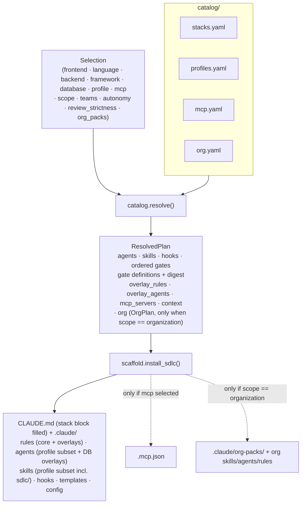
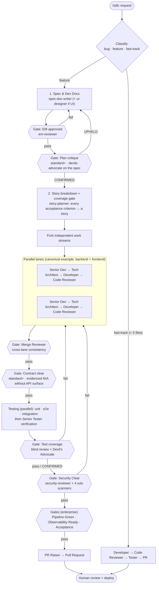
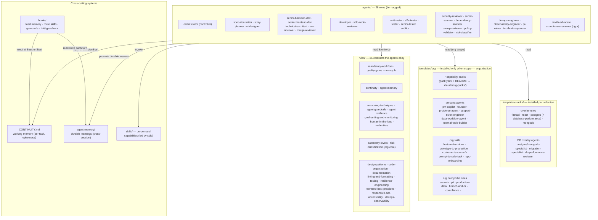

# claude-kit Architecture

claude-kit packages a complete, **stack-agnostic** software-delivery lifecycle as Claude Code
**configuration** — agents, skills, rules, hooks — plus the working-memory and learning systems that
make a long-running agent reliable. It installs configuration only (no application code, no Docker),
is driven by a data **catalog**, and ships through **two channels from one source of truth**.

---

## 1. Distribution: one source of truth, two install channels


```mermaid
flowchart LR
    subgraph SRC["claude-kit repo — single source of truth"]
        direction TB
        A["agents/ (28)"]
        S["skills/"]
        C["commands/"]
        H["hooks/"]
        R["rules/ (25)"]
        T["templates/ (+ stacks/ & org/ overlays)"]
        K["catalog/ (stacks · profiles · mcp · org)"]
    end

    SRC -->|"hatchling force-include<br/>(bundled into the wheel)"| PKG["PyPI: claude-code-kit<br/>CLI: claude-kit / ckit / claude-sdlc"]
    SRC -->|"auto-discovered at repo root"| MKT["GitHub marketplace<br/>.claude-plugin/marketplace.json"]

    PKG -->|"pip install claude-code-kit<br/>claude-kit init"| PROJ
    MKT -->|"/plugin marketplace add ajyadav013/claude-kit<br/>/plugin install claude-kit@claude-kit"| CC["Claude Code session<br/>(agents · skills · commands · hooks live)"]
    CC -->|"/claude-kit:init"| PROJ["Your project:<br/>CLAUDE.md + .claude/{rules,agents,skills,hooks,templates,config}"]

    PROJ --> RUN(["/sdlc — autonomous SDLC active"])
    CC --> RUN
```

**Why two channels converge on `init`:** a Claude Code plugin cannot auto-inject a `CLAUDE.md` or a
`rules/` directory into your project — those only take effect as real files in the repo. So both the
pip CLI (`claude-kit init`) and the plugin command (`/claude-kit:init`) do the same job: resolve the
catalog and write the config into `.claude/`. The plugin command prefers the pip CLI when it's on
PATH (full resolver) and fails with an installation instruction when it is absent; the former shell
copy fallback cannot meet the same untrusted-filesystem guarantees and no longer writes project
files. The plugin still makes agents, skills, commands, and hooks available globally without any
files in your repo.

---

## 2. Catalog-driven resolution (init)

`init` never branches on a specific stack. It collects a `Selection` (interactive prompts,
`--defaults`, or `--config`), and `catalog.resolve()` turns it into a concrete `ResolvedPlan`:


```mermaid
flowchart TB
    SEL["Selection<br/>(frontend · language · backend · framework · database · profile · mcp<br/>· scope · teams · autonomy · review_strictness · org_packs)"]
    subgraph CAT["catalog/"]
        ST["stacks.yaml"]
        PR["profiles.yaml"]
        MC["mcp.yaml"]
        OR["org.yaml"]
    end
    SEL --> RESOLVE["catalog.resolve()"]
    CAT --> RESOLVE
    RESOLVE --> PLAN["ResolvedPlan<br/>agents · skills · hooks · ordered gates<br/>gate definitions + digest<br/>overlay_rules · overlay_agents · mcp_servers · context<br/>· org (OrgPlan, only when scope == organization)"]
    PLAN --> INSTALL["scaffold.install_sdlc()"]
    INSTALL --> OUT["CLAUDE.md (stack block filled) + .claude/<br/>rules (core + overlays) · agents (profile subset + DB overlays)<br/>skills (profile subset incl. sdlc/) · hooks · templates · config"]
    INSTALL -.->|"only if mcp selected"| MCPJSON[".mcp.json"]
    INSTALL -.->|"only if scope == organization"| ORGOUT[".claude/org-packs/ + org skills/agents/rules"]
```

- **Profiles** (`lean ⊊ standard ⊊ enterprise`) select *which* agents/skills/hooks/gates are
  installed — composed via `inherit:` and an `all` token, with no code branches. One canonical
  `gate_definitions` map declares required/conditional behavior and closed skip conditions; its
  canonical SHA-256 digest is persisted with the ordered list.
- **Overlays** (rules + DB agents) are copied only for the selected stacks from
  `templates/stacks/<dir>/`.
- **`init-options.json`** records every installed file's checksum + `owner` (kit / overlay /
  user-editable), which powers `validate`, `diff`, and a safe `upgrade`.

Adding a framework/database/profile/MCP server is a **catalog edit + a `templates/stacks/` folder** —
never a change to `resolve()`.

### Same plan, second target: `export` (for non-Claude-Code editors)

The `ResolvedPlan` is the reuse seam. `claude-kit export` (`src/claude_kit/export.py`) takes the **same**
plan and, instead of `scaffold.install_sdlc()` writing `.claude/`, projects it into the formats a
single-agent editor reads natively — `.cursor/rules/*.mdc` + `.cursor/mcp.json` (Cursor), a root
`AGENTS.md`, or `.github/copilot-instructions.md` (Copilot). It is a pure projection: it adds no stack
knowledge, and `catalog.resolve()` gains no branches (golden rules #1 and #6). Fidelity is asymmetric
and stated in every exported file — rules, the charter, and MCP port cleanly, while the *enforced*
gates and reviewer subagents become single-agent guidance. See
[cursor-export.md](cursor-export.md) for the full mapping.

---

## 3. The SDLC pipeline (run)

`/sdlc` reads the installed profile's gate set and hands off to the **Orchestrator**, which never
writes code — it decomposes the request, spawns the right agents, runs them in parallel where
independent, and enforces a quality gate between phases. **Only the active profile's gates run.**


```mermaid
flowchart TD
    REQ(["/sdlc request"]) --> CLS{"Classify:<br/>bug · feature · fast-track"}

    CLS -->|"feature"| SPEC["1. Spec & Dev Docs<br/>spec-doc-writer (+ ui-designer if UI)"]
    SPEC --> EM{{"Gate: EM approved<br/>em-reviewer"}}

    EM -->|"pass"| PC{{"Gate: Plan critique<br/>standard+ · devils-advocate on the spec"}}
    PC -->|"CONFIRMED"| STORY["2. Story breakdown + coverage gate<br/>story-planner: every acceptance criterion → a story"]
    STORY --> FORK["Fork independent work streams"]
    subgraph LANES["Parallel lanes (canonical example: backend + frontend)"]
        direction LR
        L1["Senior Dev → Tech Architect → Developer → Code Reviewer"]
        L2["Senior Dev → Tech Architect → Developer → Code Reviewer"]
    end
    FORK --> LANES
    LANES --> MR1{{"Gate: Merge Reviewer<br/>cross-lane consistency"}}

    MR1 -->|"pass"| CC{{"Gate: Contract clear<br/>standard+ · evidenced N/A without API surface"}}
    CC -->|"pass"| TEST["Testing (parallel): unit · e2e · integration<br/>then Senior Tester verification"]
    TEST --> TCG{{"Gate: Test coverage<br/>blind review + Devil's Advocate"}}

    TCG -->|"pass / CONFIRMED"| SEC{{"Gate: Security Clear<br/>security-reviewer + 4 sub-scanners"}}
    SEC -->|"pass"| OPS{{"Gates (enterprise):<br/>Pipeline Green · Observability Ready · Acceptance"}}
    OPS -->|"pass"| PR["PR Raiser → Pull Request"]
    PR --> HUMAN(["Human review + deploy"])

    CLS -->|"fast-track (< 5 files)"| FT["Developer → Code Reviewer → Tester → PR"]
    FT --> HUMAN

    EM -->|"fail"| SPEC
    PC -->|"UPHELD"| SPEC
    TCG -->|"fail"| LANES
    SEC -->|"fail"| LANES
```

**Every run has an explicit lifecycle.** `start` creates schema v2 at the first active gate; `adopt`
records which earlier gates are historical, why, and who accepts that boundary. `close-gate` and
`not-applicable` fail before either operation. `complete` and `abort` are terminal. The run binds its
repository identity, branch, start/current commit, profile/scope, gate order, and gate-definition
digest; legacy schema-v1 state is readable and migrates only through explicit adoption.

**Every gate uses the same rules:** Critical and High always block; Medium can proceed only as a
distinct structured `accepted-risk` record, never PASS. Low/Cosmetic remain non-blocking. Required
gates cannot be skipped; conditional `not-applicable` records carry a configured condition and
evidence. The RARV self-check (Reason → Act → Reflect → Verify) and blind review remain
Agent-enforced protocols; Python mechanically enforces lifecycle, ordering, transition kinds,
bindings, and evidence hashes, but does not yet parse arbitrary test results.
In standard+, the Devil's Advocate also critiques the **plan** before approval is final, so a flawed
spec is caught on paper rather than after implementation.

---

## 4. Component map


```mermaid
flowchart TB
    subgraph AGENTS["agents/ — 28 roles (tier-tagged)"]
        direction TB
        ORC["orchestrator (controller)"]
        PLAN["spec-doc-writer · story-planner · ui-designer"]
        REV["senior-backend-dev · senior-frontend-dev<br/>technical-architect · em-reviewer · merge-reviewer"]
        BUILD["developer · sdlc-code-reviewer"]
        TST["unit-tester · e2e-tester · tester · senior-tester · auditor"]
        SECG["security-reviewer · secret-scanner · dependency-scanner<br/>owasp-reviewer · policy-validator · risk-classifier"]
        SHIP["devops-engineer · observability-engineer · pr-raiser · incident-responder"]
        DA["devils-advocate · acceptance-reviewer (rigor)"]
    end

    subgraph OVERLAY["templates/stacks/ — installed per selection"]
        ORULES["overlay rules<br/>fastapi · react · postgres (+ database-performance) · mongodb"]
        OAGENTS["DB overlay agents<br/>postgres/mongodb-specialist · migration-specialist · db-performance-reviewer"]
    end

    subgraph ORG["templates/org/ — installed only when scope == organization"]
        OPACKS["7 capability packs<br/>(pack.yaml + README → .claude/org-packs/)"]
        OPERS["persona agents<br/>pm-copilot · founder-prototype-agent · support-ticket-engineer<br/>data-workflow-agent · internal-tools-builder"]
        OSKILLS["org skills<br/>feature-from-idea · prototype-to-production · customer-issue-to-fix<br/>prompt-to-safe-task · repo-onboarding"]
        OPOL["org policy/vibe rules<br/>secrets · pii · production-data · branch-and-pr · compliance · …"]
    end

    subgraph RULES["rules/ — 25 contracts the agents obey"]
        MW["mandatory-workflow · quality-gates · rarv-cycle"]
        MEM["continuity · agent-memory"]
        AGENTOP["reasoning-techniques · agent-guardrails · agent-resilience<br/>goal-setting-and-monitoring · human-in-the-loop · model-tiers"]
        ORGCORE["autonomy-levels · risk-classification (org-core)"]
        CRAFT["design-patterns · code-organization · documentation<br/>linting-and-formatting · testing · resilience-engineering<br/>frontend-best-practices · responsive-and-accessibility · devops-observability"]
    end

    subgraph SUPPORT["Cross-cutting systems"]
        CONT["CONTINUITY.md<br/>working memory (per task, ephemeral)"]
        AMEM["agent-memory/<br/>durable learnings (cross-session)"]
        HOOKS["hooks/<br/>load memory · route skills · guardrails · lint/type-check"]
        SKILLS["skills/ — on-demand capabilities (led by sdlc)"]
    end

    AGENTS -->|"read & enforce"| RULES
    AGENTS -->|"read"| OVERLAY
    AGENTS -->|"read (org scope)"| ORG
    AGENTS -->|"read/write each turn"| CONT
    HOOKS -->|"inject at SessionStart"| CONT
    HOOKS -->|"inject at SessionStart"| AMEM
    AGENTS -->|"promote durable lessons"| AMEM
    AGENTS -->|"invoke"| SKILLS
```

### The two memory systems (don't conflate them)

| | `.claude/CONTINUITY.md` | `.claude/agent-memory/` |
|---|---|---|
| Holds | Current task state — phase, active work, next steps | Durable learnings — rules, gotchas, patterns |
| Lifespan | Ephemeral — overwritten as work progresses | Permanent — accumulates across all work |
| Scope | This pipeline run | The whole project, forever |
| Loaded by | `load-continuity.sh` (SessionStart) | `load-learnings.sh` (SessionStart) |

Together they let the pipeline **survive context compaction and new sessions**: the next turn reads
CONTINUITY and resumes from "Next Steps," and applies accumulated learnings before acting.

---

## 5. Repository layout

```
claude-kit/
├── .claude-plugin/
│   ├── plugin.json            # plugin manifest (hooks → ./hooks/hooks.json)
│   └── marketplace.json       # marketplace entry (source ".")
├── agents/                    # 28 SDLC agents, tier-tagged (plugin auto-discovers)
├── skills/                    # on-demand skills incl. sdlc/ (the /sdlc entrypoint)
├── commands/                  # /claude-kit:init · :sdlc · :status · :abort
├── hooks/
│   ├── hooks.json             # plugin hooks via ${CLAUDE_PLUGIN_ROOT}
│   └── scripts/               # load-continuity, load-learnings, lint-fix, type-check, warn-* / validate-* / audit-log
├── rules/                     # 25 stack-agnostic engineering rules (incl. agent-operation + org-core rules)
├── catalog/                   # stacks · profiles/gates · MCP · org · Claude compatibility
├── templates/
│   ├── CLAUDE.md · CLAUDE.stack.md.tmpl · README.claude-sdlc.md.tmpl
│   ├── CONTINUITY.template.md · settings.json · artifacts/ · agent-memory/
│   ├── stacks/<kind>/<id>/    # per-stack overlay rules (+ agents/ for databases)
│   └── org/                   # org overlay: skills · agents (personas) · rules · packs/ (scope-gated)
├── scripts/init.sh            # compatibility launcher; project writes require the Python CLI
├── src/claude_kit/            # CLI + resolver + secure_fs + scaffold/upgrade/validation/pipeline
├── tests/                     # pytest suite (catalog · render · scaffold · validator · upgrader · cli)
├── docs/architecture.md       # this file
├── docs/agentic-patterns.md   # how the kit maps onto the 21 agentic design patterns
├── docs/org-capabilities.md   # the org vibe-coding layer + reuse-not-duplicate coverage map
└── pyproject.toml             # force-include bundles the payload into the wheel
```

---

## 6. Lifecycle: transactional init / validate / diff / upgrade

Because every install records per-file checksums + ownership in `.claude/config/init-options.json`,
the kit can safely evolve a project in place:

- **`init` / merge / force** — resolve and preflight every selected component before a live write,
  render the complete result into controlled staging, run strict validation, then apply through
  `ProjectFS` inside a schema-v2 rollback transaction. Traversal, absolute/drive/UNC paths,
  symlinks, junctions, and reparse points in managed destinations are refused. Ordinary failures
  restore immediately; an interrupted journal is recovered at the next invocation. Mutations
  currently require POSIX descriptor/lock semantics; native Windows refuses rather than use its
  former junction-racy pathname fallback (WSL is the supported mutation path for this release).
- **`validate` / `doctor`** — structural and JSON Schema checks (tracked files present, valid JSON,
  frontmatter complete, supported schema versions) plus environment checks. Strict mode fails when
  any declared schema layer is unavailable; `jsonschema` is a normal runtime dependency. Doctor also
  classifies the installed Claude Code version against `catalog/claude-code-compatibility.yaml`.
- **`diff` / `upgrade`** — `upgrade` re-renders a pristine reference of the recorded selection into a
  temp dir and compares it to the live tree. Kit/overlay files are refreshed; **user-editable files
  are never clobbered** (a modified one is kept, the new version dropped beside it as a `.claude-kit`
  sidecar); changed/removed files are backed up; deleted files are restored; orphans are pruned. The
  post-upgrade baseline is the kit's canonical checksums, so user edits stay protected across repeated
  upgrades. Every live mutation uses the same `ProjectFS` and rollback transaction as init. `diff`
  previews all of this and writes nothing.

## 7. Verified-artifact release flow

The CI workflow builds wheel and sdist once, checks them, creates `SHA256SUMS`, and installs the exact
wheel into a clean smoke environment. Only after all test, lint, schema, official Claude validator,
and workflow-security jobs succeed is that artifact uploaded as `verified-dist`. The publication
workflow authenticates the originating repository/main/SHA/run, downloads that artifact, attests it,
and sends the same files to PyPI via Trusted Publishing without rebuilding or `skip-existing`.
Post-publish verification downloads PyPI files and compares their digests; the GitHub Release points
at the verified commit and receives those same assets. A workflow dispatch against the original CI
run is the recovery mechanism for partial publication.
