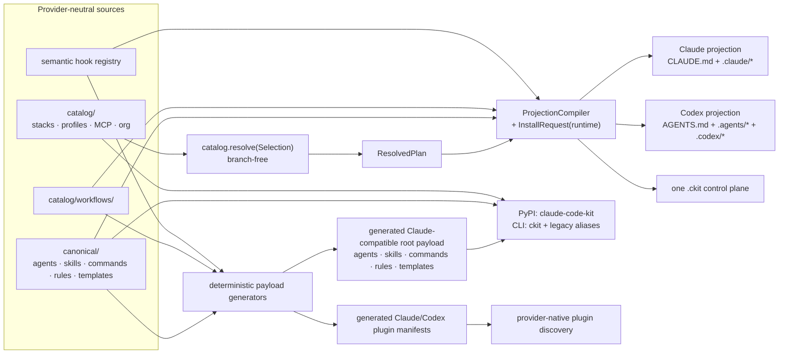
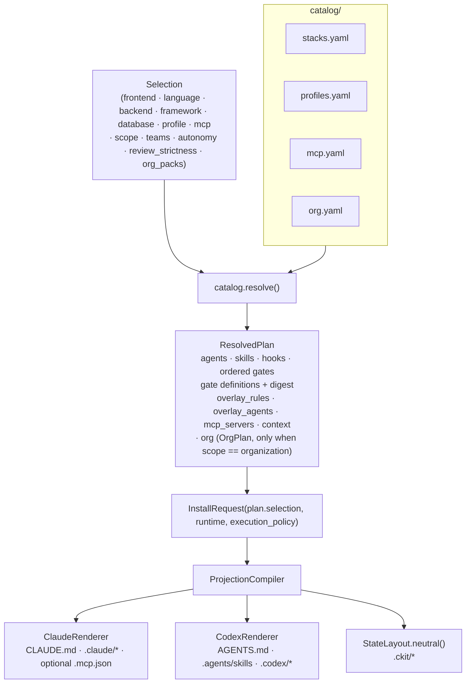
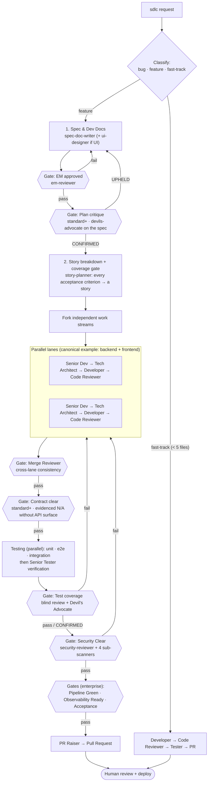
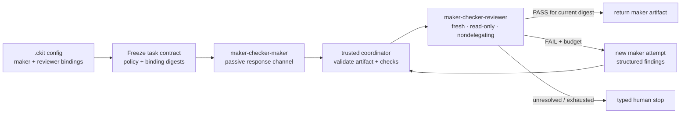
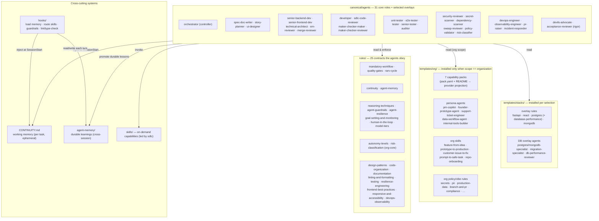

# claude-kit Architecture

claude-kit packages a complete, **stack-agnostic** software-delivery lifecycle as agent-host
**configuration** — agents, skills, rules, hooks — plus the working-memory and learning systems that
make a long-running agent reliable. It installs configuration only (no application code, no Docker),
is driven by a data **catalog**, and ships as a pip package plus generated plugin metadata for Claude
Code and Codex from one source of truth. Codex runtime support is currently preview; see
[`runtime-support.md`](runtime-support.md) for the normative capability matrix.

---

## 1. Canonical source, generated compatibility payload, and native projections


```mermaid
flowchart LR
    subgraph SRC["Provider-neutral sources"]
        CAN["canonical/<br/>agents · skills · commands · rules · templates"]
        WF["catalog/workflows/"]
        CAT["catalog/<br/>stacks · profiles · MCP · org"]
        HOOK["semantic hook registry"]
    end

    CAN --> GEN["deterministic payload generators"]
    WF --> GEN
    HOOK --> GEN
    GEN --> CLAUDEROOT["generated Claude-compatible root payload<br/>agents · skills · commands · rules · templates"]
    GEN --> MANIFESTS["generated Claude/Codex plugin manifests"]

    CAT --> RESOLVE["catalog.resolve(Selection)<br/>branch-free"]
    RESOLVE --> PLAN["ResolvedPlan"]
    PLAN --> COMPILER["ProjectionCompiler<br/>+ InstallRequest(runtime)"]
    CAN --> COMPILER
    WF --> COMPILER
    HOOK --> COMPILER
    COMPILER --> CLAUDE["Claude projection<br/>CLAUDE.md + .claude/*"]
    COMPILER --> CODEX["Codex projection<br/>AGENTS.md + .agents/* + .codex/*"]
    COMPILER --> SHARED["one .ckit control plane"]

    CLAUDEROOT --> WHEEL["PyPI: claude-code-kit<br/>CLI: ckit + legacy aliases"]
    MANIFESTS --> PLUGINS["provider-native plugin discovery"]
    CAN --> WHEEL
    CAT --> WHEEL
```

Host-rendered files are generated outputs, not additional sources of truth. Canonical definitions
contain semantic capabilities, model tiers, permission classes, write scopes, and symbolic
references without provider model/tool/path names. Renderers map only the semantics their host can
represent; unsupported behavior is reported as degraded or unsupported.

The pip scaffolder is the first-class deployment path. A static plugin can expose only the component
types its host discovers. It cannot resolve a project stack/profile/scope, compile project
instructions and custom agents, create or migrate `.ckit`, or perform ownership-aware upgrades.
The Claude `/claude-kit:init` wrapper delegates to the installed Python CLI; it does not reimplement
the installer in shell.

---

## 2. Catalog-driven resolution (init)

`init` never branches on a specific stack or provider. It collects a `Selection` (interactive
prompts, `--defaults`, or `--config`), and `catalog.resolve()` turns it into one concrete
`ResolvedPlan`. Runtime is deployment metadata carried separately by `InstallRequest`:


```mermaid
flowchart TB
    SEL["Selection<br/>(frontend · language · backend · framework · database · profile · mcp<br/>· scope · teams · autonomy · review_strictness · org_packs)"]
    subgraph CAT["catalog/"]
        ST["stacks.yaml"]
        PR["profiles.yaml"]
        MC["mcp.yaml"]
        OR["org.yaml"]
    end
    SEL --> RESOLVE["catalog.resolve()"]
    CAT --> RESOLVE
    RESOLVE --> PLAN["ResolvedPlan<br/>agents · skills · hooks · ordered gates<br/>gate definitions + digest<br/>overlay_rules · overlay_agents · mcp_servers · context<br/>· org (OrgPlan, only when scope == organization)"]
    PLAN --> REQUEST["InstallRequest(plan.selection, runtime, execution_policy)"]
    REQUEST --> COMP["ProjectionCompiler"]
    COMP --> CP["ClaudeRenderer<br/>CLAUDE.md · .claude/* · optional .mcp.json"]
    COMP --> XP["CodexRenderer<br/>AGENTS.md · .agents/skills · .codex/*"]
    COMP --> STATE["StateLayout.neutral()<br/>.ckit/*"]
```

- **Profiles** (`lean ⊊ standard ⊊ enterprise`) select *which* agents/skills/hooks/gates are
  installed — composed via `inherit:` and an `all` token, with no code branches. One canonical
  `gate_definitions` map declares required/conditional behavior and closed skip conditions; its
  canonical SHA-256 digest is persisted with the ordered list.
- **Overlays** (rules + DB agents) are copied only for the selected stacks from
  `templates/stacks/<dir>/`.
- **`.ckit/config/init-options.json`** records selected runtimes, neutral state layout, renderer and
  compatibility versions, the optional maker/reviewer execution policy, plus every installed file's
  checksum, provider, component ID, and owner. It powers `validate`, `diff`, safe upgrades, and
  explicit runtime transitions. Execution policy is installation metadata; it does not enter
  `Selection` or change `catalog.resolve()`.

Adding a framework/database/profile/MCP server is a **catalog edit + a `templates/stacks/` folder** —
never a change to `resolve()`.

### Same plan, generic editor export

The `ResolvedPlan` is also the reuse seam for `ckit export` (`src/claude_kit/export.py`), which takes
the **same** plan and projects it into formats a
single-agent editor reads natively — `.cursor/rules/*.mdc` + `.cursor/mcp.json` (Cursor), a root
`AGENTS.md`, or `.github/copilot-instructions.md` (Copilot). It is a pure projection: it adds no stack
knowledge, and `catalog.resolve()` gains no branches. It is **not** the native Codex renderer;
fidelity is asymmetric and stated in every exported file. Gates, hooks, agents, and state become
single-agent guidance or are omitted. See
[cursor-export.md](cursor-export.md) for the full mapping.

---

## 3. The SDLC pipeline (run)

`/sdlc` in Claude Code, or `$sdlc` in Codex, reads the installed profile's gate set and hands off to
the **Orchestrator**, which never writes code. The structured workflow defines role routing,
dependencies, parallel lanes, gate order/conditions, retry budgets, and evidence requirements once;
the provider adapter supplies spawn, queued-message, wait, collect, retry, and cancel mechanics.
Claude's bundled adapter uses the host's stream-JSON input and forwards bounded active corrections.
Codex defaults to the isolated one-shot `exec` path, which accepts queued messages before start.
An explicitly injected passive-only app-server backend adds bounded steer/interrupt over an
ephemeral read-only thread and fresh isolated home. Its protocol and credential-free wire behavior
are tested on the pinned hosts, but credentialed inference is not; it is neither the default nor a
parity claim.
**Only the active profile's gates run.**

The user-reachable managed path is the Preview command
`CKIT_EXPERIMENTAL=1 ckit pipeline run --provider claude|codex`. For Modes A–D it binds the
canonical workflow ID/version/digest, mode-projected gate set, gate owners, stable conditions,
capability attestations, and stage attempts to the active `.ckit` run before launching a native
worker. It checkpoints at unresolved gates and can resume through the other installed provider
without creating a second ledger. Every shell-capable Claude route additionally requires
`process.descendant_containment`. Codex may omit that requirement only for a passive read-only,
nondelegating role on an exact compatibility-pinned CLI after a fail-closed probe disables command,
hook, plugin, MCP, browser, app, and delegation surfaces. The coordinator supplies that role a
bounded, sensitive-path-filtered projection of tracked text. All other Codex roles require
descendant containment. The built-in subprocess backend does not attest it because a child can
create a new process session
outside the owned process group. Those invocations human-stop before spawn instead of making a
false containment claim. Closeout is deliberately two-part: `pull-request-prepare` performs local
checks and produces a commit-bound action plan in the managed worktree, while the final
`pull-request` leaf is a typed coordinator action requiring exactly `external.mutation`. It is never
dispatched to `pr-raiser` or a fallback worker; without an externally trusted signer and credential
broker it remains a blocking external-side-effect stop. Mode E enters a distinct authoritative
program executor only with an explicit frozen manifest. It binds the manifest, waves, units,
budgets, typed evidence, program gates, attempts, and workspace checkpoints to the shared run and
supports cross-provider no-replay. The bundled adapters can run only pure read/search audit units;
shell/write units require independently attested physical no-follow boundary containment, and
irreversible units stop before claim because approval consumption is not integrated. Managed
approval resolution is likewise unsupported: a rejection can trigger re-planning or abort, but a
local approval record cannot grant the stopped capability.


```mermaid
flowchart TD
    REQ["sdlc request"] --> CLS{"Classify:<br/>bug · feature · fast-track"}

    CLS -->|"feature"| SPEC["1. Spec & Dev Docs<br/>spec-doc-writer (+ ui-designer if UI)"]
    SPEC --> EM{{"Gate: EM approved<br/>em-reviewer"}}

    EM -->|"pass"| PC{{"Gate: Plan critique<br/>standard+ · devils-advocate on the spec"}}
    PC -->|"CONFIRMED"| STORY["2. Story breakdown + coverage gate<br/>story-planner: every acceptance criterion → a story"]
    STORY --> FORK["Fork independent work streams"]
    subgraph LANES["Parallel lanes (canonical example: backend + frontend)"]
        direction LR
        L1["Senior Dev → Tech Architect → Developer → Code Reviewer"]
        L2["Senior Dev → Tech Architect → Developer → Code Reviewer"]
    end
    FORK --> LANES
    LANES --> MR1{{"Gate: Merge Reviewer<br/>cross-lane consistency"}}

    MR1 -->|"pass"| CC{{"Gate: Contract clear<br/>standard+ · evidenced N/A without API surface"}}
    CC -->|"pass"| TEST["Testing (parallel): unit · e2e · integration<br/>then Senior Tester verification"]
    TEST --> TCG{{"Gate: Test coverage<br/>blind review + Devil's Advocate"}}

    TCG -->|"pass / CONFIRMED"| SEC{{"Gate: Security Clear<br/>security-reviewer + 4 sub-scanners"}}
    SEC -->|"pass"| OPS{{"Gates (enterprise):<br/>Pipeline Green · Observability Ready · Acceptance"}}
    OPS -->|"pass"| PR["PR Raiser → Pull Request"]
    PR --> HUMAN(["Human review + deploy"])

    CLS -->|"fast-track (< 5 files)"| FT["Developer → Code Reviewer → Tester → PR"]
    FT --> HUMAN

    EM -->|"fail"| SPEC
    PC -->|"UPHELD"| SPEC
    TCG -->|"fail"| LANES
    SEC -->|"fail"| LANES
```

**Every run has an explicit lifecycle under `.ckit/state`.** `start` creates schema v2 at the first
active gate; `adopt`
records which earlier gates are historical, why, and who accepts that boundary. `close-gate` and
`not-applicable` fail before either operation. `complete` and `abort` are terminal. The run binds its
repository identity, branch, start/current commit, profile/scope, gate order, and gate-definition
digest; a managed run additionally freezes the full executable workflow and gate-owner mapping.
Legacy schema-v1 state is readable and migrates only through explicit adoption.

**Every gate uses the same rules:** Critical and High always block; Medium can proceed only as a
distinct structured `accepted-risk` record, never PASS. Low/Cosmetic remain non-blocking. Required
gates cannot be skipped; conditional `not-applicable` records carry a configured condition and
evidence. The RARV self-check (Reason → Act → Reflect → Verify) and blind review remain
Agent-enforced protocols; Python mechanically enforces lifecycle, ordering, transition kinds,
bindings, and evidence hashes. Managed Modes A–D additionally freeze exact stage/gate evidence
contracts, validate required fields and kind-specific pass/finding semantics, persist root-owned
content-addressed records, and derive each gate bundle from its successful owner attempt. Mode E
applies its own frozen program-evidence profiles. Manual runs still bind arbitrary project files by
hash and do not gain those semantic guarantees.
In standard+, the Devil's Advocate also critiques the **plan** before approval is final, so a flawed
spec is caught on paper rather than after implementation.

### Explicit maker–checker loop

`/maker-checker` in Claude Code and `$maker-checker` in Codex are explicit-only projections of one
canonical skill. The skill is a thin entrypoint: the provider-neutral Python coordinator owns the
contract, model routing, iteration budget, artifacts, typed review semantics, and human stops.


```mermaid
flowchart LR
    CFG[".ckit config<br/>maker + reviewer bindings"] --> FREEZE["Freeze task contract<br/>policy + binding digests"]
    FREEZE --> MAKER["maker-checker-maker<br/>passive response channel"]
    MAKER --> CHECKS["trusted coordinator<br/>validate artifact + checks"]
    CHECKS --> REVIEW["maker-checker-reviewer<br/>fresh · read-only · nondelegating"]
    REVIEW -->|"PASS for current digest"| RESULT["return maker artifact"]
    REVIEW -->|"FAIL + budget"| REVISION["new maker attempt<br/>structured findings"]
    REVISION --> CHECKS
    REVIEW -->|"unresolved / exhausted"| STOP["typed human stop"]
```

Both role definitions expose only semantic file read/search capabilities. The built-in native
invocations are tool-denied; the coordinator supplies their input as a bounded, filtered, and
heuristically redacted projection of Git-tracked UTF-8 text. For documents, the trusted coordinator
writes the bounded response into the shared artifact tree. For code, the maker returns a unified
diff; the coordinator rejects protected paths and unsupported patch metadata, applies it in a
run-owned worktree, and runs `git diff --check`. The reviewer never writes or repairs the artifact,
and PASS cannot authorize merge or another external effect. See
[Configurable maker–checker](maker-checker.md) for the exact configuration and safety contract.

The loop uses a `snapshot_kind: maker-checker` schema-v2 variant in the one shared
`.ckit/state/pipeline-snapshot.json`; it does not create a provider-local or second pipeline ledger.
An exact `--resume RUN_ID` reuses the frozen task, contract, providers, resolved model requests, and
revision budget. The validator binds every durable attempt and artifact hash to that snapshot and
rejects evidence or worktree drift before dispatch. Configuration changes apply only to later runs;
catalog changes cannot rebind an active run; and abort, rather than disable, records its terminal
operator-aborted result. Terminal predecessors are archived non-recursively when either snapshot
kind later claims the shared slot.

---

## 4. Component map


```mermaid
flowchart TB
    subgraph AGENTS["canonical/agents — 31 core roles + selected overlays"]
        direction TB
        ORC["orchestrator (controller)"]
        PLAN["spec-doc-writer · story-planner · ui-designer"]
        REV["senior-backend-dev · senior-frontend-dev<br/>technical-architect · em-reviewer · merge-reviewer"]
        BUILD["developer · sdlc-code-reviewer<br/>maker-checker-maker · maker-checker-reviewer"]
        TST["unit-tester · e2e-tester · tester · senior-tester · auditor"]
        SECG["security-reviewer · secret-scanner · dependency-scanner<br/>owasp-reviewer · policy-validator · risk-classifier"]
        SHIP["devops-engineer · observability-engineer · pr-raiser · incident-responder"]
        DA["devils-advocate · acceptance-reviewer (rigor)"]
    end

    subgraph OVERLAY["templates/stacks/ — installed per selection"]
        ORULES["overlay rules<br/>fastapi · react · postgres (+ database-performance) · mongodb"]
        OAGENTS["DB overlay agents<br/>postgres/mongodb-specialist · migration-specialist · db-performance-reviewer"]
    end

    subgraph ORG["templates/org/ — installed only when scope == organization"]
        OPACKS["7 capability packs<br/>(pack.yaml + README → provider projection)"]
        OPERS["persona agents<br/>pm-copilot · founder-prototype-agent · support-ticket-engineer<br/>data-workflow-agent · internal-tools-builder"]
        OSKILLS["org skills<br/>feature-from-idea · prototype-to-production · customer-issue-to-fix<br/>prompt-to-safe-task · repo-onboarding"]
        OPOL["org policy/vibe rules<br/>secrets · pii · production-data · branch-and-pr · compliance · …"]
    end

    subgraph RULES["rules/ — 25 contracts the agents obey"]
        MW["mandatory-workflow · quality-gates · rarv-cycle"]
        MEM["continuity · agent-memory"]
        AGENTOP["reasoning-techniques · agent-guardrails · agent-resilience<br/>goal-setting-and-monitoring · human-in-the-loop · model-tiers"]
        ORGCORE["autonomy-levels · risk-classification (org-core)"]
        CRAFT["design-patterns · code-organization · documentation<br/>linting-and-formatting · testing · resilience-engineering<br/>frontend-best-practices · responsive-and-accessibility · devops-observability"]
    end

    subgraph SUPPORT["Cross-cutting systems"]
        CONT["CONTINUITY.md<br/>working memory (per task, ephemeral)"]
        AMEM["agent-memory/<br/>durable learnings (cross-session)"]
        HOOKS["hooks/<br/>load memory · route skills · guardrails · lint/type-check"]
        SKILLS["skills/ — on-demand capabilities (led by sdlc)"]
    end

    AGENTS -->|"read & enforce"| RULES
    AGENTS -->|"read"| OVERLAY
    AGENTS -->|"read (org scope)"| ORG
    AGENTS -->|"read/write each turn"| CONT
    HOOKS -->|"inject at SessionStart"| CONT
    HOOKS -->|"inject at SessionStart"| AMEM
    AGENTS -->|"promote durable lessons"| AMEM
    AGENTS -->|"invoke"| SKILLS
```

### The two memory systems (don't conflate them)

| | `.ckit/CONTINUITY.md` | `.ckit/agent-memory/` |
|---|---|---|
| Holds | Current task state — phase, active work, next steps | Durable learnings — rules, gotchas, patterns |
| Lifespan | Ephemeral — overwritten as work progresses | Permanent — accumulates across all work |
| Scope | This pipeline run | The whole project, forever |
| Loaded by | `load-continuity.sh` (SessionStart) | `load-learnings.sh` (SessionStart) |

Together they let either selected host **survive context compaction and new sessions**: the next turn
reads continuity and resumes from "Next Steps," then applies accumulated learnings before acting.
A `both` install shares these exact paths; it never creates one memory system per host.

---

## 5. Repository layout

```
claude-kit/
├── .claude-plugin/
│   ├── plugin.json            # generated Claude Code plugin manifest
│   └── marketplace.json       # generated Claude Code marketplace entry
├── .agents/plugins/
│   └── marketplace.json       # Codex marketplace; source is providers/codex/claude-kit
├── providers/codex/claude-kit/     # generated, first-class Codex plugin package root
│   ├── .codex-plugin/plugin.json
│   ├── skills/                # 127 Codex-valid skills + manual-only policy sidecars
│   └── hooks/                 # native hook JSON + adapted self-contained scripts
├── canonical/                 # provider-neutral agents · skills · commands · rules · templates
├── agents/                    # generated Claude-compatible 31-agent surface
├── skills/                    # generated compatibility skills incl. sdlc
├── commands/                  # generated Claude /claude-kit:* wrappers
├── hooks/
│   ├── hooks.json             # plugin hooks via ${CLAUDE_PLUGIN_ROOT}
│   └── scripts/               # load-continuity, load-learnings, lint-fix, type-check, warn-* / validate-* / audit-log
├── rules/ (25)                # generated Claude-compatible core engineering rules
├── catalog/                   # stacks · profiles/gates · workflows · MCP · org · compatibility · plugin metadata
├── templates/
│   ├── CLAUDE.md · CLAUDE.stack.md.tmpl · README.claude-sdlc.md.tmpl
│   ├── CONTINUITY.template.md · settings.json · artifacts/ · agent-memory/
│   ├── stacks/<kind>/<id>/    # per-stack overlay rules (+ agents/ for databases)
│   └── org/                   # org overlay: skills · agents (personas) · rules · packs/ (scope-gated)
├── scripts/gen_provider_payloads.py   # canonical → compatibility payload drift gate
├── scripts/gen_provider_manifests.py  # canonical plugin identity → provider manifests
├── scripts/init.sh            # compatibility launcher; project writes require the Python CLI
├── src/claude_kit/            # resolver + typed IR/projection + renderers + secure lifecycle/state
├── tests/                     # unit, drift, native artifact, runtime-transition, archive, host smokes
├── docs/architecture.md       # this file
├── docs/agentic-patterns.md   # how the kit maps onto the 21 agentic design patterns
├── docs/org-capabilities.md   # the org vibe-coding layer + reuse-not-duplicate coverage map
└── pyproject.toml             # force-include bundles the payload into the wheel
```

The repository root is the Claude Code plugin root. Codex deliberately installs the nested
`providers/codex/claude-kit` package selected by `.agents/plugins/marketplace.json`; its manifest is
therefore `providers/codex/claude-kit/.codex-plugin/plugin.json`, not an unused root manifest. The
nested files are deterministic projections from canonical skills, hook registry/scripts, and plugin
metadata, so this provider boundary does not introduce a second source of truth.

---

## 6. Lifecycle: transactional init / validate / diff / upgrade

Because every native install records per-file checksums, provider/component identity, and ownership
in `.ckit/config/init-options.json`,
the kit can safely evolve a project in place:

- **`init` / merge / force** — resolve and preflight every selected component before a live write,
  render the complete result into controlled staging, run strict validation, then apply through
  `ProjectFS` inside a schema-v2 rollback transaction. Traversal, absolute/drive/UNC paths,
  symlinks, junctions, and reparse points in managed destinations are refused. Ordinary failures
  restore immediately; an interrupted journal is recovered at the next invocation. Mutations
  currently require POSIX descriptor/lock semantics; native Windows refuses rather than use its
  former junction-racy pathname fallback (WSL is the supported mutation path for this release).
- **`validate` / `doctor`** — structural and JSON Schema checks (tracked files present, valid JSON,
  frontmatter complete, supported schema versions) plus environment checks. Strict mode fails when
  any declared schema layer is unavailable; `jsonschema` is a normal runtime dependency. Doctor also
  classifies installed host CLIs against the Claude and Codex compatibility catalogs, reports the
  shared state root, Codex trust requirements, and detectable local plugin/scaffold duplication.
- **`diff` / `upgrade` / runtime transition** — `upgrade` recompiles the recorded selection and
  compares it to the live tree. Kit/overlay files are refreshed; **user-editable files
  are never clobbered** (a modified one is kept, the new version dropped beside it as a `.claude-kit`
  sidecar); changed/removed files are backed up; deleted files are restored; orphans are pruned. The
  post-upgrade baseline is the kit's canonical checksums, so user edits stay protected across repeated
  upgrades. Every live mutation uses the same `ProjectFS` and rollback transaction as init. `diff`
  previews all of this and writes nothing. An explicit runtime transition reuses that same selection;
  removal of a native surface requires confirmation, makes a recoverable backup, and leaves `.ckit`
  plus the remaining provider intact.

## 7. Verified-artifact release flow

The CI workflow builds wheel and sdist once, checks them, creates `SHA256SUMS`, and installs the exact
wheel into clean smoke environments. Source, wheel, and sdist inventories must match; isolated
smokes install and strictly validate `claude`, `codex`, and `both`, while provider-native plugin
lifecycle tests stay within the non-credentialed trust boundary. Only after all test, lint, schema,
host-compatibility, archive-conformance, and workflow-security jobs succeed is that artifact uploaded
as `verified-dist`. The publication
workflow authenticates the originating repository/main/SHA/run, downloads that artifact, attests it,
and sends the same files to PyPI via Trusted Publishing without rebuilding or `skip-existing`.
Post-publish verification downloads PyPI files and compares their digests; the GitHub Release points
at the verified commit and receives those same assets. A workflow dispatch against the original CI
run is the recovery mechanism for partial publication.

These deterministic smokes prove packaging and projection integrity. They do not erase the live-host
behavior gaps that keep Codex and `both` in Preview; those are listed in
[runtime-support.md](runtime-support.md#promotion-gates).
