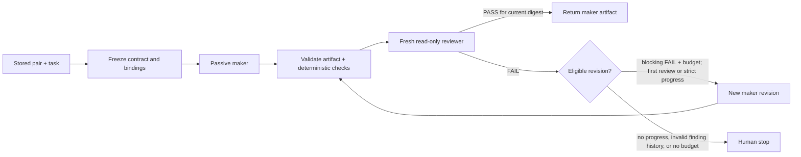

# Configurable maker–checker

The maker–checker workflow is an opt-in managed loop for one coding, design, or specification task.
The project owner chooses a concrete provider and model policy for the maker and reviewer. The
coordinator freezes those bindings, passes each reviewed artifact through a fresh read-only reviewer,
and returns the maker's artifact only after a typed `PASS` for its current digest.

The coordinator is currently a **Preview managed-execution surface**; enabling it does not change
the stable status of the surrounding Claude Code scaffold. The Codex scaffold and any pair that
uses Codex also remain Preview. Generated discovery and deterministic adapter tests do not
establish protected credentialed-host parity. The exact mapping is in the
[runtime support contract](runtime-support.md).

## Configure the pair

Maker–checker configuration requires a runtime-aware `ckit init` with the neutral `.ckit` control
plane. A cross-provider pair therefore requires `--runtime both`; a Claude-only or Codex-only
install can use two different models from its one installed provider. Interactive `init` offers the
optional pair. `--defaults` leaves it disabled so unattended installs do not opt into model calls.

For a repeatable dual-runtime install, put the policy in `init.yaml`:

```yaml
runtime: both
frontend: {framework: react, language: typescript}
backend: {language: python, framework: fastapi}
database: postgres
profile: standard
mcp: []
capture_mode: "off"
scope: individual
execution:
  strategy: maker-reviewer
  maker:
    provider: claude
    model: {kind: tier, value: deep}
  reviewer:
    provider: codex
    model: {kind: exact, value: YOUR_CODEX_MODEL_ID}
  max_revisions: 2
```

Replace `YOUR_CODEX_MODEL_ID` with an exact model ID accepted by the installed Codex host; it is a
placeholder, not a bundled model alias.

Then install with the Preview switch required by `codex` and `both` scaffolds:

```bash
CKIT_EXPERIMENTAL=1 ckit init . --config init.yaml
```

Each role accepts exactly one model-selection form:

| Form | Meaning |
|---|---|
| `inherit` | Use the selected host's active default. |
| `tier` | Resolve `fast`, `balanced`, or `deep` through that provider's compatibility catalog at dispatch time. Claude currently maps those tiers to its native aliases; Codex tiers currently inherit the host model because the catalog deliberately has no hard-coded Codex aliases. |
| `exact` | Pass the user-supplied provider model ID to that native host. Shape is validated when configured; access and authentication are determined only when the host is launched. |

`max_revisions` is an integer from 0 through 3. It counts reviewer-requested revisions after the
initial maker/reviewer iteration: `0` allows one iteration, while the default `2` allows at most
three. Using the same provider and model in both slots is permitted, but the CLI warns that it
reduces review independence. Configuration stores no prompt, credential, API key, or host login.

## Change it later

The configure-anytime commands update only `.ckit/config/init-options.json` through the existing
transactional project writer:

```bash
# Prompt for both roles; existing values are offered as defaults.
ckit maker-checker configure .

# Supply one complete pair without prompts.
ckit maker-checker configure . \
  --maker-provider claude --maker-model-tier deep \
  --reviewer-provider codex --reviewer-model-id YOUR_CODEX_MODEL_ID \
  --max-revisions 2

ckit maker-checker show .
ckit maker-checker probe .
ckit maker-checker disable .
```

Interactive reconfiguration pre-fills the stored pair. Non-interactive configuration must name each
concrete provider and exactly one of `--ROLE-inherit`, `--ROLE-model-tier`, or `--ROLE-model-id` for
each role. A role cannot name a provider that the project did not install.

A one-provider scaffold can still use different models. For example, replace both placeholders
below with IDs accepted by the installed Codex host:

```bash
ckit maker-checker configure . \
  --maker-provider codex --maker-model-id CODEX_MAKER_MODEL_ID \
  --reviewer-provider codex --reviewer-model-id CODEX_REVIEWER_MODEL_ID \
  --max-revisions 2
```

`probe` is deliberately read-only. It validates the stored policy, locates each configured host
executable, and checks `--version` against the compatibility floor. It sends no prompt and does not
prove login, exact-model entitlement, model existence, or inference behavior. Those checks remain a
launch-time provider result.

`ckit validate` and `ckit doctor` also make the configured boundary visible. They verify that each
provider is installed, each native maker/reviewer route exists, and both rendered roles remain
read/search-only with no write scope or delegation. They report pinned tier mappings, warn when a
Codex tier falls back to the host default, and warn when both slots share one binding. They do not
turn an exact model ID into a live availability claim.

## Run it

The installed skill is explicit-only:

```text
Claude Code: /maker-checker --kind design Design an accessible account-recovery flow
Codex:       $maker-checker --kind specification Specify idempotent webhook delivery
```

Both native entrypoints call the same provider-neutral CLI coordinator. You can invoke it directly:

```bash
ckit maker-checker run . \
  --kind code \
  --task 'Add strict parsing for the existing report-date parameter'
```

`--kind` accepts `code`, `design`, `specification`, or `auto`. `auto` performs a conservative local
classification from the task text and fails with guidance when the kind is ambiguous; specifying
the kind is more predictable.

Before sending task content, the CLI prints the maker and reviewer provider/model policies and the
revision limit. A successful run exits 0 and prints the final artifact path, SHA-256 digest,
iteration count, residual risks, and the preserved worktree path for code. A configuration,
preflight, or snapshot-setup error exits 1. Native launch and transport failures become typed human
stops; those exit 2 and print the reason, required action, and any preserved artifact.

A run sends the task, current artifact context, and a coordinator-produced source projection to the
configured model providers. The built-in adapters give neither native role local tools. They satisfy
the roles' semantic read/search input with a bounded snapshot of Git-tracked UTF-8 text. Exact root
`AGENTS.md` and `CLAUDE.md` files are included as trusted project guidance; nested or case-variant
instruction files, control-plane and generated/cache directories, `.mcp.json`, sensitive-looking
paths, symlinks, and non-text files are withheld before the provider projection opens them for
inclusion. Secret-shaped values in included text are heuristically redacted, but this is not a
guarantee that every secret is detected: treat the projection as sensitive. Eligible non-ignored
untracked text or an ambiguous, racing, undecodable, or over-limit snapshot fails before either
native host starts. The provider-visible scope identity is derived only from that filtered
projection. Separately, a private coordinator checkpoint detects changes across tracked, untracked,
ignored, control, sensitive-name, and non-text workspace entries with Git filters disabled. That
private checkpoint and any digest derived from withheld bytes are never placed in either provider
prompt. This detects native-host mutations without executing a repository-defined clean filter or
turning excluded content into a provider-visible secret verifier.

The audited Claude path uses safe mode, an empty tool set, disabled slash commands, no Chrome, and no
custom-agent selection. The Codex path keeps the exact-pinned passive lockdown documented in the
runtime matrix. A host version that does not support the required controls fails at launch; the
non-inferential `probe` does not exercise those flags.

Configure a cross-provider pair only when that data flow is acceptable under the project's privacy
policy. `show`, `validate`, `doctor`, and `probe` do not send the task or source projection to either
model.

### Resume or abort a frozen run

Maker–checker and `/sdlc` share the single `.ckit/state/pipeline-snapshot.json` lifecycle. A
maker–checker snapshot is the schema-v2 `snapshot_kind: maker-checker` variant, so the project can
have only one active maker–checker or SDLC run. Starting another run while either kind is active
fails closed. A new run archives a valid terminal snapshot before claiming that shared location.
The ignored root-level `.claude-kit-managed-execution.lock` is only a versioned kernel-lock anchor,
kept outside rollback surfaces so a transaction cannot replace its inode; it is not a second state
ledger or provider-local control plane.
During the compatibility window the coordinator also holds the earlier ignored
`.ckit/state/managed-execution.lock` inode, preventing an older installed CLI and a current CLI from
running coordinators concurrently. If a fresh native install fails after these anchors are created,
all provider and configured control-plane surfaces are rolled back, but the new target may retain
only the two coordination anchors and their parent directories. A retry reuses them. The installer
deliberately does not remove the project root by pathname after failure, because a concurrent
replacement could otherwise make cleanup delete an unrelated directory.

Inspect an interrupted run and resume its exact ID:

```bash
ckit pipeline status .
ckit pipeline resume .
ckit maker-checker run . --resume RUN_ID
```

For this snapshot kind, `ckit pipeline resume .` validates the state and prints the exact
maker–checker command; it does not launch either model. The `maker-checker run --resume` command
performs the execution. Its default `--kind auto` reuses the frozen kind. You may supply `--kind`
only when it matches the frozen kind, and may supply `--task` only as an exact equality assertion:

```bash
ckit maker-checker run . --resume RUN_ID \
  --kind specification \
  --task 'Specify retry and idempotency behavior for webhook delivery'
```

Resume reads the frozen task, artifact contract, providers, resolved model requests, and revision
budget; the CLI announces the pair and budget before it dispatches. It does not substitute a newly
configured pair, and still uses the frozen pair if current defaults changed or maker–checker was
subsequently disabled. Later compatibility-catalog changes do not silently re-resolve its model
request either. `disable` therefore affects future runs, not an active one. To terminate the active
pair instead, use `ckit pipeline abort .`; the abort records a terminal `operator-aborted` result
and preserves its bounded evidence and any run-owned worktree. Completed and human-stop runs are
terminal and cannot be resumed; a later new run archives their valid predecessor snapshot.

New runs also freeze `convergence_policy: strict-blocking-finding-subset` inside the digested
artifact contract. That marker makes reviewer progress part of snapshot coherence, so resume cannot
silently apply a different convergence rule. A present but unrecognized policy is treated as an
unsupported future contract and fails validation and resume. Contracts created before this marker
was introduced remain readable: marker absence selects the legacy bounded-revision behavior, does
not add a prior-finding register to reviewer context, and does not retroactively impose the strict
subset rule.

If the coordinator cannot prove that a cancelled or partially started native worker terminated, it
keeps an `unsafe_dispatch` marker and refuses resume, abort, provider removal, and replacement
dispatch. This avoids running two makers or reviewers after losing process ownership. Inspect the
exact logical attempt, route, native dispatch ID, and native attempt number with:

```bash
ckit pipeline status .
```

After independently verifying that exact host job/process is no longer running, bind a concise
operator reference to all of those identities:

```bash
ckit maker-checker confirm-terminated . \
  --run-id RUN_ID \
  --attempt-id ATTEMPT_ID \
  --route maker-checker-maker \
  --dispatch-id NATIVE_DISPATCH_ID \
  --dispatch-attempt 1 \
  --evidence 'host job NATIVE_DISPATCH_ID reports terminated at TIMESTAMP'
```

Use the route printed by `status`; it may instead be `maker-checker-reviewer`. The command does not
kill or inspect the worker. It requires an exact marker match, stores the bounded confirmation as a
hash-bound mode-0600 proof, and marks the attempt interrupted. Only then can you explicitly resume
or abort the frozen run.

A runtime transition also cannot remove Claude or Codex while that provider is named by the active
frozen pair. The upgrader holds the managed/pipeline locks and checks the snapshot itself, so
changing or disabling current defaults does not bypass this protection. Resume the run to a
terminal result or explicitly `ckit pipeline abort .`, then retry the provider-removal transition.

Before another dispatch, resume validates the snapshot structure, contract and binding digests,
evidence hashes, attempt chain, current artifact, and code-worktree ownership/checkpoint/index.
Tampered artifacts, a changed code worktree, a mismatched task/kind/run ID, or another snapshot
variant are refused. A stale recorded attempt is marked interrupted and retried at its frozen stage;
completed stages and evidence are not replayed or rewritten. A durable code-patch apply intent is
reconciled against its expected post-apply digest so coordinator interruption cannot silently
double-apply or replace it. If the frozen provider, route, or passive capability is no longer
available, the coordinator produces a typed stop rather than substituting a worker.

## What the coordinator enforces



- Maker and reviewer are passive, nondelegating roles whose only semantic project capabilities are
  read/search. The built-in Claude and Codex invocations are tool-denied and receive the bounded
  coordinator projection above instead of local filesystem access. They cannot run shell commands,
  write project files, invoke MCP/browser/delegation features, or contact each other. The
  coordinator is the only writer and validates their strict JSON envelopes.
- A design or specification is stored under
  `.ckit/artifacts/maker-checker/runs/<run-id>/`. For code, the initial maker response is a textual
  unified diff; the coordinator creates a run-owned Git worktree, validates and applies the patch
  there, and leaves the source checkout unchanged. Later maker responses are incremental diffs
  against that worktree, not complete replacements.
- Code patches cannot modify `.agents`, `.ckit`, `.claude`, `.codex`, `.git`, or protected root
  control files. Binary patches, renames, deletions, mode changes, symlinks, duplicate path sections,
  non-applicable patches, and revisions outside the initial patch's frozen path set fail closed.
- Every reviewer starts fresh with the frozen contract, current artifact and digest, and
  coordinator-produced check evidence. It does not receive the maker's hidden rationale. `PASS`
  requires matching contract/artifact digests, criterion-by-criterion evidence, green supplied
  checks, and no blocking finding.
- Under `strict-blocking-finding-subset`, a second or later reviewer receives a compact
  `prior_finding_registry` copied from the immediately preceding review. It contains each prior
  finding's stable ID, severity, and message; the current artifact, checks, and frozen contract are
  still supplied independently. The first reviewer has no prior register.
- Reviewer `FAIL` is semantic feedback, not a transport retry. The first strict-policy `FAIL` must
  contain at least one blocking `medium`, `high`, or `critical` finding. A new maker attempt must
  disposition every stable finding as fixed, disputed with evidence, or human-required.
- After a maker revision, another `FAIL` counts as progress only when its blocking finding IDs are a
  proper subset of the preceding review's blocking IDs and every surviving blocker has the same or
  lower severity. An unchanged blocker set, a renamed blocker, a new or reopened blocker, or an
  escalated surviving blocker stops with `conflicting-evidence`; none consumes another maker
  revision. Disputed or human-required maker dispositions, an unchanged revision, stale evidence,
  malformed output, a timeout, or an exhausted budget also become an explicit human stop.
- Reviewer `PASS` authorizes only returning the current artifact. It never authorizes merge,
  publication, deployment, purchase, deletion, credential use, or another external effect.

The current deterministic checks are intentionally narrow: non-empty content for documents, and
non-empty content plus `git diff --check` for code. The passive roles cannot run the project's test,
lint, type-check, build, rendering, accessibility, or link-check commands. Run the relevant project
checks and inspect the preserved worktree before accepting or merging code; a reviewer `PASS` is not
a substitute for them.

The run keeps its mode-0600 contract and terminal result under the shared
`.ckit/artifacts/maker-checker/runs/<run-id>/` tree. Each completed iteration adds its maker
response, artifact, check record, and reviewer response; lower-level provider captures remain
separately bounded by the native dispatch adapter. No provider-local configuration or evidence
ledger is created.

## Plugin boundary

The generated Claude and Codex plugins expose the discoverable skill, but a static plugin does not
choose providers/models or create `.ckit`. Run the project scaffolder first. The native invocation
is `/maker-checker` in Claude Code and `$maker-checker` in Codex; copying the slash form into Codex is
not a supported compatibility shortcut.
