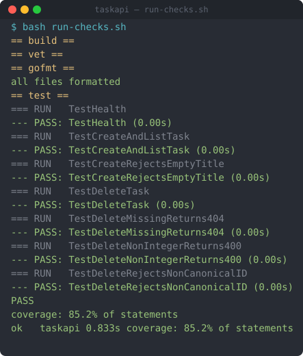

# A real `/sdlc` run — captured, not illustrated

The sibling example ([`../react-fastapi-postgres-feature/`](../react-fastapi-postgres-feature/)) is a
**synthetic** walkthrough — hand-written to show the shape of the pipeline. **This one is real.** A
genuine feature was driven through the kit's gates against a freshly-scaffolded project, and this
folder is the output of the kit's own [`scripts/capture-sdlc-run.sh`](../../scripts/capture-sdlc-run.sh)
harness — the actual spec, the deterministic gate state, the verdict log, and the real diff. Every gate
verdict is backed by the command output it cites. Nothing here is fabricated, which is the whole point
of the kit's [§2.5 evidence rule](../../rules/quality-gates.md).



> The image is a static render of a genuine terminal recording of the gate checks. Replay the
> animation with `asciinema play cast/gate-checks.cast`; provenance is in [`cast/`](cast/).

## The run

**Request:** *Add `DELETE /tasks/{id}` to a small Go `net/http` task API.* Scaffolded with
`claude-kit init` (backend **Go / net-http**, **standard** profile), then driven gate by gate.

**The headline — the devil's advocate caught what a unanimous panel missed (again).** Four reviewers
returned a clean verdict: code-review **PASS**, em **APPROVED**, security **SECURITY CLEAR**, acceptance
**ACCEPT**. Because that pass was unanimous, the kit spawned the **`devils-advocate`** — which attacked
the id-parsing seam over a **raw TCP socket** (every test routed through Go's `http.Client`, which
silently normalizes paths) and found a real **Medium**:

> `strconv.Atoi` aliased `/tasks/01`, `/tasks/+1`, `/tasks/%2B1`, `/tasks/00000000001` onto task `1`
> and **deleted it**, while `/tasks/-1` returned 404 — inconsistent and destructive.

It **reproduced** the bug (raw wire + direct-to-mux), so the deterministic pipeline **refused to close
the next gate** while the Medium was open:

```
FAIL  cannot close 'contract-clear': medium=1 open finding(s) must be resolved first
      (critical/high/medium block a gate per quality-gates.md).
```

The fix (reject non-canonical ids) + a **mux-level regression test** + a tightened spec closed it; the
**same** devil's advocate re-verified over the raw wire and returned **UPHELD**. The gate then closed.
That is the defect loop and the anti-sycophancy moat working on real code — see
[`run-artifacts/devils-advocate.txt`](run-artifacts/devils-advocate.txt),
[`run-artifacts/gate-refused.txt`](run-artifacts/gate-refused.txt), and
[`run-artifacts/defect-loop-reverify.txt`](run-artifacts/defect-loop-reverify.txt).

## What's in this folder

| Path | What it is |
|------|------------|
| [`captured-bundle/`](captured-bundle/) | **Verbatim output of `capture-sdlc-run.sh`** — the spec, `state/pipeline-snapshot.json` (gate state + per-gate evidence, paths rewritten bundle-relative), `state/stack-catalog.snapshot.yaml`, `continuity.md` (verdict log), `evidence/` (the gate evidence the snapshot references), `git/changes.diff`, and a `REDACTION-CHECKLIST.md`. |
| [`run-artifacts/`](run-artifacts/) | Genuine artifacts from the **same run** that the harness's `gate_evidence` model doesn't collect: the devil's-advocate verdict + re-verification, the deterministic gate **refusal**, the acceptance verdict, and `pipeline status`/`validate`. |
| [`sample-app/`](sample-app/) | The Go source the run executed against (post-run state). `bash sample-app/run-checks.sh` reproduces the gates: **7 tests, 85.2% coverage**. |
| [`cast/`](cast/) | The terminal recording of the gate checks (`.cast` + a static `.svg`) and the recorder used to make it. |

## Reproduce it

The sample app is **Go standard library only** — no third-party deps:

```bash
bash examples/real-run/sample-app/run-checks.sh   # build + vet + gofmt + 7 tests
```

To capture your *own* run as a bundle like `captured-bundle/`, run a real `/sdlc` task in a
claude-kit project and then `scripts/capture-sdlc-run.sh` against it — see
[`docs/capture-a-real-run.md`](../../docs/capture-a-real-run.md).

## What's genuine vs. authored

- **Real agents.** The verdicts in `captured-bundle/evidence/` and `run-artifacts/` were produced by
  spawning the actual read-only claude-kit agents (`sdlc-code-reviewer`, `em-reviewer`,
  `security-reviewer`, `acceptance-reviewer`, `devils-advocate`) against this code; findings cite real
  `file:line` and the devil's advocate reproduced its finding before it counted.
- **Real tool output.** `build-green`, `test-coverage`, the gate refusal, and the diff are captured
  command output. `captured-bundle/` is the literal harness output (this run is what shook out the
  harness improvement that pulls `gate_evidence` files into the bundle and strips local absolute paths).
- **Real recording.** `cast/gate-checks.cast` is a genuine `pty` capture of the gate checks (real
  output, real timing) — not a re-enactment. See [`cast/`](cast/).
- **Not included:** a hosted/animated screencast — the committed `.cast` + static `.svg` stand in.

Environment of record: Go 1.26, claude-kit standard profile.
